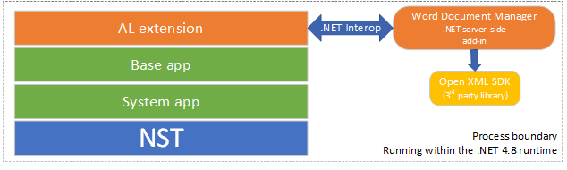
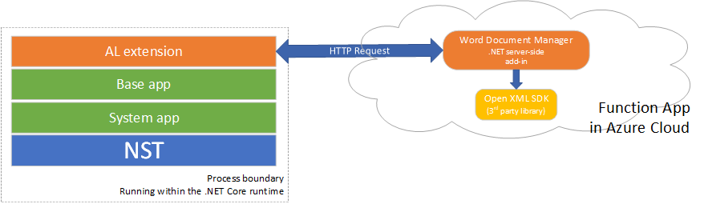
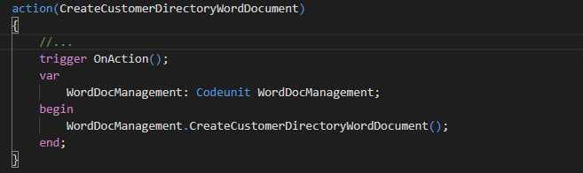
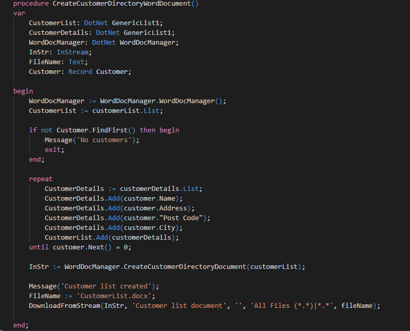
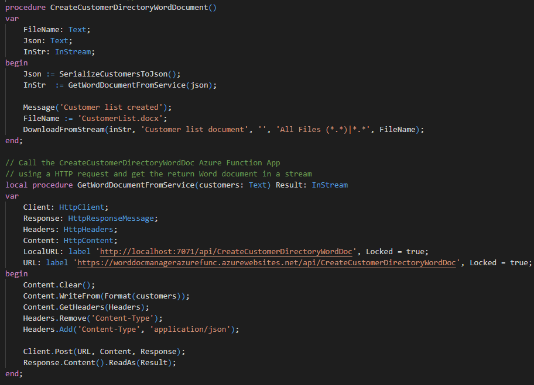

# Migrating Your .NET Add-In to the Cloud

## Business Central architecture evolution

If you have developed a server-side .NET add-in for Business Central,
this article is for you. The Business Central stack is moving towards
full alignment between the cloud version and the on-prem version, and if
your solution relies on a server-side .NET component, you will need to
address these changes.

One of the major changes that is going to impact the .NET interop story,
is that the entire stack of Business Central is moving from .NET to .NET
Core. As you might know, the traditional .NET a.k.a. .NET framework 4.8
in its latest version, is now in sustained engineering and there will be
no further development of that framework. The future is .NET core, which
means all evolution such as performance improvements, framework
extensions and so on will be happening there and only there.

In [this blog
post](https://devblogs.microsoft.com/dotnet/net-core-releases-and-support/)
you can read about the details of the future .NET Core releases and
their lifecycles.

.NET Core has a lot of benefits and going through those is outside of
the scope of this article, but there are numerous resources on the web
on the subject, like [this
one](https://www.fortech.ro/top-advantages-net-core/).

At some point in time in the future, the NST will be fully converted to
.NET Core, which means that .NET server-side add-ins will no longer
load, as when you run a process in the .NET Core run-time environments,
all dependencies (DLL’S) need to be compiled for .NET Core as well.

The other major upcoming change for Business Central, is the alignment
of the cloud and on-prem versions. Already today, the cloud and on-prem
versions of Business Central are very similar, but there are a few
differences. Typically, there are several things you can do in an
on-prem deployment, that are not allowed in the cloud. This is mostly
for security reasons and deploying server-side .NET components, which
are running in-process with the NST, is obviously not safe in the cloud.

Keeping these two versions of Business Central in parallel is not
efficient and ultimately, there will be no difference between the two
codebases, which means that all the restrictions that apply in the
cloud, will also apply for the on-prem version.

## Deprecation of .NET server-side add-ins

When a process runs on .NET Core, all of its dependencies (the DLLs it
loads), need to also be compiled for .NET Core. This means that any
server-side .NET add-in that was compiled for the (old) .NET Framework,
will not load anymore, once the NST has fully migrated to .NET core.

One option could be to recompile your .NET add-in to .NET Core, however
this will most likely require some refactoring, as the two frameworks
leverage different libraries with some overlap but also some significant
differences.

Moreover, if the add-in references a third-party library, which you do
not have the code for, you will not be able to recompile this part to
target .NET Core.

The good news is that if you’re already addressing this issue by
gradually refactoring your components and as an additional benefit, you
will end up with a solution that can run on-prem as well as in the
cloud.

Let’s take a close look at how to achieve that with a particular focus
on the .NET server side add-ins.

## Why would you need a .NET add-in? 

Well, there are various reasons why you might choose to write some of
your code in C\# or another .NET language. Without a doubt, the .NET
framework offers a very large library many of which capabilities are not
(yet) available in AL. Visual Studio is also a very powerful development
environment with tons of advanced features. Maybe you are more familiar
with C\# than you are with AL. One of the most common scenarios is the
use of a third-party library, which has been written for a .NET
language.

We will take a close look at the latter case in the next section, where
we will walk through how to go from a .NET server-side add-in
architecture to an architecture that not only will survive the move of
the NST to .NET core but also make your extension ready for the cloud.

## Walkthrough: How to refactor your .NET add-in 

### The scenario

Let’s imagine that in your ERP solution you need to create Word
documents. In this example, we will look at an AL extension that creates
a directory list of all customers with their respective addresses in a
Word document and downloads it to the client.

For creating Word Document, there is a great free open-source .NET
library called [Open XML
SDK](https://learn.microsoft.com/en-us/office/open-xml/getting-started).

At the starting point, the AL extension uses a server-side .NET add-in,
let’s call it Word Document Manager, which performs the Word document
creation by using the Open XML SDK library. The AL code calls the .NET
add-in using the usual AL/.NET interop mechanism. This of course
requires that the extension is compiled with the "target": "OnPrem"
setting in the app.json file, preventing the extension to be used in the
cloud.

The diagram below illustrates the original architecture of the extension
using a traditional server-side .NET add-in design.

As of today, the NST is running against .NET framework 4.8 and equally,
the AL code from the System App, the Base app and any AL extension gets
compiled to C\# and finally to IL to run within the .NET 4.8 runtime.

In a near future, the NST, the Base app, and the System app and any AL
extension will all be compiled and running against .NET Core. At this
point, there will only be two options: refactoring and recompiling the
.NET add-in to target .NET Core or moving to a service-oriented
architecture.

Although the first option seems more straight-forward, in our example we
use a third-party library which is only available in .NET 4.8, so the
only option is to move to a service-oriented architecture. Later we’ll
see that besides solving the .NET Core compatibility problem, the
service-oriented architecture also presents additional benefits.

### A service-oriented architecture

The basic idea is to move the code from the .NET server-side add-in to a
cloud-based service.

In our example we are going to move the Word Document Manager to an
[Azure Function
App](https://azure.microsoft.com/en-us/services/functions/). Then the AL
code needs to be refactored to call the service using HTTP requests
rather than .NET interop. The diagram below illustrates the new
architecture:

### Structure of the sample

The code for this sample is available here on the
[BCTech](https://github.com/microsoft/BCTech/tree/master/samples/.NETAddin) GitHub repository.

It is structured in the following way:

-   [WordDocManagerAddin folder](https://github.com/microsoft/BCTech/tree/master/samples/.NETAddin/WordDocManagerAddin): contains the .NET add-in code. The project can be
    opened and compiled in Visual Studio

-   [ALAddin folder](https://github.com/microsoft/BCTech/tree/master/samples/.NETAddin/ALAddin): contains the AL extension using the .NET add-in.
    This is the “before” extension. It compiles in Visual Studio Code
    with the "target": "OnPrem" setting.

-   [ALNoAddin folder](https://github.com/microsoft/BCTech/tree/master/samples/.NETAddin/ALNoAddin): contains the AL extension once refactored to use
    the Azure Function App instead of the .NET add-in. It compiles in
    Visual Studio Code with the "target": "Cloud" setting.

-   [WordDocManagerAzureFunc folder](https://github.com/microsoft/BCTech/tree/master/samples/.NETAddin/WordDocManagerAzureFunc): contains the Azure Function App that
    replaces the add-in. It can be compiled and deployed from Visual
    Studio Code (once you have installed the necessary VSCode
    extensions).

### Moving the add-in to the cloud

[Azure Function
Apps](https://azure.microsoft.com/en-us/services/functions/) are
lightweight, easy to manage and a good place to start if you are new to
cloud development. They already offer a lot of advanced features around
security, monitoring, and reliability, but there are also other more
advanced options for running a service and depending on your scenario
and your needs, you might want to consider alternatives that Azure has
to offer such as [Web
Apps](https://azure.microsoft.com/en-us/services/app-service/web/),
[Cloud
Services](https://azure.microsoft.com/en-us/services/cloud-services/)
and more.

Moving the add-in code to an Azure Function App is really straight
forward. You can use either Visual Studio or Visual Studio Code to
create an HTTP Azure Function App and practically copy and paste the
code from your add-in. If your add-in has more than one method in its
API, you can just add one Function App for each.

In you project in Visual Studio or Visual Studio code, you simply
reference the third-party libraries that you use, and the deployment
will take care of uploading these libraries to the cloud and put them in
the right place, where your code can find them.

If the .NET add-in passes or returns complex .NET types, you will need
to do something about this. Instead, you will need to serialize
parameters and deserialize the return values.

In our example, instead of passing a list of customers, we serialize the
list to a JSON format, which gets deserialized in the Azure Function App
before the WordDocManager class is called.

Once you have moved the add-in to the cloud, you can test it
independently of your extension by using a tool like
[Insomnia](https://insomnia.rest/), [Bruno](https://www.usebruno.com/)  or [Insomnium](https://github.com/ArchGPT/insomnium/releases/).

### Refactoring the AL code

If your code is already well-structured, very little refactoring will be
involved. Indeed, your .NET add-in already has a well-defined interface.

To prepare, for this move, you might want to refactor your code to use a
[proxy pattern](https://en.wikipedia.org/wiki/Proxy_pattern), where
instead of calling directly to the add-in, we create a code unit (the
proxy) with the same procedure as the addin and do the actual add-in
from the codeunit. This is what we have in the ALAddin extension.

In the customization of the customer list, we have added an action to
create the Word Document.

In WordDocManagement codeunit, we then relay the call to the actual
add-in.

Using the proxy pattern allows you to do this migration in stages. In
the first stage, you can refactor your existing code to apply this
pattern, keeping the .NET add-in.

In the next stage, it becomes easy to move the actual generation of the
Word document to take place in the cloud. All you need to refactor, is
the WordDocManagement codeunit to issue an HTTP request instead of
calling the .NET add-in

In the ALNoAddIn extension the code in the customized customer list
action remained unchanged and all changes are contained in the
WordDocManagement codeunit.

As mentioned earlier, there is a bit of serialization gymnastics
involved but in essence, it is not very different than filling up lists.

## Advantages of a service-oriented architecture.

The architecture described above has several benefits.

By having to move the code to a separate service, you will most likely
achieve a better separation of concerns. Exposing the functionally of
the service to be accessed via HTTP requests, forces you to create a
well-defined API. You can also update the service, fix bugs, and add new
functionality without having to redeploy anything on the Business
Central installation itself.

Last but not least, if you move your .NET add-in to a service, your
solution will be cloud-ready. The functionality that the service exposes
can be used indifferently from an on-prem installation or a cloud
installation.

## Conclusion

As you can see, getting rid of server-side .NET add-in requires some
refactoring, but the recipe is pretty straight-forward and by doing so,
you can start looking at refactoring your AL code to be truly
cloud-ready and making it compile with the "target": "Cloud" setting.

## Compiling and running the samples

For the AL extensions, you will of course need to install the AL
language extension for VS Code and doing the usual launch.json and
app.json tweaking to match your BC instance.

Additionally, to build and deploy the Azure Function App, you will need
to install the [Azure Functions VS Code
extension](https://marketplace.visualstudio.com/items?itemName=ms-azuretools.vscode-azurefunctions)
and the [C\# for VS Code
extension](https://marketplace.visualstudio.com/items?itemName=ms-dotnettools.csharp).
If you want to run and debug Azure Functions locally, [this
article](https://learn.microsoft.com/en-us/azure/azure-functions/functions-develop-vs-code?tabs=csharp)
explains the details of how to go about it.

The .NET add-in is a regular Visual Studio project. To build, it
requires the DocumentFormat.OpenXML package, which can be installed
within Visual Studio using the NuGet package manager.

In order for the AL extension referencing the .NET add-in to compile,
you will need to make sure that the built assembly is to be found in a
path listed in the al.assemblyProbingPaths

## Resources

[Azure Functions Serverless Compute \| Microsoft
Azure](https://azure.microsoft.com/en-us/services/functions/)

[Web App Service \| Microsoft
Azure](https://azure.microsoft.com/en-us/services/app-service/web/)

[Cloud Services - Deploy Cloud Apps & APIs \| Microsoft
Azure](https://azure.microsoft.com/en-us/services/cloud-services/)

[Develop Azure Functions by using Visual Studio Code \| Microsoft
Docs](https://learn.microsoft.com/en-us/azure/azure-functions/functions-develop-vs-code?tabs=csharp)

[Insomnia](https://insomnia.rest/)

[Bruno](https://www.usebruno.com/)

[Insomnium](https://github.com/ArchGPT/insomnium/releases/)
