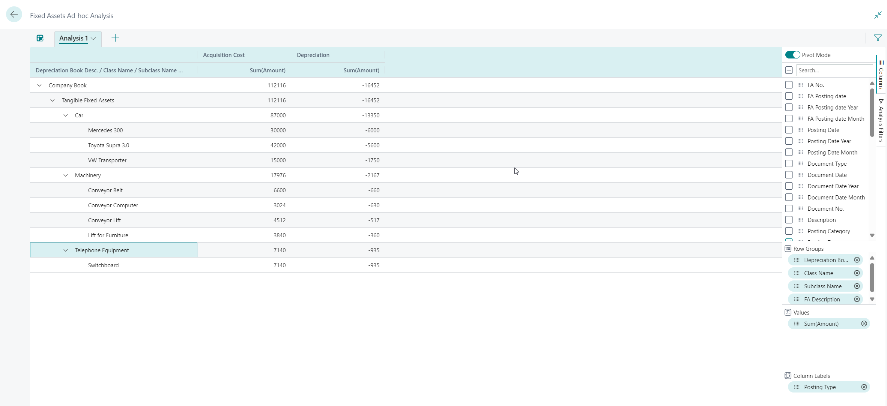

# Analyze data from a query in Business Central (2023 release wave 2)
In the 2023 release wave 2 of Business Central, we introduced the ability to do data analysis on an AL query.

Read more about that here: https://learn.microsoft.com/en-us/dynamics365/business-central/analysis-mode?toc=%2Fdynamics365%2Fbusiness-central%2Fdev-itpro%2Ftoc.json

## Out-of-the-box analysis queries in 2024 release wave 2

In the 2024 release wave 2, we want to ship out-of-the-box queries designed to make ad-hoc analysis easier in sales, purchase, inventory, fixed assets, projects, and service management.

Many of the first examples will be ledger entry tables (such as customer ledger entries, vendor ledger entries, item ledger entries, fixed assets ledger entries, project ledger entries) joined to relevant tables (typically the tables where a code field on the ledger can be joined to) where additional fields can make enrich the analysis scenarios that a user would typically do on the ledger entry list page. 

## Whats in this repo?

This repo hold AL code for these analysis queries:
* Fixed Assets Ad-hoc Analysis

### Fixed Assets Ad-hoc Analysis

The *Fixed Assets Ad-hoc Analysis* query joins data from *fixed assets ledger entries* to relevant master data tables such as *Fixed Asset*, *Fixed Asset Class*, *Fixed Asset Subclass*, *Fixed Asset Location*, and *Depreciation Book*.

When opening the query in the Business Central client, you can slice'n'dice fixed assets data any way you like. 

## How can I test this in my environments?

Initally, you will need to package the queries into a per-tenant extension and then deploy/upload it to an environment for testing. 

The queries are read-only by nature, so there should be no risk in trying them out. 

Please provide feedback here on bugs and possible improvements, and more importantly also usage scenarios "If you want to ABC, then use query DEF - group like this, aggregate like this, pivot like this, call the analysis "GHI".

For examples of usage scenarios across functional areas, see https://learn.microsoft.com/en-gb/dynamics365/business-central/ad-hoc-data-analysis-by-functional-area

# Disclaimer
Microsoft Corporation (“Microsoft”) grants you a nonexclusive, perpetual, royalty-free right to use and modify the software code provided by us for the purposes of illustration  ("Sample Code") and to reproduce and distribute the object code form of the Sample Code, provided that you agree: (i) to not use our name, logo, or trademarks to market your software product in which the Sample Code is embedded; (ii) to include a valid copyright notice on your software product in which the Sample Code is embedded; and (iii) to indemnify, hold harmless, and defend us and our suppliers from and against any claims or lawsuits, whether in an action of contract, tort or otherwise, including attorneys’ fees, that arise or result from the use or distribution of the Sample Code or the use or other dealings in the Sample Code. Unless applicable law gives you more rights, Microsoft reserves all other rights not expressly granted herein, whether by implication, estoppel or otherwise. 

THE SAMPLE CODE IS PROVIDED "AS IS", WITHOUT WARRANTY OF ANY KIND, EXPRESS OR IMPLIED, INCLUDING BUT NOT LIMITED TO THE WARRANTIES OF MERCHANTABILITY, FITNESS FOR A PARTICULAR PURPOSE AND NONINFRINGEMENT. IN NO EVENT SHALL MICROSOFT OR ITS LICENSORS BE LIABLE FOR ANY DIRECT, INDIRECT, INCIDENTAL, SPECIAL, EXEMPLARY, OR CONSEQUENTIAL DAMAGES (INCLUDING, BUT NOT LIMITED TO, PROCUREMENT OF SUBSTITUTE GOODS OR SERVICES; LOSS OF USE, DATA, OR PROFITS; OR BUSINESS INTERRUPTION) HOWEVER CAUSED AND ON ANY THEORY OF LIABILITY, WHETHER IN CONTRACT, STRICT LIABILITY, OR TORT (INCLUDING NEGLIGENCE OR OTHERWISE) ARISING IN ANY WAY OUT OF THE USE OF THE SAMPLE CODE, EVEN IF ADVISED OF THE POSSIBILITY OF SUCH DAMAGE.