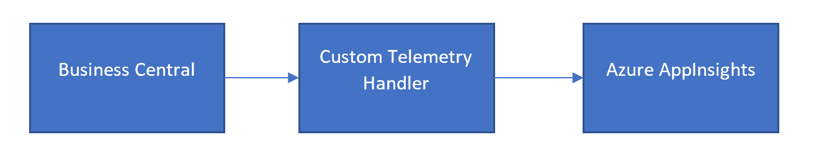

In this folder, you will find information and a code sample that illustrate how you can send telemetry data to a different endpoint than Azure Application Insights to control where data is ingested.


# How do I send telemetry data to a different endpoint than Azure Application Insights?
Azure Application Insights support that you can override the standard data ingestion endpoint provided in the connection string that you can copy from the Azure Application Insights portal. This means that you can send telemetry data to your own component to do post-processing such as filtering or enrichment before ingesting data into your data source of choice (an Azure SQL database, a datalake, Azure Log Analytics, Azure Application Insights, or a third-party data store.)

You override the ingestion endpoint by using the **IngestionEndpoint** key in the Azure Application Insights connection string

Read more in the documentation here: https://learn.microsoft.com/en-us/azure/azure-monitor/app/sdk-connection-string?tabs=net#connection-string-with-explicit-endpoint-overrides


The endpoint protocol specification is described here: https://github.com/MohanGsk/ApplicationInsights-Home/blob/master/EndpointSpecs/ENDPOINT-PROTOCOL.md


The ingestion schema for Azure Application Insights is described here: https://github.com/microsoft/ApplicationInsights-dotnet/tree/master/BASE/Schema/PublicSchema


# How to use an Azure Function as a custom endpoint to filter telemetry events
Business Central currently does not have the ability to restrict telemetry events. If telemetry is enabled for an app or a server, all events are sent. This can lead to information overload and high costs.

## Custom Telemetry Handler
The Azure Function _Custom Telemetry Handler_ is intended to be able to filter telemetry events sent by Business Central.

### Architecture
The _Custom Telemetry Handler_ is placed between Business Central and Azure Application Insights. Business Central sends the events to the _Custom Telemetry Handler_ where the events are captured, filtered and then forwarded to Azure Application Insights.



The _Custom Telemetry Handler_ is an Azure Function, built in .Net 6. It is also possible to turn it into a local web API.

### Installation
The Azure Function can be installed in different ways:
- Directly from Visual Studio or VS Code
- Manually as a .zip file with the Azure CLI or PowerShell
- Through Azure Pipelines

### Configuration in Business Central
The Azure Application Insights connection string that you normally set in a Business Central environment or in the app.json of an extension must be modified to refer to the Azure Function.

The connection string has the following structure:
```
InstrumentationKey=<guid>;IngestionEndpoint=<url>
```

For instance:
```
InstrumentationKey=a498c22a-ef9e-487e-8cca-b1d39580ca0e;IngestionEndpoint=https://westeurope-1.in.applicationinsights.azure.com/
```

To redirect ingestion traffic to the _Custom Telemetry Handler_, simply change the IngestionEndpoint to the URL of the Azure Function app. 

The _Custom Telemetry Handler_ is configured to accept any path, so the URL must be specified without a path. Only the full hostname needs to be set.

**Example:** If the Azure Function has the following URL
https://bccustomtelemetryhandler.azurewebsites.net/

Then the AppInsights Connection String for Business Central should be:
```
InstrumentationKey=<guid>;IngestionEndpoint=https://bccustomtelemetryhandler.azurewebsites.net/
```

Note, only the URL part of the connection string needs to be replaced, the guid remains the same.

### Configuration of the Azure Function app
The settings of the Azure Function must be specified under Configuration, Application settings.

| Institution | Obligated | Description |
| ----------- | --------- | ----------- |
| BCApplicationInsightsConnectionStrings | Yes | One or more full connection string of the AppInsights resource. Multiple values must be separated by a pipe sign (\\|). The received messages are forwarded to the AppInsights resource with the same instrumentation key. If the instrumentation key in the message does not appear in one of the specified connection strings, the event will not be processed. |
| ExcludeEventIdList | new | A list of event IDs to exclude. Multiple values must be separated by a semicolon. The event ids may contain the wildcards * and ? contain. One ? counts as one character and a * for an unlimited number of characters. <br> Examples: <br> LC004? exclude messages LC0040 through LC0049. <br> RT* excludes all messages that start with RT. <br> Note : if this setting is not specified, all messages will be forwarded. |
| ExcludeEventTypes | new | A list of event types to exclude. Multiple values must be separated by a semicolon. Possible values: _AppTraces_ and _AppPageViews_ |
| EnableLogs | new | If set, log messages are generated. These can be monitored in real-time in the Logs screen under Code + Test of the function. Possible values: _true_ or _false_. The default value if not set is _false_. |

### Kudos

The guidance and code sample in this directory was written by Arend-Jan Kauffmann. The Azure function was developed for the partner [Mysolution](https://www.mysolution.com/) in the Netherlands and they agreed to share it with the community (yay!).

# Disclaimer
Microsoft Corporation (“Microsoft”) grants you a nonexclusive, perpetual, royalty-free right to use and modify the software code provided by us for the purposes of illustration  ("Sample Code") and to reproduce and distribute the object code form of the Sample Code, provided that you agree: (i) to not use our name, logo, or trademarks to market your software product in which the Sample Code is embedded; (ii) to include a valid copyright notice on your software product in which the Sample Code is embedded; and (iii) to indemnify, hold harmless, and defend us and our suppliers from and against any claims or lawsuits, whether in an action of contract, tort or otherwise, including attorneys’ fees, that arise or result from the use or distribution of the Sample Code or the use or other dealings in the Sample Code. Unless applicable law gives you more rights, Microsoft reserves all other rights not expressly granted herein, whether by implication, estoppel or otherwise. 

THE SAMPLE CODE IS PROVIDED "AS IS", WITHOUT WARRANTY OF ANY KIND, EXPRESS OR IMPLIED, INCLUDING BUT NOT LIMITED TO THE WARRANTIES OF MERCHANTABILITY, FITNESS FOR A PARTICULAR PURPOSE AND NONINFRINGEMENT. IN NO EVENT SHALL MICROSOFT OR ITS LICENSORS BE LIABLE FOR ANY DIRECT, INDIRECT, INCIDENTAL, SPECIAL, EXEMPLARY, OR CONSEQUENTIAL DAMAGES (INCLUDING, BUT NOT LIMITED TO, PROCUREMENT OF SUBSTITUTE GOODS OR SERVICES; LOSS OF USE, DATA, OR PROFITS; OR BUSINESS INTERRUPTION) HOWEVER CAUSED AND ON ANY THEORY OF LIABILITY, WHETHER IN CONTRACT, STRICT LIABILITY, OR TORT (INCLUDING NEGLIGENCE OR OTHERWISE) ARISING IN ANY WAY OUT OF THE USE OF THE SAMPLE CODE, EVEN IF ADVISED OF THE POSSIBILITY OF SUCH DAMAGE.
