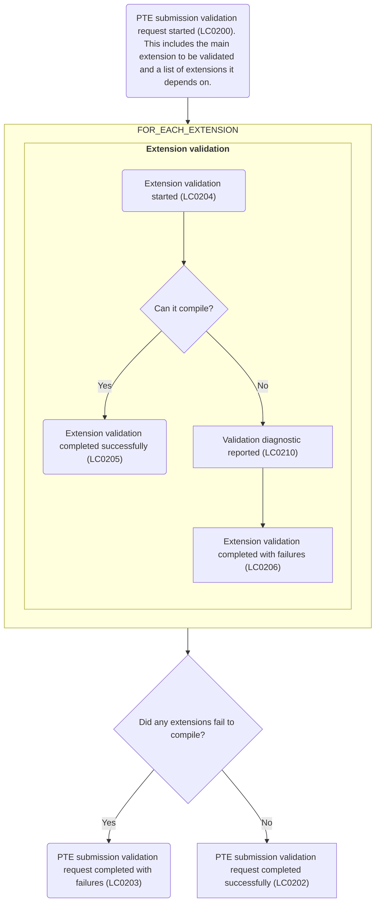

## Per-tenant extension (PTE) validation flow

Validation flow is as follows

1. PTE submission validation request started (LC0200). This includes the main extension to be validated and a list of extensions it depends on.
2. For each extension (main + dependent extensions)
   - Extension validation started (LC0204)
   - Either Extension validation completed successfully (LC0205), or
   - Validation diagnostic reported (LC0210) and then Extension validation completed with failures (LC0206)
3. Depending on validations of all extensions
   - Either PTE submission validation request completed successfully (LC0202), or
   - PTE submission validation request completed with failures (LC0203)

