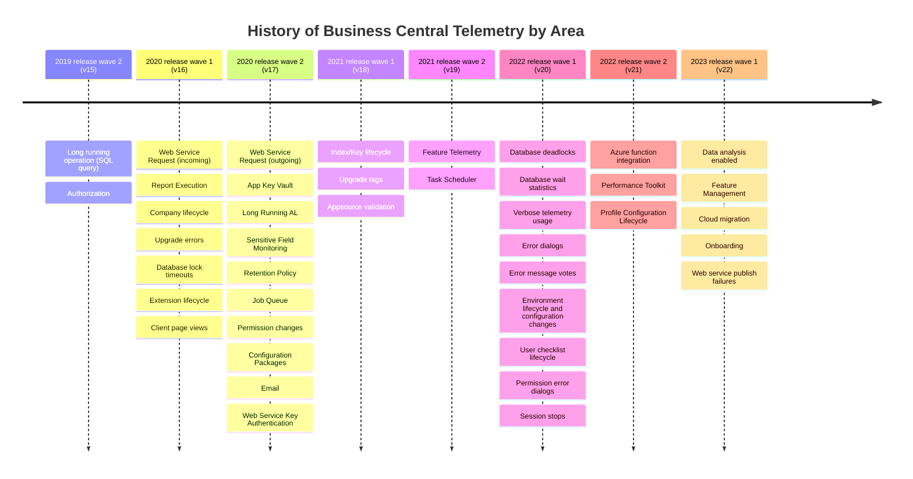

In this folder, you will find samples of Kusto Query Language (KQL) for each type of signal that is sent to Application Insights.

# Where can I use Kusto Queries?
Read more here in docs:
https://learn.microsoft.com/en-us/dynamics365/business-central/dev-itpro/administration/telemetry-analyze-with-kql

# Where can I learn more about KQL?
Read more here in docs:
https://learn.microsoft.com/en-us/dynamics365/business-central/dev-itpro/administration/telemetry-analyze-with-kql

# Which tools can I use (KQL editors and clients)?
Read more here in docs:
https://learn.microsoft.com/en-us/dynamics365/business-central/dev-itpro/administration/telemetry-analyze-with-kql

# What signal is available in which version?
Signal is added incrementally to Business Central. In this table you can see in which version or update a class of signal was added/modified:

|Signal | Emitted from version, update | Documentation (use CTRL+click to open in a new tab) |
| ------ | ------ | ------ |
| Long running operation (SQL query) | 2019 release wave 2 (15.0) | https://learn.microsoft.com/en-us/dynamics365/business-central/dev-itpro/administration/telemetry-long-running-sql-query-trace |
| Authorization | 2019 release wave 2 (15.2) | https://learn.microsoft.com/en-us/dynamics365/business-central/dev-itpro/administration/telemetry-authorization-trace |
| Web Service Request | 2020 release wave 1 (16.0) | https://learn.microsoft.com/en-us/dynamics365/business-central/dev-itpro/administration/telemetry-webservices-trace |
| Report Execution | 2020 release wave 1 (16.0) | https://learn.microsoft.com/en-us/dynamics365/business-central/dev-itpro/administration/telemetry-reports-trace | 
| Open Company timing | 2020 release wave 1 (16.0) | https://learn.microsoft.com/en-us/dynamics365/business-central/dev-itpro/administration/telemetry-authorization-trace |
| Company lifecycle (create/copy/delete) | 2020 release wave 1 (16.1) | https://learn.microsoft.com/en-us/dynamics365/business-central/dev-itpro/administration/telemetry-company-lifecycle-trace |
| Upgrade errors due to exceptions in upgrade code | 2020 release wave 1 (16.2) | https://learn.microsoft.com/en-us/dynamics365/business-central/dev-itpro/administration/telemetry-extension-update-trace |
| Database lock timeouts | 2020 release wave 1 (16.2, later backported to 16.0 and 16.1 in SaaS) | https://learn.microsoft.com/en-us/dynamics365/business-central/dev-itpro/administration/telemetry-database-locks-trace |
| Extension lifecycle | 2020 release wave 1 (16.3) | https://learn.microsoft.com/en-us/dynamics365/business-central/dev-itpro/administration/telemetry-extension-lifecycle-trace |
| Client page views | 2020 release wave 1 (16.3) | https://learn.microsoft.com/en-us/dynamics365/business-central/dev-itpro/administration/telemetry-page-view-trace |
| HTTP status and HTTP headers added to Web Service Request signal | 2020 release wave 1 (16.3) | https://learn.microsoft.com/en-us/dynamics365/business-central/dev-itpro/administration/telemetry-webservices-trace |
| AL HttpClient signal (outgoing web service calls) | 2020 release wave 2 (17.0) | https://learn.microsoft.com/en-us/dynamics365/business-central/dev-itpro/administration/telemetry-webservices-outgoing-trace |
| App Key Vault Secret Acquisitions | 2020 release wave 2 (17.0) | https://learn.microsoft.com/en-us/dynamics365/business-central/dev-itpro/administration/telemetry-extension-key-vault-trace  |
| Long Running AL execution | 2020 release wave 2 (17.1) | https://learn.microsoft.com/en-us/dynamics365/business-central/dev-itpro/administration/telemetry-al-method-trace |
| Extension lifecycle for app telemetry | 2020 release wave 2 (17.1) | https://learn.microsoft.com/en-us/dynamics365/business-central/dev-itpro/administration/telemetry-extension-lifecycle-trace |
| Sensitive Field Monitoring | 2020 release wave 2 (17.1) | https://learn.microsoft.com/en-us/dynamics365/business-central/dev-itpro/administration/telemetry-field-monitoring-trace |
| Retention Policy | 2020 release wave 2 (17.1) | https://learn.microsoft.com/en-us/dynamics365/business-central/dev-itpro/administration/telemetry-retention-policy-trace |
| Job Queue | 2020 release wave 2 (17.2) | https://learn.microsoft.com/en-us/dynamics365/business-central/dev-itpro/administration/telemetry-job-queue-lifecycle-trace |
| Permissions | 2020 release wave 2 (17.2) | https://learn.microsoft.com/en-us/dynamics365/business-central/dev-itpro/administration/telemetry-permission-changes-trace |
| Configuration Package | 2020 release wave 2 (17.2) | https://learn.microsoft.com/en-us/dynamics365/business-central/dev-itpro/administration/telemetry-configuration-package-trace |
| Email | 2020 release wave 2 (17.2) | https://learn.microsoft.com/en-us/dynamics365/business-central/dev-itpro/administration/telemetry-email-trace |
| Posting | 2020 release wave 2 (17.2) | pending link to docs, sample KQL code updated |
| Web Service Key Authentication | 2020 release wave 2 (17.3) | https://learn.microsoft.com/en-us/dynamics365/business-central/dev-itpro/administration/telemetry-webservices-access-key-trace |
| Reporting engine in reporting signal | 2020 release wave 2 (17.3) | https://learn.microsoft.com/en-us/dynamics365/business-central/dev-itpro/administration/telemetry-reports-trace |
| HTTP authorization | 2020 release wave 2 (17.3) | https://learn.microsoft.com/en-us/dynamics365/business-central/dev-itpro/administration/telemetry-webservices-trace |
| Client page views (for ISVs) | 2021 release wave 1 (18.0) | https://learn.microsoft.com/en-us/dynamics365/business-central/dev-itpro/administration/telemetry-page-view-trace |
| Index/Key lifecycle | 2021 release wave 1 (18.0) | https://learn.microsoft.com/en-us/dynamics365/business-central/dev-itpro/administration/telemetry-table-index-trace#enabled |
| Sensitive Field Monitoring (field added/removed) | 2021 release wave 1 (18.0) | https://learn.microsoft.com/en-us/dynamics365/business-central/dev-itpro/administration/telemetry-field-monitoring-trace |
| Upgrade tag signal | 2021 release wave 1 (18.0) | https://learn.microsoft.com/en-us/dynamics365/business-central/dev-itpro/administration/telemetry-extension-update-trace |
| Extension lifecycle (dependent extensions) | 2021 release wave 1 (18.1) | https://learn.microsoft.com/en-us/dynamics365/business-central/dev-itpro/administration/telemetry-extension-lifecycle-trace |
| Appsource validation | 2021 release wave 1 (18.4) | https://learn.microsoft.com/en-us/dynamics365/business-central/dev-itpro/administration/telemetry-appsource-submission-validation-trace |
| Use of read scale-out in reporting | 2021 release wave 2 (19.1) | https://learn.microsoft.com/en-us/dynamics365/business-central/dev-itpro/administration/telemetry-reports-trace |
| Feature Telemetry | 2021 release wave 2 (19.1) | https://learn.microsoft.com/en-us/dynamics365/business-central/dev-itpro/administration/telemetry-feature-telemetry |
| Task Scheduler Telemetry | 2021 release wave 2 (19.1) | https://learn.microsoft.com/en-us/dynamics365/business-central/dev-itpro/administration/telemetry-task-scheduler-trace |
| Database deadlocks | 2022 release wave 1 (20.0) | https://learn.microsoft.com/en-us/dynamics365/business-central/dev-itpro/administration/telemetry-database-deadlocks-trace |
| Database wait statistics | 2022 release wave 1 (20.0) | https://learn.microsoft.com/en-us/dynamics365/business-central/dev-itpro/administration/telemetry-database-wait-statistics-trace |
| Verbose telemetry enabled | 2022 release wave 1 (20.0) | KQL sample ready, https://learn.microsoft.com/en-us/dynamics365-release-plan/2022wave1/smb/dynamics365-business-central/telemetry-action-enabling-detailed-telemetry-logged-telemetry |
| General error dialogs | 2022 release wave 1 (20.0) |  https://learn.microsoft.com/en-us/dynamics365/business-central/dev-itpro/administration/telemetry-error-method-trace |
| Error message votes | 2022 release wave 1 (20.0) | https://learn.microsoft.com/en-us/dynamics365/business-central/dev-itpro/administration/telemetry-error-message-voting-trace |
| Report action and document type in reporting | 2022 release wave 1 (20.0) | https://learn.microsoft.com/en-us/dynamics365/business-central/dev-itpro/administration/telemetry-reports-trace |
| Environment lifecycle and configuration changes| 2022 release wave 1 (20.0) | https://learn.microsoft.com/en-us/dynamics365/business-central/dev-itpro/administration/telemetry-environment-lifecycle-trace |
| User checklist lifecycle | 2022 release wave 1 (20.0) | https://learn.microsoft.com/en-us/dynamics365/business-central/dev-itpro/administration/telemetry-user-checklist-trace |
| Permission error dialogs | 2022 release wave 1 (20.1) | https://learn.microsoft.com/en-us/dynamics365/business-central/dev-itpro/administration/telemetry-permission-error-trace |
| Session stops | 2022 release wave 1 (20.0) | (pending link to release note) |
| Dependency cycle discovered in permission sets | 2022 release wave 1 (20.2) | KQL sample ready, (pending link to release note) |
| Client page views (for on-premises) | 2022 release wave 2 (21.0) | https://learn.microsoft.com/en-us/dynamics365/business-central/dev-itpro/administration/telemetry-page-view-trace |
| Azure function integration | 2022 release wave 2 (21.0) | (pending link to docs) |
| Performance Toolkit | 2022 release wave 2 (21.3) | KQL sample ready, pending link to docs |

# Business Central Telemetry Timeline

# Disclaimer
Microsoft Corporation (“Microsoft”) grants you a nonexclusive, perpetual, royalty-free right to use and modify the software code provided by us for the purposes of illustration  ("Sample Code") and to reproduce and distribute the object code form of the Sample Code, provided that you agree: (i) to not use our name, logo, or trademarks to market your software product in which the Sample Code is embedded; (ii) to include a valid copyright notice on your software product in which the Sample Code is embedded; and (iii) to indemnify, hold harmless, and defend us and our suppliers from and against any claims or lawsuits, whether in an action of contract, tort or otherwise, including attorneys’ fees, that arise or result from the use or distribution of the Sample Code or the use or other dealings in the Sample Code. Unless applicable law gives you more rights, Microsoft reserves all other rights not expressly granted herein, whether by implication, estoppel or otherwise. 

THE SAMPLE CODE IS PROVIDED "AS IS", WITHOUT WARRANTY OF ANY KIND, EXPRESS OR IMPLIED, INCLUDING BUT NOT LIMITED TO THE WARRANTIES OF MERCHANTABILITY, FITNESS FOR A PARTICULAR PURPOSE AND NONINFRINGEMENT. IN NO EVENT SHALL MICROSOFT OR ITS LICENSORS BE LIABLE FOR ANY DIRECT, INDIRECT, INCIDENTAL, SPECIAL, EXEMPLARY, OR CONSEQUENTIAL DAMAGES (INCLUDING, BUT NOT LIMITED TO, PROCUREMENT OF SUBSTITUTE GOODS OR SERVICES; LOSS OF USE, DATA, OR PROFITS; OR BUSINESS INTERRUPTION) HOWEVER CAUSED AND ON ANY THEORY OF LIABILITY, WHETHER IN CONTRACT, STRICT LIABILITY, OR TORT (INCLUDING NEGLIGENCE OR OTHERWISE) ARISING IN ANY WAY OUT OF THE USE OF THE SAMPLE CODE, EVEN IF ADVISED OF THE POSSIBILITY OF SUCH DAMAGE.
