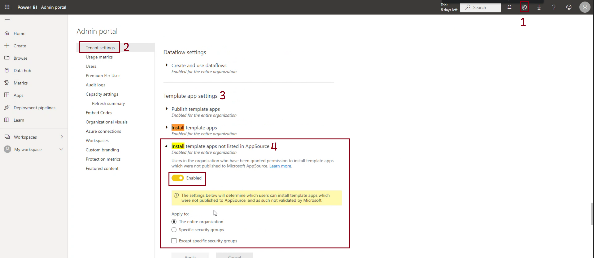
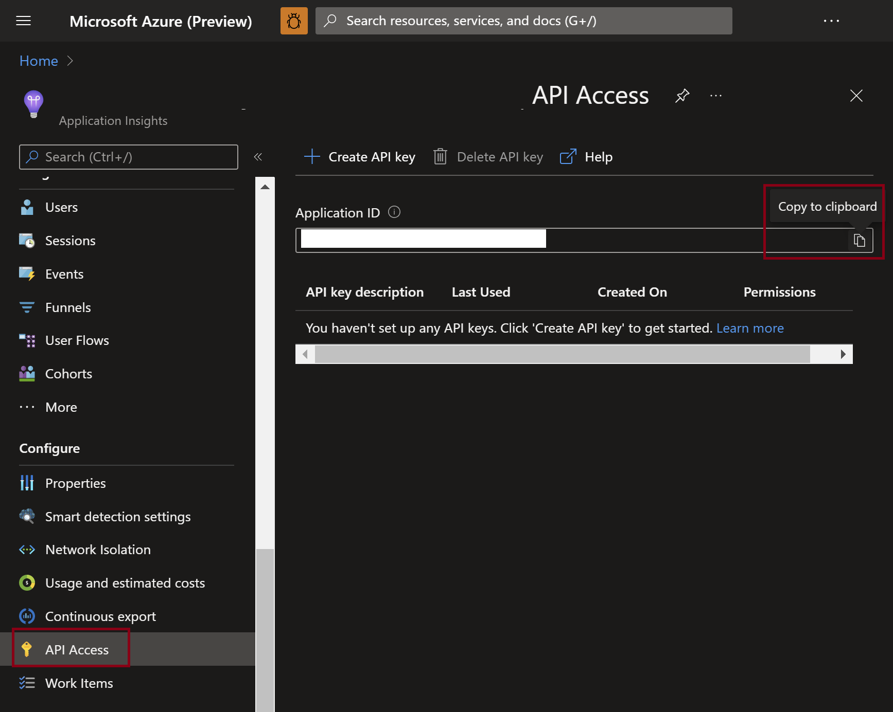
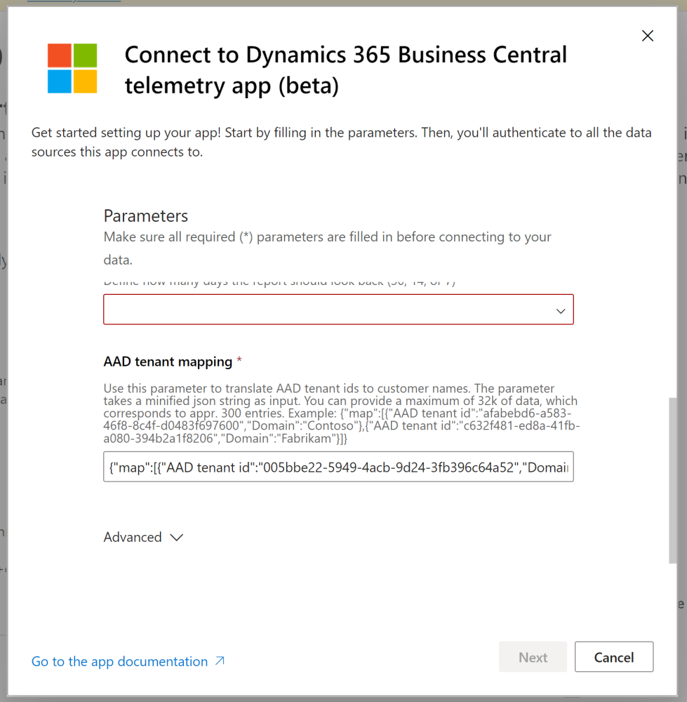
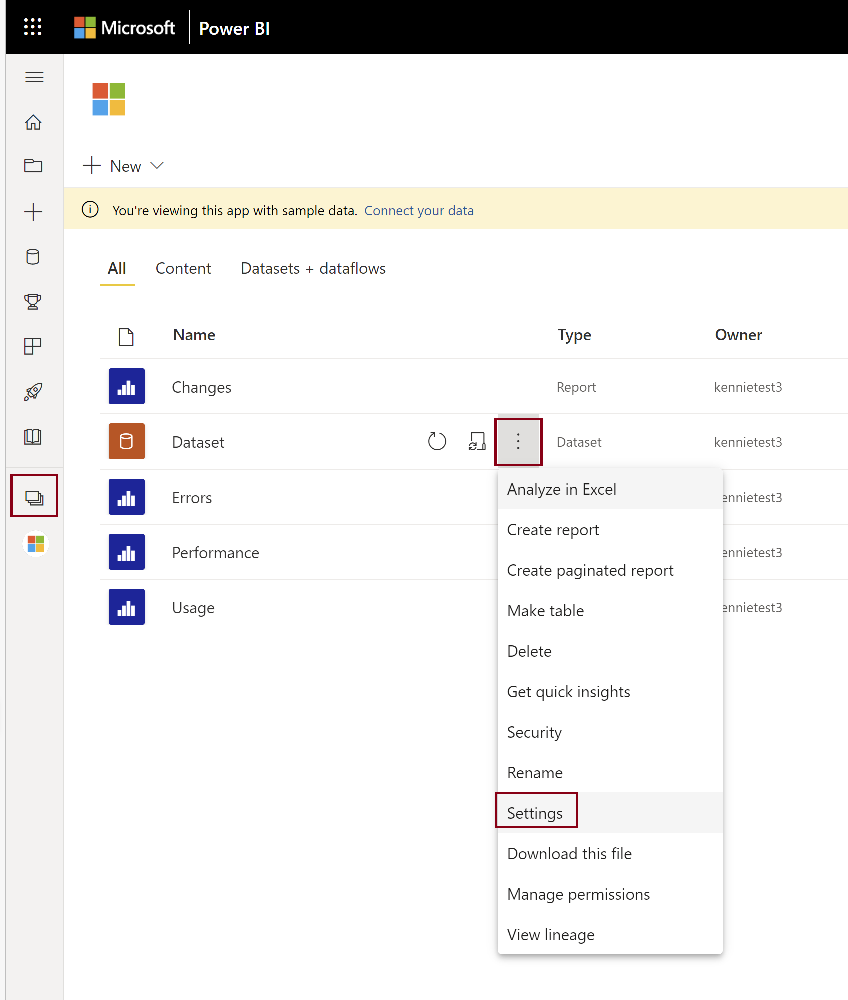
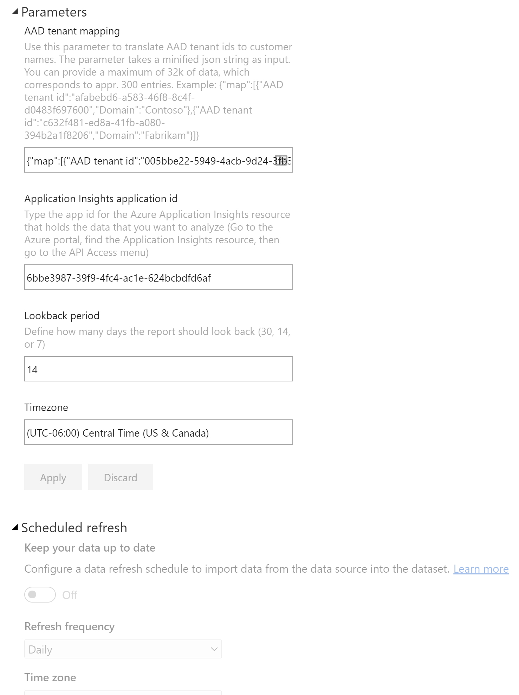

In this folder, you will find the source code for the PowerBI app report on Dynamics 365 Business Central telemetry in Azure Application Insights. 

# Power BI prerequisites
If you choose to install a version of the app that is not on appsource, you need to allow it to be installed. 

Go to the PBI admin portal.
Under Tenant settings, Go to Template App settings. Here you can enable template apps that are not listed on app source.
Remember to set the setting back after installing the beta version of the app.



# Getting the report
Use this link to install/update the template app from Appsource: https://aka.ms/bctelemetryreport 

Use this link to install/update the current development version template app (if you want to test bleeding edge): https://aka.ms/bctelemetryreportbeta 

The app comes with sample data.

# Connecting to Azure Application Insights
To connect the app to an Azure Application Insights resource, you need one thing: the Application Insights app id (get it from the API Access menu in the Azure Application Insights portal). 




NB! If you get this error "The OAuth authentication method isn't supported for this data source", then please check if the application id is correct. This usually is the root cause for that error.

# Configuring the (AAD Tenant id, customer) mapping
You define the (AAD tenant id, domain name) mapping in the app parameter _AAD tenant mapping_, that you set when you configure the app to read data from your Azure Application Insights resource (you can also change parameter values after configuring the app).



The mapping must be uploaded as a (minified) json file with the following format:
```
{
    "map":
    [
        { "AAD tenant id":"005bbe22-5949-4acb-9d24-3fb396c64a52" , "Domain":"Contoso 1" },
        { "AAD tenant id":"0140d8e7-ef60-4cc3-9a6b-b89042b3ea1f" , "Domain":"Contoso 2" }        
    ]
}
```

(see examples of the json format and the corresponding minified file here: [Tenant mapping examples](./tenant-mapping))

A minified json file is just a json file where all newlines have been removed. This is needed for Power BI to be able to read the data.

You can also use Powershell to produce the json input. This repository has a script [Get-AADMapping.ps1](./tenant-mapping/Get-AADMapping.ps1) that makes this easy.

# Changing parameters after initial configuration
Once you completed the setup of the app, how can you change parameters such as _Application Insights application id_ or _Lookback period_?

You can change configuration settings by going to the Power BI portal, open the workspace for the installed app, go to settings, and then Parameters.





# Sharing the app with coworkers and others
Once installed, it is possible to share the app with coworkers and others (e.g. customers). 

Do this:
1. Share the Power BI workspace with the person. This will make the app appear under _Workspaces_ in their Power BI portal.
2. Provide the url to the person and ask them to open it in a browser. This will make the app appear under _Apps_ in their Power BI portal.

Read more here [Share Power BI reports and dashboards with coworkers and others](https://learn.microsoft.com/en-us/power-bi/collaborate-share/service-share-dashboards)

# Using the app
Once installed and configured, how can you use the different reports in the app? We identified four different personas as described in this table:

| Persona | Description |
| ------- | ----------- | 
| Account Manager | Person working with sales to new and existing customers. | 
| Product Owner | Person responsible for an extension/app. |
| Project manager | Person responsible for the implementation of a Business Central environment for a customer. |
| Supporter | Person working with triage, investigation, and mitigation of customer issues. | 


For each persona, in the table below you can find examples of scenarios, where the app might be of help.

| Persona | Scenario | How the Power BI app can help |
| ------- | ---------| -------------------- |
| Account Manager | Prospective customer have concerns that SaaS solutions are a blackbox.| The Power BI app comes with sample data when you install it. If the questions pops up, show them what kind of insights the app offers and that they can get access to the app if they find it useful. Focus on the Usage report unless the customer wants to see some of the more technical reports (Errors, Performance, or Administration). If the customer has a representative from IT, then show them the Administration report. |
| Account Manager | Plan new activities with existing customer. | Most of the pages in the Usage report can help drive conversations with customer on how to get more value with their Busienss Central investment. E.g. look at the pages _Page views_, _Reports_, and _Feature Usage_ to check if the customer is using the functionality that they set out to when starting the project. Lack of data means lack of usage.  |
| Account Manager | Get existing customers excited about reporting with Excel layouts. | Go to the Usage report and open the _Reports_ page to check if the customer is using the Excel layouts (you can filter on this). If they do so, great. Maybe you can follow up with training or PoCs on Power Query and maybe also start working differently with the customer on reporting. With Excel layouts, some reports only need a developer for the AL report object, then the customer/end users can do most/all of the layout in Excel. If the customer is not using Excel layouts yet, maybe show them the power of Business Central reports with Excel layouts and show them a bit of Power Query in Excel. |
| Product Owner | Which features in our app(s)/per-tenant extensions are being used and how often? | Make sure that apps/extensions have enabled telemetry in the app manifest (app.json). Use the AL system module _Feature Telemetry_ to instrument your app with usage telemetry. Consider having separate Power BI apps for apps/extensions and environments. Once you have data in telemetry, then go to the Usage report. Visit the _Feature Usage_ page. You can filter the results down to publisher/app. |
| Project manager | We need a way to track progress on User Acceptance Testing (UAT) efforts | Go to the Usage report. Visit the pages _Page views_, _Reports_, and _Feature Usage_ to see what users are doing in Business Central. Consider sharing the app with the customer. Then they can do the follow-ups internally based on data. |
| Project manager | We want a smooth go-live for the customer. | Use the Error dashbord in the Error report to drive errors to zero before go-live. Monitor the dashboard in the first weeks after go-live. Consider sharing the app with the customer. Then status meetings and follow-ups can be based on data. |
| Project manager | Only for SaaS: We want to check if the customer will get broken integrations when upgrading to version 20.0/21.0 | Use the _Deprecated features_ page in the Usage report to see if the customer is still using web service keys (basic auth) for integrations. If you see any data here, then work on a mitigation plan with the customer to move integrations to OAuth.|
| Supporter | Customer calls and says that "something changed since Friday last week." | Go to the Administration report, find the _All changes_ page and filter to a period in time that overlaps "Friday last week." Depending on what the customer reported that changed (data, UI, business logic, performance, stability, ...), you might get lucky that one of the lifecycle events for environments, extensions, companies, or indexes can explain the root cause of the changed behavior. You can now dig further into the issue with the app, with KQL queries, or simply by reaching out to the code owner. |
| Supporter | Customer complains that some users cannot login. | Go to the Error report, investigate the _Login Errors_ page. |
| Supporter | Customer complains that users gets lots of errors when using the system. | Go to the Error report, investigate pages _Error Dialogs_, _Permission Errors_, and _Feature Errors_. You can filter pages by Extension Publisher to learn in which code path the error is coming from. |
| Supporter | Customer experience a lot of locking issues. | Use the _Database Deadlocks_ page in the Error report to examine deadlocks. Use the _Database Lock Timeouts_ page in the Performance report to examine lock timeouts. Use the _Long running SQL queries_ page (filter SQL Statement to "UPDLOCK") to investigate SQL queries that take locks. | 


# Learn more
Microsoft MVP Yun Zhu wrote this fantastic blog post where he walks you through the installation and configuration process end-to-end in great detail:  https://yzhums.com/24811/

# Disclaimer
Microsoft Corporation (“Microsoft”) grants you a nonexclusive, perpetual, royalty-free right to use and modify the software code provided by us for the purposes of illustration  ("Sample Code") and to reproduce and distribute the object code form of the Sample Code, provided that you agree: (i) to not use our name, logo, or trademarks to market your software product in which the Sample Code is embedded; (ii) to include a valid copyright notice on your software product in which the Sample Code is embedded; and (iii) to indemnify, hold harmless, and defend us and our suppliers from and against any claims or lawsuits, whether in an action of contract, tort or otherwise, including attorneys’ fees, that arise or result from the use or distribution of the Sample Code or the use or other dealings in the Sample Code. Unless applicable law gives you more rights, Microsoft reserves all other rights not expressly granted herein, whether by implication, estoppel or otherwise. 

THE SAMPLE CODE IS PROVIDED "AS IS", WITHOUT WARRANTY OF ANY KIND, EXPRESS OR IMPLIED, INCLUDING BUT NOT LIMITED TO THE WARRANTIES OF MERCHANTABILITY, FITNESS FOR A PARTICULAR PURPOSE AND NONINFRINGEMENT. IN NO EVENT SHALL MICROSOFT OR ITS LICENSORS BE LIABLE FOR ANY DIRECT, INDIRECT, INCIDENTAL, SPECIAL, EXEMPLARY, OR CONSEQUENTIAL DAMAGES (INCLUDING, BUT NOT LIMITED TO, PROCUREMENT OF SUBSTITUTE GOODS OR SERVICES; LOSS OF USE, DATA, OR PROFITS; OR BUSINESS INTERRUPTION) HOWEVER CAUSED AND ON ANY THEORY OF LIABILITY, WHETHER IN CONTRACT, STRICT LIABILITY, OR TORT (INCLUDING NEGLIGENCE OR OTHERWISE) ARISING IN ANY WAY OUT OF THE USE OF THE SAMPLE CODE, EVEN IF ADVISED OF THE POSSIBILITY OF SUCH DAMAGE.
