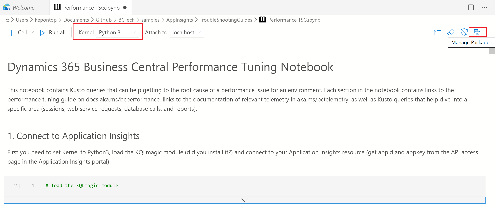
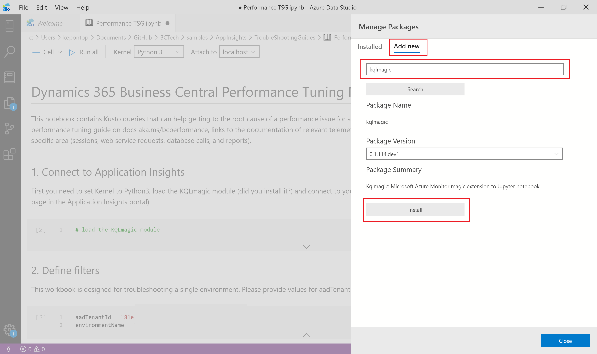
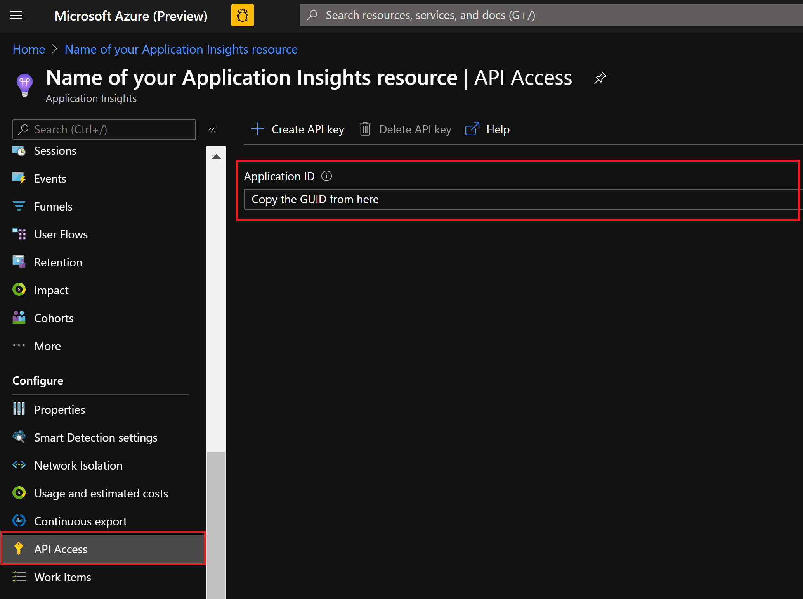
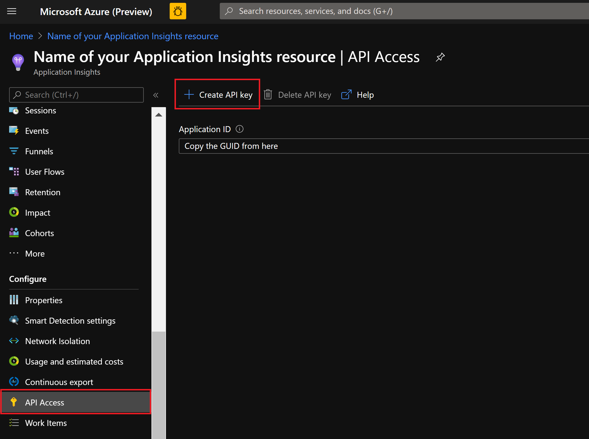
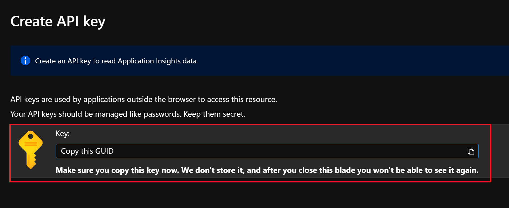

Telemetry in Azure Application Insights is a very powerful tool to investigate issues after they have occurred (where you cannot attach a debugger to troubleshoot the issue). Having a good arsenal of Kusto query language (KQL) scripts can be very handy, but sometimes executing KQL statements one by one in the Azure Application Insights portal can be tedious. This is where notebooks come in handy, and in this part of the samples repository we show you how to get started using Jupyter notebooks in Azure Data Studio. With the Kqlmagic module, you can now combine KQL with Python to create powerful interactive trouble shooting guides (TSGs).

# Which Jupyter Notebook Trouble Shooting Guides (TSGs) are available?
This repository contains Jupyter Notebook TSGs for 
* Investigating performance issues (overview analysis)
* Investigating performance issues in your code (analysis outside Microsoft code base)
* Investigating web service issues (throttling, performance, bad endpoints)
* Investigating Microsoft connector (PowerBI, PowerApps, LogicApps, or Flow) issues (throttling, performance, bad endpoints)
* Investigating data-related issues (long running queries, database locks, report performance)
* Investigating login issues (authentication and authorization flows)
* Investigating if environments are using deprecated web service protocols
* Investigating lifecycle issues with extensions (compile, synchronize, publish, install, update, un-install, un-publish)
* Investigating results for the technical validation of AppSource submissions

| TSG | Description |
| ----------- | ----------- |
| Login-issues-TSG.ipynb | Use this TSG for cases related to login issues, such as if one or more users cannot login (check failure reasons in authorization checks before/after onCompanyOpen trigger, to troubleshoot if a login issue is related to firewall/network issues at the customer site (check if web service requests get in but client requests are not present), or to check if logins are successful again after an incident |
| Performance-overview-TSG.ipynb | Use this TSG to analyze performance problems. The TSG runs through most of common root causes for perf issues and has links to the performance tuning guide so that partners can fix their code to be more performant
| Web-services-TSG-version.ipynb | Use this TSG to analyze issues with web services: Is the environments being throttled? Analyze endpoint performance. Analyze failure reasons (HTTP codes 401, 404, 408, 426) |
| Microsoft-Connectors-TSG-version.ipynb | Use this TSG to analyze issues with Microsoft connectors (PowerBI, PowerApps, LogicApps, or Flow): Is the environments being throttled? Analyze endpoint performance. Analyze failure reasons (HTTP codes 400, 401, 404, 408, 426) |
| Performance-partner-code-TSG.ipynb | Use this TSG to analyze performance problems in partner code. The TSG filters telemetry on object ids outside the ranges used for the base app and localizations (the code written by Microsoft) | 
| Data-related-TSG.ipynb | Use this TSG to analyze data-related issues: Long running queries, database locks, reports that runs many sql statements | 
| Extensions-TSG.ipynb | Use this TSG to analyze issues with the extension lifecycle (compile, synchronize, publish, install, update, un-install, un-publish). You can set filters on AAD tenant id, environment name, and extension id to troubleshoot all environments in a AAD tenant id, a single environment, single extensions, or any other combination of the three |
| AppSource-Submission-TSG.ipynb | Use this TSG to analyze the results of the technical validation of AppSource submissions. You can see whether your submission passed the technical validation, which errors were reported, which countries and releases were validated, but also which baselines were used for breaking change validation |


# What is Azure Data Studio?
Azure Data Studio is a cross-platform database tool for data professionals using the Microsoft family of on-premises and cloud data platforms on Windows, MacOS, and Linux. Azure Data Studio offers a modern editor experience with IntelliSense, code snippets, source control integration, and an integrated terminal. It's engineered with the data platform user in mind, with built-in charting of query result sets and customizable dashboards. 

# What is Kqlmagic?
Kqlmagic is a command that extends the capabilities of the Python kernel in Azure Data Studio notebooks. You can combine Python and Kusto query language (KQL) to query and visualize data using rich Plot.ly library integrated with render commands. Kqlmagic brings you the benefit of notebooks, data analysis, and rich Python capabilities all in the same location. Supported data sources with Kqlmagic include Azure Data Explorer, Application Insights, and Azure Monitor logs.

# How do I learni more about Azure Data Studio?
Here are some resources for you to get started on Azure Data Studio. Use CTRL+click to open them in a new browser tab/window.
* [How to Start with Microsoft Azure Data Explorer (Pluralsight course, requires subscription)](https://app.pluralsight.com/library/courses/microsoft-azure-data-explorer-starting/table-of-contents)
* [Exploring Data in Microsoft Azure Using Kusto Query Language and Azure Data Explorer (Pluralsight course, requires subscription)](https://app.pluralsight.com/library/courses/microsoft-azure-data-exploring/table-of-contents)

# How do I install and configure Azure Data Studio?
1. First, you need to download and install Azure Data Studio. See how to here: https://docs.microsoft.com/en-us/sql/azure-data-studio/download-azure-data-studio
2. Now create a new notebook (needed for steps 3+4 below) and choose the Python3 kernel, see https://docs.microsoft.com/en-us/sql/azure-data-studio/notebooks-tutorial-python-kernel#create-a-notebook
3. Install a Python kernel for Azure Data Studio (let Azure Data Studio do it for you or reuse an existing Python installation). See how to here: https://docs.microsoft.com/en-us/sql/azure-data-studio/notebooks-tutorial-python-kernel#change-the-python-kernel

# How do I install and set up Kqlmagic?
To install and set up Kqlmagic, open a python notebook. Click the "Manage Packages" icon on the right of the notebook:



Under the "Add new" tab, type "kqlmagic" and click Install (we generally recommend people to install non “dev” version of Kqlmagic):


For some users, the KQL Magic installation fails with an error. Please try these two steps 

Step 1:
```python
import sys
!{sys.executable} -m pip install --upgrade pip
```

Step 2:
```python
import sys
!{sys.executable} -m pip install Kqlmagic --no-cache-dir --upgrade
```
in a Python code cell (just create a new notebook and change to the Python Kernel).

# I have installed the tools. Now what?
You are now ready to run some notebooks. Either write your own or download some from this repository.

# How do I connect a notebook to an Azure Application Insights resource?
You need two GUIDs to be able to read data from your Application Insights resource: 
1. Application ID
2. an API key

Get the Application ID from the *API Access* page in the Application Insights portal:


Then generate an API key 





You can now use the Application ID and API key to connect to and read from the Application Insights resource from the notebook. 

See more here: https://docs.microsoft.com/en-us/sql/azure-data-studio/notebooks-kqlmagic#kqlmagic-with-application-insights


# Disclaimer
Microsoft Corporation (“Microsoft”) grants you a nonexclusive, perpetual, royalty-free right to use and modify the software code provided by us for the purposes of illustration  ("Sample Code") and to reproduce and distribute the object code form of the Sample Code, provided that you agree: (i) to not use our name, logo, or trademarks to market your software product in which the Sample Code is embedded; (ii) to include a valid copyright notice on your software product in which the Sample Code is embedded; and (iii) to indemnify, hold harmless, and defend us and our suppliers from and against any claims or lawsuits, whether in an action of contract, tort or otherwise, including attorneys’ fees, that arise or result from the use or distribution of the Sample Code or the use or other dealings in the Sample Code. Unless applicable law gives you more rights, Microsoft reserves all other rights not expressly granted herein, whether by implication, estoppel or otherwise. 

THE SAMPLE CODE IS PROVIDED "AS IS", WITHOUT WARRANTY OF ANY KIND, EXPRESS OR IMPLIED, INCLUDING BUT NOT LIMITED TO THE WARRANTIES OF MERCHANTABILITY, FITNESS FOR A PARTICULAR PURPOSE AND NONINFRINGEMENT. IN NO EVENT SHALL MICROSOFT OR ITS LICENSORS BE LIABLE FOR ANY DIRECT, INDIRECT, INCIDENTAL, SPECIAL, EXEMPLARY, OR CONSEQUENTIAL DAMAGES (INCLUDING, BUT NOT LIMITED TO, PROCUREMENT OF SUBSTITUTE GOODS OR SERVICES; LOSS OF USE, DATA, OR PROFITS; OR BUSINESS INTERRUPTION) HOWEVER CAUSED AND ON ANY THEORY OF LIABILITY, WHETHER IN CONTRACT, STRICT LIABILITY, OR TORT (INCLUDING NEGLIGENCE OR OTHERWISE) ARISING IN ANY WAY OUT OF THE USE OF THE SAMPLE CODE, EVEN IF ADVISED OF THE POSSIBILITY OF SUCH DAMAGE.
