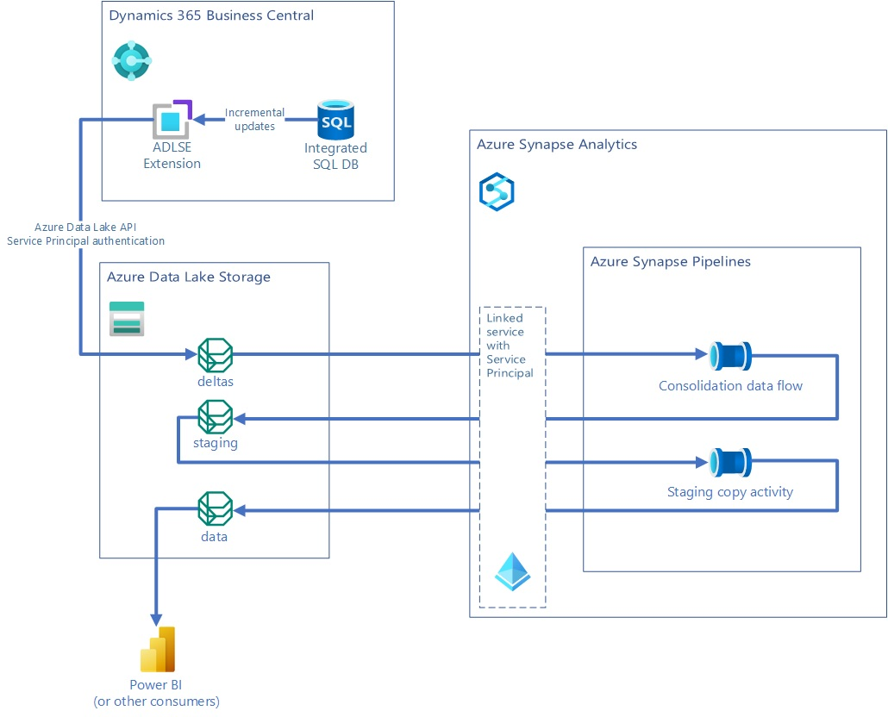

# Exporting data to Azure Data Lake Gen 2

## Introduction
The **bc2adls** tool is used to export data from [Dynamics 365 Business Central](https://dynamics.microsoft.com/en-us/business-central/overview/) (BC) to [Azure Data Lake Storage](https://learn.microsoft.com/en-us/azure/storage/blobs/data-lake-storage-introduction) and expose it in the [CDM folder](https://learn.microsoft.com/en-us/common-data-model/data-lake) format. The components involved are the following,
- the **[businessCentral](/tree/main/businessCentral/)** folder holds a [BC extension](https://learn.microsoft.com/en-gb/dynamics365/business-central/ui-extensions) called `Azure Data Lake Storage Export` (ADLSE) which enables export of incremental data updates to a container on the data lake. The increments are stored in the CDM folder format described by the `deltas.cdm.manifest.json manifest`.
- the **[synapse](/tree/main/synapse/)** folder holds the templates needed to create an [Azure Synapse](https://azure.microsoft.com/en-gb/services/synapse-analytics/) pipeline that consolidates the increments into a final `data` CDM folder.

The following diagram illustrates the flow of data through a usage scenario- the main points being,
- Incremental update data from BC is moved to Azure Data Lake Storage through the ADLSE extension into the `deltas` folder.
- Triggering the Synapse pipeline(s) consolidates the increments into the data folder.
- The data is now ready for consumption by analytics apps like Power BI,
	- via the `data.cdm.manifest.json` manifest file, or
	- via the raw CSV files for each individual entity inside the `data` folder
	

**Learn more at [aka.ms/bc2adls](https://aka.ms/bc2adls).**
