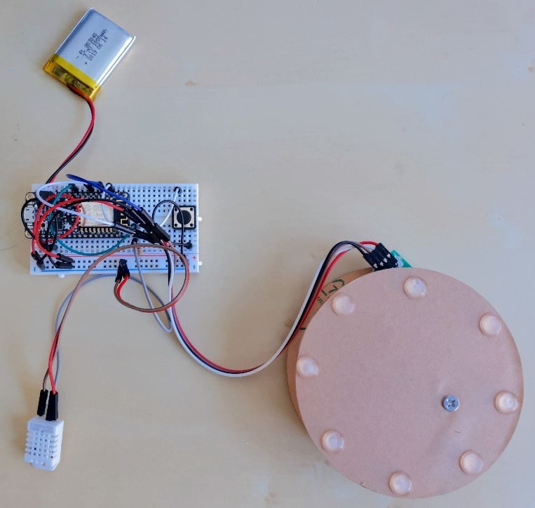
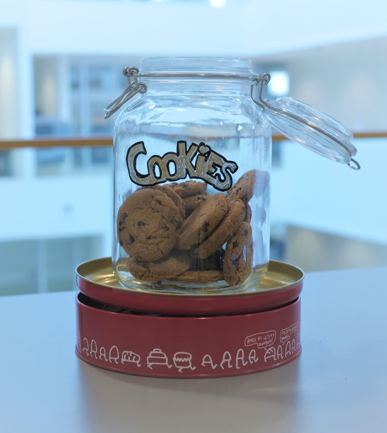

# Azure IoT and Business Central
This article provides a fun example of how we can leverage IoT data in Business Central using services from [Microsoft Azure](https://azure.microsoft.com/) that make getting started with Internet of Things (IoT) easier and much less complex. 

IoT is changing the way we do business, however, the wide range of questions we need to answer can make it daunting to get started. What data do we need? How will we use it? How do we provide access to it in a controlled and secure way? How do we connect devices? The list goes on and on.

The answer is rather vague. We can use IoT for almost anything, but a few common business scenarios are:

* Tracking packages (where’s my parcel?)
* Counting inventory in real-time (how much do I really have in my warehouse?)
* Guiding manufacturing processes using IoT telemetry from industrial machinery 
* Monitoring machines to discover maintenance issues before the machines break down

This article describes how to build a cookie jar that will notify us when it’s nearly empty, and connect it to Business Central so that we can use the supply chain features to refill it. Although the descriptions are specific to the cookie jar, the concepts apply to any IoT project and can be copied and adapted to business needs.

You will need an Azure subscription to replicate the steps in this article.

## Introducing Project Cookie Jar
Project Cookie Jar is all about being alerted when our inventory is low for a particular item so that we don’t run out of stock. In this case, our inventory items are chocolate chip cookies and we store them in a cookie jar.  

We'll use a load cell connected to an Arduino compatible [ESP8266](https://en.wikipedia.org/wiki/ESP8266) device to create a connected scale. The cookie jar sits on the scale, and when it’s above a certain weight the jar is full, and when it’s below the weight it's empty. 

The question here is, when should the cookie jar emit telemetry? For example, we could decide that our jar should send a signal only when it's empty. That would reduce the amount data we have to deal with. However, it would also mean that we aren’t monitoring the level of cookies in real time and make it more complicated to add other sensors (such as a humidity sensor to ensure the cookies stay crisp, or a temperature sensor to ensure the chocolate doesn’t melt). Our jar could also send data at certain weight points, for example, when a multiple of 100 grams is reached. This means adding a lot of logic to our cookie jar, and if we decide that we want something different we’d have to re-program the cookie jar.

Instead, our cookie jar will send data every few seconds, regardless of what the values are. Our jar doesn’t need to know what the values mean. This allows us to know how full the jar is at any given time, and when we add sensors, we’re already able to send data. 

The next question is, where should our cookie jar send the data? IoT projects can have thousands of devices, each sending data every few seconds. We would probably want to archive the data so we can create dashboards, run analyses, or use it for machine learning. 

Sending all that data directly to Business Central doesn’t sound like the right approach. Instead, we’ll use an Azure service that is designed specifically for this purpose. Although the go-to service for this case is probably Azure IoT Hub, this project uses [Azure IoT Central](https://azure.microsoft.com/en-in/services/iot-central/) because it’s easy to set up and provides an out-of-the-box IoT monitoring application. Azure IoT Central is built on Azure IoT Hub and simplifies the experience by hiding the other services it uses. It can handle a continuous stream of data from thousands of devices.

## Project Overview
The steps in this sample project require an Azure subscription. 

1. [Create an Application in Azure IoT Central](README.md#create-an-application-in-azure-iot-central)
2. [Create Device Templates](README.md#create-device-templates)
3. [Set Up a Simulated Device](README.md#set-up-a-simulated-device)
4. [Set Up a Real Device](README.md#set-up-a-real-device)
5. [Create an Azure Logic Application](README.md#create-an-azure-logic-application)
6. [Azure IoT Central and Business Central](README.md#integrate-azure-iot-central-and-business-central)
7. [Set Up a Workflow in Business Central](README.md#set-up-a-workflow-in-business-central)

## Create an Application in Azure IoT Central
The first step is to set up an Azure IoT Central app.

1. Go to https://apps.azureiotcentral.com/, and then choose **Create a custom app**. 
2. Give the new application a name. In this project we'll use **BC-Cookie-Jar**.
3. If needed, we can edit the default URL. In this project we'll use **bc-cookie-jar.azureiotcentral.com**.
4. Choose **Custom application (legacy)**.

   > **NOTE:**
   > While drafting this article, Azure IoT Central was updated with new features and user experiences. To follow the steps in this article, choose the **Custom Application (legacy)** template. If you choose **Custom Application** the steps in this article will not match the experience.

5. Provide Azure subscription information.
6. Click **Create**, and wait for about 30 seconds. We should be redirected to the Dashboard page of our Azure IoT Central application. 

## Create Device Templates
Real-world IoT projects typically involve lots of similar devices. Creating device templates lets us manage information about our devices in one place, instead of updating devices individually. 

1.	On the **Dashboard** page, click the **Create Device Templates** tile.
2.	Choose one of the existing templates or choose Custom. The templates are pre-loaded with telemetry and properties. For this project, choose **Custom** to start from scratch.
3.	Enter a name for the template. For example, **Cookie Jars**.
4.	Click **Create**.

We now have an empty device template where we can set up our devices on the **Measurements**, **Settings**, **Properties**, **Commands**, **Rules**, and **Dashboard** tabs. Our cookie jar will send Weight as telemetry, so let’s add that now.

1.	On the **Measurements** tab, choose **New**.
2.	Select **Telemetry** as the type.
3.	For the cookie jar, enter the values as shown in the following table.

    |Field  |Value  |
    |---------|---------|
    |Display Name     |Weight         |
    |Field Name     |Weight         |
    |Units     |Grams         |
    |Minimum Value     |0         |
    |Maximum Value     |5000         |
    |Decimal Places     |0         |
    |Color     |Default         |

3.	Click **Save**.

To be notified when the cookie jar is low on cookies, create a simple, telemetry-based rule.

1.	On the **Rules** tab, choose **New**.
2.	Select **Telemetry** as the type.
3.	Fill in the fields as described in the following table.

    |Field  |Value  |
    |---------|---------|
    |Name     |Low on cookies         |
    |Enable rule for all devices of this template     |On         |

4. To add a condition, click **+** and then fill in the fields as described in the following table.

    |Field  |Value  |
    |---------|---------|
    |Measurement     |Weight         |
    |Aggregation     |None         |
    |Operator     |Less than         |
    |Threshold     |125         |

5. Click **Save**.

Now that we’ve defined a rule, we need to choose what happens when it triggers. There are several options, but let’s send an email.

1.	Click the **+** sign next to Actions.
2.	Click the **Email** tile, and then fill in the fields as described in the following table.

    |Field  |Value  |
    |---------|---------|
    |Display Name     |Low on cookies email         |
    |To:     |\<your email address\> (semi-colon separated)        |
    |Notes:     |Please refill the cookie jar.         |

3. Click **Save**.

When we create a new device template in Azure IoT Central, a new simulated device is provisioned based on the template.

## Set Up a Simulated Device
We can use simulated devices to test various scenarios, measurements, events, rules, and actions, and integrate with other apps from Azure IoT Central. Our devices are listed under **Devices** on the left. The new template should be available under **Templates**, and there should be one device in the list of devices under **Cookie Jars (1.0.0)**. The name of the simulated device is suffixed with (Simulated) and has **Yes** in the **Device Simulated** column. 

If we click the name of the device a page that is similar to the template setup page opens. It shows the data from the device itself, and random data is being generated for the Weight measurement. When this measurement falls below 125 the rule will be triggered and an email will be sent.

In this setup the random data that is generated for testing will fluctuate roughly between 1000 and 4000. To make the rule trigger more frequently, we can raise the threshold value for it on the device template.

Now that we have an Azure IoT Central application to connect a real device to, let’s set up a real device.  

## Set Up a Real Device 
We’ll need to define a real device in Azure IoT Central to get the connection information we need in order to connect the cookie jar to the correct application.

1. In Azure IoT Central, in the menu on the left, click **Devices**.
2. In the list of devices under the Cookie Jars template, click the **+** sign, and then select **Real**. 
3. We can leave the **Device ID** and **Name** as is, but let’s change the name to **Cookie Jar 1**.
4. Click **Create**.

### Connection Information
We have now defined a real device. Notice that simulated data is not generated for this device, and that there are new menu items in the top right corner of the screen. Let’s build the real connected cookie jar.

To see the connection information that we’ll need to connect a real device to our Azure IoT Central application, click **Connect**.

### Components of the cookie jar
Here’s the list of components we’ll use for the cookie jar. 

> **NOTE:**
> You can connect many types of devices to Azure IoT Central. If a device can connect to the Internet, you can probably connect it to Azure IoT Central. For the list of Azure-certified devices, see [Browse Devices](https://catalog.azureiotsolutions.com/alldevices). 

* Adafruit Feather Huzzah ESP8266: an Arduino compatible controller with built-in Wi-Fi capabilities. It’s also quite small.
* An Arduino compatible scale kit based on an HX711 chip
* A 3.7v 1000 mAh battery with a JST-PH connector to power the Feather. Important: Ensure that the polarities are correct for the battery and your controller. Incorrect polarity can damage them.
* A small 400 pin prototyping breadboard and a bunch of cables
* A push button (optional). Adding a push button lets us set the scale to 0 when the empty jar is on the scale, so we measure only the weight of the contents of the jar
* A DHT-22 temperature and humidity sensor (optional)
* A round metal tin to hide the electronics
* A jar to put the cookies in

### Wiring the device
Here’s the wiring diagram for the connected scale, including a temperature sensor.


Here’s the assembled electronics.



And here’s how it looks when it’s assembled.



### Programming the device
For this project the Arduino IDE was used to program the device. The IDE is can be downloaded for free from the [Arduino website](https://www.arduino.cc/). We can use other editors, but in this article refers to the Arduino IDE. Writing the code from scratch would require quite a bit of effort, but Azure IoT Central provides sample code for a number of architectures on their [GitHub page](https://github.com/Azure/iot-central-firmware), including the ESP8266 that this project uses. We just need to adjust it a little to get our connected cookie jar to emit data. We can look at the code in [./samples/AzureIoTCentral/Arduino/CookieJar](./Arduino/CookieJar) to explore the changes.

> **NOTE:**
> To upload the code to the device, we must install the Arduino IDE and follow the instructions to install the drivers for our board. For more information, see [Adafruit Feather Huzzah ESP8266](https://learn.adafruit.com/adafruit-feather-huzzah-esp8266). If we were using a different board, we’d need to adjust the libraries and board drivers accordingly. It’s a good idea to play around with the examples included in the IDE (File/Examples/Built-in Examples) to get a feel for the language and how to use the IDE. For example, how to compile and upload sketches, and so on.

#### Arduino code
The samples on the IoT Central Github page differ for each architecture, so if we weren’t using an ESP8266 we will probably have to change the code to make this example work.

1. Download the sample code for the device architecture from [iot-central-firmware](https://github.com/Azure/iot-central-firmware), and place it in a folder called **CookieJar/src**.

> **NOTE:**
> The sample code contains some minor issues. To resolve them for the ESP8266, we might need to download the following fixes (if they are not yet merged): 
>  * https://github.com/Azure/iot-central-firmware/pull/101 
>  * https://github.com/Azure/iot-central-firmware/pull/102)

2. Download the sample code for the cookie jar from [Arduino](./Arduino) and put it in the CookieJar folder, and then open the CookieJar.ino file in the Arduino IDE.

Before we can compile the code, we’ll need to install the libraries used for the sensors.

* In the Arduino IDE, go to **Tools**, and then **Manage Librarie**, and install the following libraries:

    |Sensor  |Library  |
    |---------|---------|
    |weight sensor     |[HX711 Arduino Library](https://github.com/bogde/HX711) by Bogdan Necula, Andreas Motl         |
    |temperature and humidity     |[Adafruit Unified Sensor](https://github.com/adafruit/Adafruit_Sensor) by Adafruit<br>[DHT sensor library](https://github.com/adafruit/DHT-sensor-library) by Adafruit<br>JSON helper library [Arduino_JSON](https://github.com/arduino-libraries/Arduino_JSON) by Arduino        |

> [!TIP]
> We can choose a different library if we want. There are usually multiple options for each type of sensor.

Now we can compile the sketch and fix any dependency errors before continuing.

There are still a few things to set up before we upload the code to the device. There should be several tabs in the Arduino IDE. The first tab is the CookieJar.ino file. The three other tabs are .h files that contain some basic settings. The following table describes what to set up on each tab.

|Tab  |Setup  |
|---------|---------|
|wifi_setup.h     |Enter the SSID and password for our Wi-Fi.         |
|sensor_setup.h     |Set up the pins that we connected our sensors to. If we used the same setup as in the wiring diagram above the pins should be correct, but if we connected our sensors to different pins on our device, this is where we define what goes where. If we connected a temperature sensor, we may also have to change the DHTTYPE variable if our DHT is of a different type.<br><br>In addition to the pins, there is also a SCALE_CALIBRATION variable we’ll need to change. The value depends on our load cell. For more information about how to calibrate your scale, see [How to calibrate your load cell](https://github.com/bogde/HX711#how-to-calibrate-your-load-cell).         |
|azure_iot_device_setup.h     |Set up the connection to Azure IoT Central. We’ll need to enter the **scope ID**, **device ID**, and the **device key** from the device connection page in Azure IoT Central. If we used the telemetry field names in this document, those are the only things we’ll need to change. If we used different names, we must make sure the names in Azure IoT Central match the ones defined here.         |

The setup is done and the code compiles, so we can try and upload it to the device. We recommend opening the serial monitor (Tools / Serial Monitor) the first few times to see what the device is doing. Make sure the device is connected to a computer with the USB cable 

> **NOTE:**
> Make sure the baud rate is correct. If gibberish displays, the rate is wrong. For example, in this sketch the rate is set to 512000, which means that the serial monitor should be set to the 500000 option.
After the code is compiled and uploaded the device should connect to Wi-Fi, authenticate with Azure IoT Central, and start to emit telemetry.

> **NOTE:**
> Data is received instantly, there is approximately a two minute delay on the telemetry measurements graph. The delay applies only to the graph, our rules will trigger immediately.

In the next few sections we’ll use more Azure services to connect Azure IoT Central to Business Central and get IoT data.

## Create an Azure Logic Application
Now that the cookie jar is connected we can review the rule we set up, and instead of sending an email when the jar is close to empty we can connect to [Azure Logic Apps](https://azure.microsoft.com/en-us/services/logic-apps/) and from there to Business Central. Azure Logic Apps provides a connector for IoT Central that makes it very easy to set up. 

1. Sign-in to the [Azure portal](https://portal.azure.com/) and search for **Logic Apps**.
2. Click **Add**.
3. Give the logic app a name.
4. Choose a subscription and a resource group.
5. Select a location. Keep all Azure services geographically close to each other, for example, in the same data center, to reduce latency between steps.
6. Click **Create**. It will take a minute to deploy our new logic app.
7. If the new logic app doesn't display, click **Refresh**. When the app is available, open it.
8. Click the **Blank Logic App** template.
9. In the logic apps editor, search for the **IoT Central** connector, and then choose the **When a rule is fired** trigger.
10. We can now connect the trigger to your IoT Central application and the new rule we created by selecting the following values: 

    |Field  |Value  |
    |---------|---------|
    |Application     |BC Cookie Jar         |
    |Rule     |Low on cookies         |

We can now start adding steps to define what you want to happen when the rule is triggered. 

> **NOTE:**
> If we enable the logic app and return to IoT Central, open the device template we created. On the **Rules** tab there are now two actions in the **Actions** section, the email action we configured earlier and the new logic app. If we no longer want the email action to be triggered we can remove it.

The next few steps in the logic app are a little tricky. First, the rule we defined will continuously trigger while the weight is within the threshold values. We want the rule to trigger only once. To prevent the rule from triggering, in IoT Central, configure a **Pending refill** property on the device. Also configure the rule to trigger only when **Pending refill** is **False**. This property indicates that we have been informed that the jar needs a refill and things are on hold until that happens. The jar will continue emitting telemetry every few seconds because the device doesn’t know about this property, but the rule in IoT Central will not trigger while Pending Refill is true. 

Now that we have this property we can set up the logic app to toggle the new property after the rule triggers.

To add a new step in our logic app, follow these steps. 
1. In Azure portal, search for **IoT Central**, and choose the **Get a device** action.
2. In the **Application** field, choose the logic app.
3. Select **Device ID** in the **Device** field. This value is retrieved from the trigger step so it will be the device ID on which the rule was triggered.

To add a new step of type Condition from the built-in connector control, do the following.

* Specify an IF statement, for example, IF Pending Refill is equal to true.

We can now add steps in the **If true** and **If false** sections. For the cookie jar, if **Pending Refill** is **true** we don’t want to do anything, so we’ll leave that section empty.

In the **If false** section we’ll want to update the Cookie Jar device in IoT Central to set the property to true. To do this, we can add an action from the IoT Central connector called **Update a device**. 
1. To update the **Pending Refill** property, we'll add it to the fields on the action. Select the device template for our device, and then click **Add new parameter** to select the property.
2. Type **Yes** in the field for the property.

Our logic app is connected to IoT Central and when a rule triggers it will update a property on the device in IoT Central. The next step is to integrate it with Business Central.

## Integrate Azure IoT Central and Business Central
To connect the cookie jar to Business Central so that we can manage our cookie replenishment process, we set up authorization using OAuth. In this section we’ll set up a reusable Azure Logic Apps workflow to get an OAuth access token to Business Central.

If we can use the Business Central connector for logic apps it's easier to set up the integration. If we wanted to call a custom API in Business Central then we cannot use the standard connector. We can, however, call an API using HTTP requests. 

To call an API on a Business Central tenant in production, we must use OAuth tokens. We also want to make sure that we treat these tokens, secrets, and password carefully and do not expose them. To keep things safe, we'll store our secrets in Azure Key Vault. 

We need to set things up for our cookie jar project as follows:

1. Register Business Central as an app in the Azure portal.
2. Manually request a refresh token.
3. Create an Azure Logic App workflow that uses the refresh token to get a Business Central access token.
4. Use the access token in the logic app to call a custom API in Business Central.

### Register the app
1. Register Business Central as an app in Azure portal under **App Registrations** to be able to request OAuth tokens. For more information, see [Getting Started Developing Connect Apps for Dynamics 365 Business Central](https://learn.microsoft.com/en-us/dynamics365/business-central/dev-itpro/developer/devenv-develop-connect-apps). Follow the steps for Azure Active Directory (AAD) based authentication.
2. The following table shows the properties to fill in.

    |Property  |Value  |
    |---------|---------|
    |Name     |The name of the application.         |
    |Redirect URI     |Type: Web<br>URI: http://localhost        |
    |Client secrets     |Create a secret and make a note of it. We will use this to get an access token.         |
    |API permissions     |Dynamics 365 Business Central<br>user_impersonation         |

### Get a refresh token
Request a refresh token manually using a tool such as [Insomnia](https://insomnia.rest/), [Bruno](https://www.usebruno.com/), [Insomnium](https://github.com/ArchGPT/insomnium/releases/), or [Fiddler](https://www.telerik.com/download/fiddler/), and store the token and client secret in Azure Key Vault.

### Use Azure Key Vault
To keep things safe, store the client secret and the refresh token in Azure Key Vault, so that our logic app can use them without exposing them. 

First, let’s set up a key vault:

1. In Azure portal, search for **key vaults**.
2. Click **Add** to create a new key vault.
3. Choose a subscription and resource group.
4. Give the key vault a name.
5. Pick a location, preferably the same location as the other services.
6. Click **Review + create**.

Next, we’ll store the secrets:
1. On the left, under **Settings**, click **Secrets**.
2. Click **Generate/Import**, and then add the client secret we created earlier.

    |Field  |Value  |
    |---------|---------|
    |Upload options     |Manual         |
    |Name     |Enter a name.         |
    |Value     |\<paste the client secret\>         |
    |Enabled     |Yes         |

3. Repeat the process to store the refresh token.

Now that we have safely stored our secrets, we can create a logic app which will retrieve these secrets and use them to request an access token. 

### Create a logic app workflow to request an access token
1. In the Azure portal, go to **Logic Apps** and click **Add**. Create a new logic app using a blank template. 
2. To trigger the logic app by an HTTP request, search for **Request**, select the **When a HTTP request is received** trigger, and then click **New step**.
3. To retrieve the client secret from Azure Key Vault so we’ll need an HTTP GET request. 
4. Search for **HTTP** and select **HTTP** from the actions. Fill in the following fields.

    |Field  |Value  |
    |---------|---------|
    |Method     |GET         |
    |URI     |https://\<key vault name\>.vault.azure.net/secrets/\<client secret name\>?api-version=7.0 (replace the placeholders with the key vault name and secret name. The base URL of our key vault is available on the Overview tab of the Azure Key Vault.        |
    |Authentication     |Managed Identity         |

5. Click **Add new parameter**, and then select **Audience**.
6. Enter **https://vault.azure.net**.

The response comes in the body as JSON, so we’ll need to parse the JSON to get the secret value.
1. Click **New step**, and search for **parse json**.
2. Select **Parse JSON**.
3. On the **Dynamic Content** tab, choose **Body**.
4. For the **Schema**, use the following code example:

```
{
    "properties": {
        "attributes": {
            "properties": {
                "created": {
                    "type": "integer"
                },
                "enabled": {
                    "type": "boolean"
                },
                "recoveryLevel": {
                    "type": "string"
                },
                "updated": {
                    "type": "integer"
                }
            },
            "type": "object"
        },
        "id": {
            "type": "string"
        },
        "value": {
            "type": "string"
        }
    },
    "type": "object"
}

```

5. Click **New step**, and repeat the steps for the HTTP GET action. Retrieve the refresh token and then add another Parse JSON action to parse the second response (the response schema is the same).

Now that we have the secrets, we can do an HTTP POST action to request a new access token.

1. Click **New step**, select the HTTP action, and fill in the fields as described in the following table.

    |Field  |Value  |
    |---------|---------|
    |Method     |POST         |
    |URI     |https://login.microsoftonline.com/<tenant domain\>/oauth2/token         |
    |Headers     |Key: Content-Type<br>Value: application/x-www-form-urlencoded         |
    |Body     |grant_type=refresh_token&resource=https%3A%2F%2Fapi.businesscentral.dynamics.com&client_id=\<client id\>&client_secret=\<client secret value\>&refresh_token=\<refresh token value\><br>**Note:** The client ID is the ID of our app registration (see here). For the client secret value and the refresh token value we select the value property from the respective Parse JSON steps from the Dynamic Content page.         |
    |Authentication     |None         |

We’ll need to parse the response of this HTTP Post action, so we'll add a new Parse JSON action to parse the body and add the following schema.

```
{
    "properties": {
        "access_token": {
            "type": "string"
        },
        "expires_in": {
            "type": "string"
        },
        "expires_on": {
            "type": "string"
        },
        "ext_expires_in": {
            "type": "string"
        },
        "id_token": {
            "type": "string"
        },
        "not_before": {
            "type": "string"
        },
        "refresh_token": {
            "type": "string"
        },
        "resource": {
            "type": "string"
        },
        "scope": {
            "type": "string"
        },
        "token_type": {
            "type": "string"
        }
    },
    "type": "object"
}

```

    When we request an access token we also get a new refresh token. We must update our existing refresh token in Azure Key Vault with the value from the new refresh token. Secrets in Azure Key Vault cannot be modified but we can delete the value and add a new one.
2. Click **New step**.
3. To add an HTTP action, fill in the fields as described in the following table.

    |Field  |Value  |
    |---------|---------|
    |Method     |DELETE         |
    |URI     |https://\<key vault name\>.vault.azure.net/secrets/\<refresh token secret name\>?api-version=7.0         |
    |Authentication     |Managed Identity         |
    |Audience      |https://vault.azure.net         |

4. Click **New step**.
5. To add another HTTP action, fill in the fields as described in the following table.

    |Column1  |Column2  |
    |---------|---------|
    |Method     |PUT         |
    |URI     |https://\<key vault name\>.vault.azure.net/secrets/\<refresh token secret name\>?api-version=7.0         |
    |Body     |Paste the code that is available immediately below this table.<br>**Note:** Select the refresh_token value from the last Parse JSON action.         |
    |Authentication     |Managed Identity         |
    |Audience     |https://vault.azure.net         |

Here is the code to paste in the **Body** field.

```
{
    "value": "<new refresh token value>"
}
```
We want to return the access token to the HTTP call that triggered the workflow, so we'll add a **Response** action step.
1. Click **New Step**.
2. To add a Response action, fill in the fields as described in the following table.

    |Field  |Value  |
    |---------|---------|
    |Status Code     |200         |
    |Body     |Paste the code that is available immediately below this table.         |

```
{
    "access token": "<access token value>",
    "token type": "<token type value>"
}
```
The logic app workflow is now complete, but there are still a few things to do before it will work. The logic app will access Azure Key Vault through a managed identity, so we must enable the identity and then go to Azure Key Vault and grant access to it. 

1. Save the logic app, and from the menu on the left go to the **Identity** page. 
2. On the **Identity** page, set **Status** to **On**, and then click **Save**. 
3. Copy the **Object ID** GUID. 
4. In Azure Key Vault, choose **Access Control (IAM)**.
5. Click **Add**, select **Add role assignment**, and then fill in the fields as described in the following table.

    |Field  |Value  |
    |---------|---------|
    |Role     |Contributor         |
    |Assign access to     |Logic App         |
    |Select     |\<our logic app\>         |

6. Click **Save**.
7. Go to the **Workflow settings** page to specify who can trigger this logic app. Select **Only other Logic Apps**. 

When this logic app runs we can monitor the input and output of each step in the run history. That’s great for debugging and making sure everything works as expected, but because those steps include secrets it’s a potential risk. We shouldn’t grant anyone access to the run history because they would be able to impersonate us when accessing Business Central. 

To make this workflow more secure, we can hide the input and output of critical steps. We can give people access to the run history but not allow them to edit the logic app.
1. Open the **Logic App Designer**, and click **...** next to the top HTTP action.
2. Click **Settings**, and enable **Secure Inputs** and **Secure Outputs**.
3. Repeat step 2 for the other HTTP actions and the Response action.
4. Save your changes.

We can verify that our secrets aren’t exposed by clicking **Run** to trigger the logic app manually, and then checking the run history. The run history will show at which step a failure occurred.

> **NOTE:**
> Remember to restrict access to this logic app workflow. If someone can trigger this logic app they will be able to impersonate us in Business Central.

In the next section we'll use this logic app workflow to call a custom API in Business Central, and then run a Business Central workflow to replenish the cookie jar.

## Azure IoT and a Custom API for Business Central
We’ll use the logic app workflow from the previous section to get an OAuth access token to connect the cookie jar to Business Central, so we can use supply chain features to replenish our cookies.

### Settings in the logic app
Now that we have a secure way to get an access token for Business Central, we can use the token to call a custom API. The source code for the custom API that this project uses is available in this BCTech repository at [./samples/AzureIoTCentral/AL](./AL). To use it, we must deploy the Json and Azure IoT Central API extensions in our Business Central tenant.

Now let’s get back to the logic app. When the rule from Azure IoT Central is triggered, the logic app will set **Pending Refill** to **True**, but before that we want it to call the API in Business Central to run some logic (for example, to create a purchase order for our cookies). Unfortunately, the Logic Apps Designer doesn’t let us add actions before the Update Device action, so we'll remove that action and add it again later.

To call in to Business Central, we need an access token. 
1. Find the app that we created for sending an email, and open the Logic App Designer. We did that in the [Create an Azure Logic Application](README.md#create-an-Azure-Logic-Application) section.
1. Click **Add an action**, search for **azure logic apps**, and then select the **Choose a Logic Apps workflow** action.
1. Select the logic app we created for getting an access token.
1. Select the **Manual** action.

As before, we’ll need to parse the JSON response with this schema:

```
{
    "properties": {
        "access_token": {
            "type": "string"
        },
        "token_type": {
            "type": "string"
        }
    },
    "type": "object"
}

```

4.	To add the HTTP action to call the custom API, fill in the properties as described in the following table.

    |Field  |Value  |
    |---------|---------|
    |Method     |Post         |
    |URI     |https://api.businesscentral.dynamics.com/v1.0/sandbox/api/iot/azureiotcentral/v2.0/companies(\<company guid\>)/measurements<br>**Note:** We must insert the GUID of the company we are connecting to in the URI. To find the GUID we can use a tool like [Insomnia](https://insomnia.rest/), [Bruno](https://www.usebruno.com/), [Insomnium](https://github.com/ArchGPT/insomnium/releases/), or [Fiddler](https://www.telerik.com/download/fiddler/), to call this API: https://api.businesscentral.dynamics.com/v1.0/sandbox/api/microsoft/automation/v1.0/companies.         |
    |Headers     |Connection	Keep-Alive<br>Content-Type	Application/json         |
    |Body     |Paste the code that is available immediately below this table.<br>**Note:** The schema only gives us the structure. We must fill in each value by selecting the corresponding values from the **When a rule is fired** trigger on the **Dynamic Content** page.         |
    |Authentication     |Raw         |
    |Value     |<token_type><access_token><br>**Note:** These values are available on the Parse JSON action on the **Dynamic Content** page.         |

```
{
    "ActionID": "<id>",
    "ApplicationID": "<application.id>",
    "ApplicationName": "<application.name>",
    "ApplicationSubdomain": "<application.subdomain>",
    "DeviceConnectionID": "<device.deviceId>",
    "DeviceID": "<device.id>",
    "DeviceName": "<device.name>",
    "DeviceSimulated": "<device.simulated>",
    "DeviceTemplateID": "<rule.deviceTemplate.id>",
    "DeviceTemplateVersion": "<rule.deviceTemplate.version>",
    "RuleEnabled": "<rule.enabled>",
    "RuleID": "<rule.id>",
    "RuleName": "<rule.name>",
    "Timestamp": "<timestamp>",
    "measurements": "<device.measurements>",
}


```

Now add the Update device step again, so that if the call to the custom API succeeds, Pending Refill is updated. If the call fails, the flag will not be updated.

The next step is to define what should happen in Business Central when a measurement is received through the API call. 

## Set Up a Workflow in Business Central
The API that is called by the Azure Logic App will create a record in a new table named **Az. IoT Central Measurement**. To make this project more configurable, we used the built-in workflow feature of Business Central and extended it with a new workflow event and response. The code for the Azure IoT Central Device Workflow extension is available in the BCTech repository at /samples/AzureIoTCentral/AL/Azure IoT Central Workflow/.

After we install the extension in Business Central we will have the following:
* A new **workflow category** named **IoT**.
* A new **workflow event** named **An Azure IoT Central measurement is received**.
* A new **workflow response** named **Create Purchase Order from IoT Workflow Setup**.
* A new **page** named **IoT Device Workflow Setup** that we can use to link a device to a vendor and an item.

To set things up, we’ll need to add some data. 
1. In Business Central, open the **Workflows** page to set up the workflow.
2. Select **New** to add a new workflow.
3. Fill in the **Code** and **Description** fields.
4. In the **Category** field, choose **IoT**.
5. Under **Workflow Steps**, create a new line with the settings described in the following table.

    |Column1  |Column2  |
    |---------|---------|
    |When Event     |An Azure IoT Central measurement is received         |
    |On Condition     |Always         |
    |Then Response     |Create Purchase Order from IoT Workflow Setup<br>**Note:** This response will create a purchase order and send it for approval.         |

6. Turn on the **Enabled** toggle.
7. If we don't already have an approval workflow for purchase orders, we would need to create one. For more information, see [Walkthrough: Setting Up and Using a Purchase Approval Workflow](https://learn.microsoft.com/en-us/dynamics365/business-central/walkthrough-setting-up-and-using-a-purchase-approval-workflow). 

We still need to add some more setup data. The workflow response above will add some of it for us. We need to get our device to trigger the rule to see if it triggers the logic app and calls the custom API. If that works, all we need to do is open the **IoT Device Workflow Setup** page and fill in the **Vendor No.** and an **Item No.** fields. To run the test again, we need to reset the Pending Refill flag in Azure IoT Central.

To add the missing data manually, follow these steps:

1. In Business Central, open the **Azure IoT Central Devices** page, and add a record with the device ID and device name from Azure IoT Central. (The Device ID is available on the **Connect** page in Azure IoT Central.)
2. Open the **IoT Device Workflow Setup** page, and add a record to indicate the vendor and item that the workflow should create the purchase order for. Fill in the fields as described in the following table.

    |Field  |Value  |
    |---------|---------|
    |Device ID     |\<device id\><br>**Note:** This is a short identifier that shows in the URL on the Device page in Azure IoT Central.         |
    |Device Connection ID     |\<device connection ID\>         |
    |Rule ID      |\<rule ID\><br>**Note:** The rule ID is available in the logic app that we created earlier. We can view it by clicking ***...** on the **When a rule is fired** trigger and selecting **Peek code**.         |
    |Item No.      |Choose an item to use in the purchase order.         |
    |Vendor No.      |Choose a vendor to use in the purchase order.         |

If we have set everything up correctly, a purchase order should now be sent for approval whenever our device telemetry triggers the rule in Azure IoT Central. In our case, when we're close to running out of cookies Business Central will remind us to buy some more.

