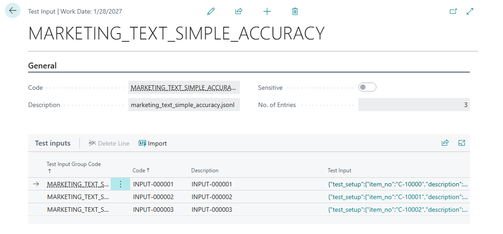
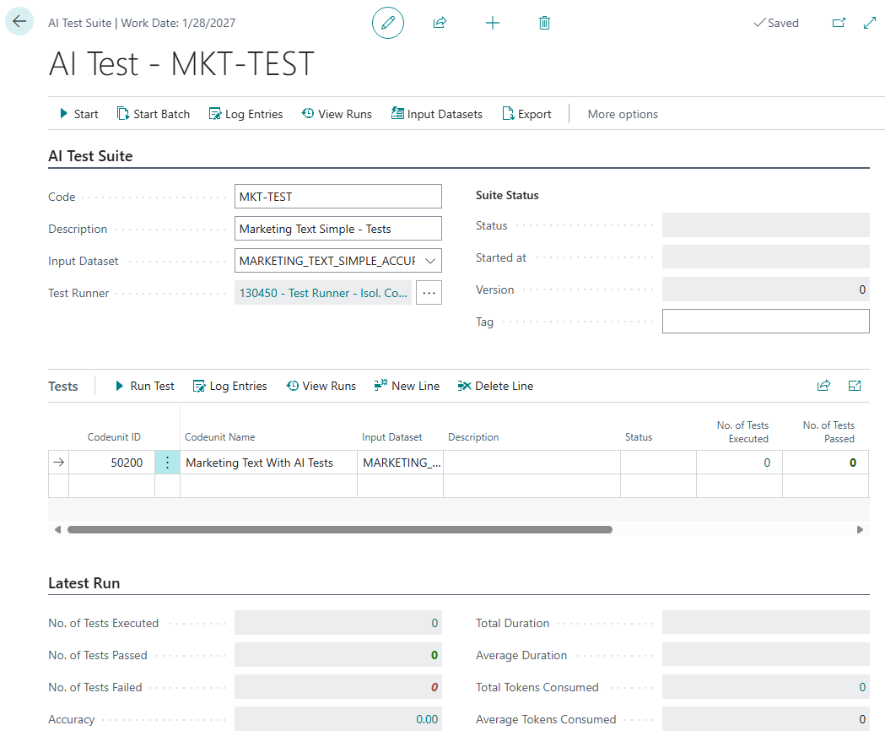

# AI Test Tool

This article explains how to use the AI Test Tool in Business Central.

## Contents
1. [Overview](01-overview.md)
2. [Creating Datasets](02-datasets.md)
3. [Writing AI Tests](03-tests.md)
4. [AI Test Tool](04-ai-test-tool.md)
5. [Best Practices](05-best-practices.md)

---

## What is the AI Test Tool?

The AI Test Tool is an essential component of the developer tools for Copilot in Business Central. It focuses on data-driven test automation to ensure that AI systems are accurate with various inputs, maintain the trust and security of our customers and their data, and are resilient to changes in AI model versions.

With the AI Test Tool, you can:

- Create tests for your prompt dialogues using a familiar framework in AL and Visual Studio Code.
- Organize your test datasets based on purpose and prompt variations.
- Implement automatic verification depending on your feature's use case.
- Run tests as fully automated or semi-automated.

## Step-by-Step: Using the AI Test Tool

This goes over how to use the AI Test tool to set up a test suite, execute it and view the results.

Prerequisite: You have created and published test codeunits for your AI Tests and created the necessary datasets. See [Creating Datasets](02-datasets.md)
and [Writing AI Tests](03-tests.md).

### 1. Upload dataset(s)
1. Open the *AI Test Suite* page
1. Open the *Test Input* page using the *"Input Datasets"* action
1. Import the dataset using the *"Import data-driven test inputs"* action and uploading your dataset.

Once the dataset is uploaded, you can open and view the dataset in Business Central. From here, you can also view the test input of each line by clicking the test input. You can also set the dataset to "Sensitive" by toggling the Sensitive toggle which will hide the test input and output by default, both in the dataset view and results view.



### 2. Set up of test suite 
1. Open the *AI Test Suite* page
1. Upload the previously created datasets for the tests
1. Create a test suite using the New action
1. Open the newly created test suite
1. Configure the test suite (see example below)

Specify a unique code for the test suite and description. On the header level, select the input dataset that was previously uploaded. On the test line, add the test codeunits previously created. Optionally, specify a line-specific input dataset for each line that requires a different input dataset than the header-level input dataset.


### 3. Pre-configure test app 
These steps will make sure that the test suite is pre-configured whenever the test app is installed.

1. Open *AI Test Suites* page 
1. Export the previously created test suite using the "Export" action
1. In your test app, add the datasets and test suite to the /.resources folder.
1. Create an install codeunit that imports the test suite and dataset when installed.

```al
codeunit 50201 "Marketing Text Simple Install"
{
    Subtype = Install;

    trigger OnInstallAppPerCompany()
    var
        DatasetPaths: List of [Text];
        TestSuitePaths: List of [Text];
        ResourcePath: Text;
    begin
        // Load Datasets
        DatasetPaths := NavApp.ListResources('Datasets/*.jsonl');
        foreach ResourcePath in DatasetPaths do
            SetupDataInput(ResourcePath);

        // Load Test Suites
        TestSuitePaths := NavApp.ListResources('TestSuites/*.xml');
        foreach ResourcePath in TestSuitePaths do
            SetupTestSuite(ResourcePath);
    end;

    local procedure SetupDataInput(FilePath: Text)
    var
        AITALTestSuiteMgt: Codeunit "AIT AL Test Suite Mgt";
        FileName: Text;
        ResInStream: InStream;
    begin
        // Get the filename from the path
        FileName := FilePath.Substring(FilePath.LastIndexOf('/') + 1);

        NavApp.GetResource(FilePath, ResInStream);
        AITALTestSuiteMgt.ImportTestInputs(FileName, ResInStream);
    end;

    local procedure SetupTestSuite(Filepath: Text)
    var
        AITALTestSuiteMgt: Codeunit "AIT AL Test Suite Mgt";
        XMLSetupInStream: InStream;
    begin
        NavApp.GetResource(Filepath, XMLSetupInStream);
        AITALTestSuiteMgt.ImportAITestSuite(XMLSetupInStream);
    end;
}
```

### 4. Execute the test suite
1. Open *AI Test Suites* page 
1. Open the previously created test suite
1. Run the AI Test Suite using the Start action. Alternatively, run them one line at a time using the Start action for each line. Each test method will be executed for each dataset line
1. The tests doing the evaluation in AL will either fail or succeed based on the condition
2. Test Output must be generated for all the tests which needs to be evaluated externally.

### 5. Inspect the results

1. Open AL Test Tool and switch to the created test suite to execute each test manually
1. Open *Log Entries* page to see the result of each execution
1. Download the test output which generates the .jsonl file or export the logs to excel
1. Open AL Test Tool and switch to the created test suite to execute each test manually


> [!TIP]
> You can also use the API (page 149038 "AIT Log Entry API") to get the result for a suite
