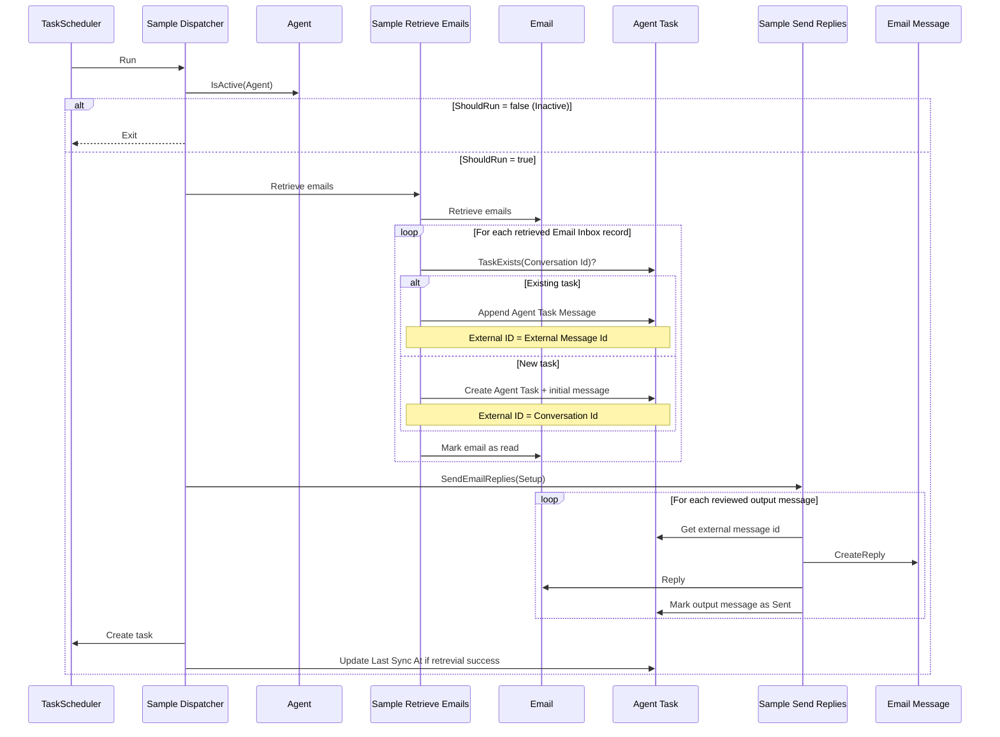
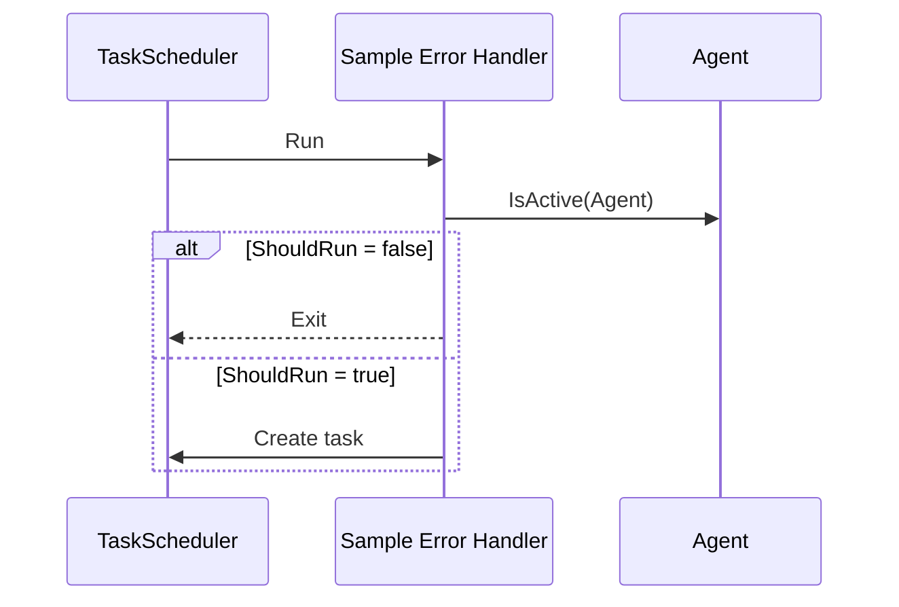

# Sample Agent + Email Integration (Business Central)

This AL extension is a small **sample** showing how to connect **Agents** with **Email** in Microsoft Dynamics 365 Business Central.

It uses a recurring **scheduled task** to:

1. Retrieve inbound emails from a configured email account.
2. Create (or append to) **Agent Tasks** based on the email conversation.
3. Send email replies for agent outputs that have been **Reviewed**.

## How it works

An “agent cycle” is executed by the scheduled task running codeunit `50100 "Sample Dispatcher"`:

1. **ShouldRun check**
	 - `Sample Dispatcher` calls `Agent.IsActive(Setup."Agent User Security ID")` to decide whether to run.
2. **Retrieve emails → Agent tasks**
	 - `50102 "Sample Retrieve Emails"` calls `Email.RetrieveEmails(...)`.
	 - For each email in `Email Inbox`:
		 - If an agent task already exists for the email **conversation**, the message is appended to the existing task.
		 - Otherwise, a new agent task is created.
	 - The email is marked as read via `Email.MarkAsRead(...)`.
3. **Send replies**
	 - `50103 "Sample Send Replies"` finds agent task output messages with:
		 - `Type = Output`
		 - `Status = Reviewed`
		 - `Agent User Security ID = Setup."Agent User Security ID"`
	 - It creates a reply-all email (`Email Message.CreateReplyAll`) and sends it with `Email.ReplyAll(...)`.
	 - On success, the agent output message is marked as sent.
4. **Reschedule**
	 - `Sample Dispatcher` schedules itself again using `TaskScheduler.CreateTask(...)`.
	 - The sample currently reschedules with a fixed delay of **1 minute**.

If the dispatcher fails, `50101 "Sample Error Handler"` is used as the task error handler and will reschedule the next run.

## Included objects

- `table 50100 "Sample Setup"`
	- Stores which agent and email account to use, sync timestamps, and scheduled task IDs.
- `codeunit 50100 "Sample Dispatcher"`
	- Orchestrates one cycle (retrieve emails, send replies, reschedule).
- `codeunit 50101 "Sample Error Handler"`
	- Reschedules the dispatcher if the scheduled task run fails.
- `codeunit 50102 "Sample Retrieve Emails"`
	- Retrieves inbound emails and creates/appends agent task messages.
- `codeunit 50103 "Sample Send Replies"`
	- Sends reply-all emails for reviewed agent outputs.

## Setup (what you need to configure)

This repo focuses on the integration logic and **does not include a setup page**.
To run the sample you must create a `Sample Setup` record (`table 50100`) in your own way (for example: add a small page in a companion extension, insert the record from a one-off helper codeunit, or create it during development/debugging).

Populate:

- `Agent User Security ID`
	- The user security ID of the agent user.
- `Email Account ID`
	- The email account to retrieve from and reply with.
- `Email Connector`
	- The connector type used by the email account.

These are used behind the scenes for tracking sychronizations:

- `Earliest Sync At`
	- Used as the lower bound when retrieving emails.
- `Last Sync At`
	- Updated after a successful dispatcher run.

## Important note: scheduled task user + email access

Business Central scheduled tasks run under a **user context** (the user who scheduled/created the task).

That means:

- The user who schedules the dispatcher must have permission to run this extension’s objects.
- The user must have access to the selected email account/connector.
	If the user does not have access, email retrieval/reply operations can fail.

## Notes / limitations (by design for a sample)

- The dispatcher’s “should run” logic is currently minimal (it only checks `Agent.IsActive(...)`).
- Email retrieval uses a simple filter: unread only, attachments loaded, last message only, earliest email = `Earliest Sync At`, max 50.
- Attachment MIME filtering is marked as TODO in `Sample Retrieve Emails`.

## Quick start (developer flow)

1. Publish the extension.
2. Configure Email in Business Central (email account + connector).
3. Schedule with the Schedule Sync action.
4. Send an email to the email account selected.

