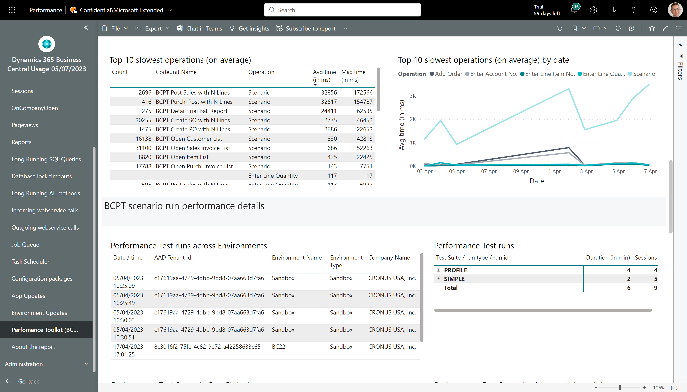
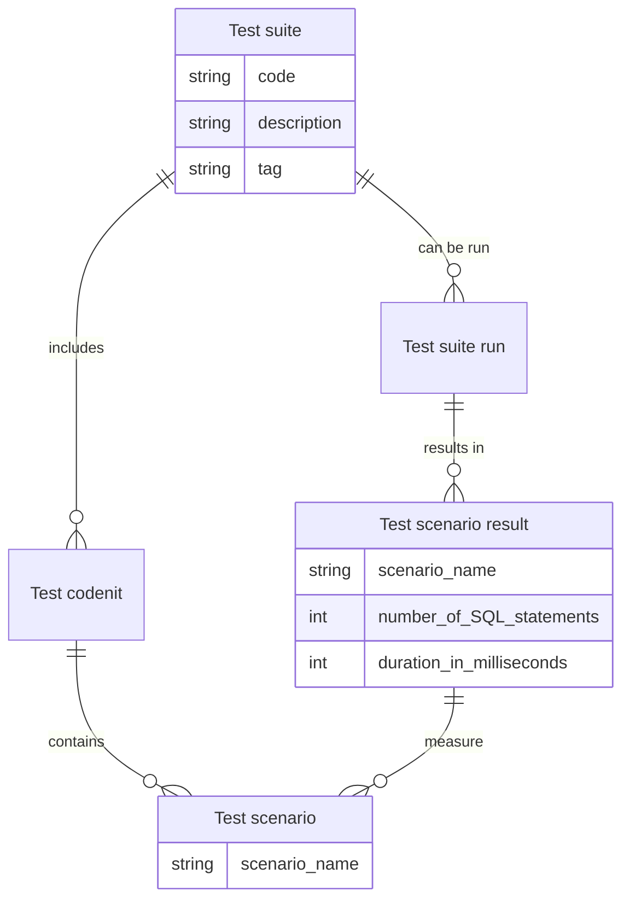

# What is the Business Central Performance Toolkit (BCPT)?
In short, the Business Central Performance Toolkit lets you simulate concurrent usage of realistic scenarios with many users. 

# How can I use the Performance Toolkit?
Once installed and configured, how can you use the tool? We identified four different personas as described in this table:

| Persona | Description |
| ------- | ----------- |
| Account Manager | Person making sales to new and existing customers. |
| Product Owner | Person responsible for an extension/app. |
| Project manager | Person responsible for the implementation of a Business Central environment for a customer. |
| Consultant | Person working with implementations of Business Central by setting up functionality in the product (not by writing AL code)|
| Supporter | Person performing triage, investigation, and mitigation of customer issues. |
| Developer | Person who writes AL code. |
| Operations manager | Person responsible for running Business Central environments for customers. |

 
In the following table, you'll find examples of scenarios for each persona where the app might be of help.

| Persona | Scenario | How the Performance Toolkit can help |
| ------- | ---------| ------------------------------------ |
| Account Manager | In pre-sales, be able to answer questions such as "can Business Central handle our scenarios?" | 0. Maybe get some help from your organization to complete steps 1-5 below. Or work on automating parts of this process.   1. Spin up an online Business Central sandbox environment   2. Setup telemetry on the environment (to get clean data, setup a new Application Insights ressource for this test only)   3. Install and configure the BCPT AL extension with the scenarios you need and in the expected use pattern.   4. Run the scenarios   5. Install and configure the Power BI app on telemetry.  Look at the results in Performance report. | 
| Product Owner | Compare performance between builds of your app(s). | 1. Setup telemetry on the app (to get clean data, setup a new Application Insights ressource for devops)   2. Have your developers write scenario codeunits for your main scenarios.   3. Run scenarios as part of your devops pipelines.   4. Install and configure the Power BI app on app telemetry. Look at the results in Performance report.   5. Consider setting up alerts on regressions. | 
| Developer | Test concurrency of your code | 1. Setup telemetry on your development environment (to get clean data, setup a new Application Insights ressource for your setup)   2. Write a scenario codeunit for your scenario.   3. Run the scenarios in the BCPT VS code extension.   4a. Install and configure the Power BI app on app telemetry. Look at the results in Performance report.   4b. If you prefer to analyze with KQL, use that tool instead. | 
| Operations manager | Test Business Central environments on next version before upgrading customers | 1. Copy the production environment to a sandbox.   2. Setup telemetry on the environment (to get clean data, setup a new Application Insights ressource for this test only)   3a. Install and configure the BCPT AL extension with the scenarios you need and in the expected use pattern.   3b. Setup scenarios as part of a devops pipeline.    4. Run the scenarios   5. Install and configure the Power BI app on telemetry.  Look at the results in Performance report.   5. Consider setting up alerts on regressions. | 
| Project manager | Before go-live, ensure that the system scales with the expected number of users and what they are supposed to do in the system. | 1. Together with the project sponsor on the customer side, identify the key scenarios that must be tested   2. Copy the production environment to a sandbox.   3. Setup telemetry on the environment (to get clean data, setup a new Application Insights ressource for this test only)   4a. Install and configure the BCPT AL extension with the scenarios you need and in the expected use pattern.   4b. Setup scenarios as part of a devops pipeline (maybe work on automating parts of this process for easier repeatability).   5. Run the scenarios   6. Install and configure the Power BI app on telemetry.  Look at the results in Performance report.   7. Consider setting up alerts on regressions. |
| Project manager | Test how multiple apps work together under pressure | Similar to the go-live scenario, but here you need to make sure that apps are installed in the environment. | 
| Supporter | Analyze performance issues due to locking or deadlocks | Similar to the developer scenario for concurrency testing. If you are lucky, scenario codeunits are already available on GitHub. |

## How can I answer the question "Can Business Central handle a specific load for prospect customer"?

As a partner, you sometimes get questions like "Can Business Central handle this many transactions per day?" when discussing a new ERP implementation project with a prospective customer. BCPT can help you answer part of that question by simulating the load the customer is intending. The following outlines a way to achieve this (note that all of these step can be automated):
1. Deploy a sandbox environment
2. Deploy an Azure Application Insights resource
3. Enable telemetry on the environment
4. Optionally, install extensions/apps that will be needed for the implementation
5. Define the scenarios and currency needed (with the customer)
6. Setup BCPT to run scenarios (there are already many scenarios available out-of-the-box)
7. Install and configure the Power BI app on telemetry
8. Use the Usage, Errors, and Performance reports in the app to get insights into how Business Central is handling the load.

# How can I analyze BCPT data?
If you have enabled environment telemetry, then you get signal about Performance Toolkit runs and scenarios. See more here: 
https://learn.microsoft.com/en-us/dynamics365/business-central/dev-itpro/administration/telemetry-performance-toolkit-trace

The telemetry data emitted from the Performance Toolkit can be analyzed using the Power BI Performance report:

You can also analyze this data directly with KQL, see sample code here: https://github.com/microsoft/BCTech/blob/master/samples/AppInsights/KQL/Queries/ExampleQueriesForEachArea/PerformanceToolkit.kql

# What Power Point presentations are available?
To make it easier to adopt BCPT, we added a number of Power Point presentations that you can use for various situations.

For more information, see [Powerpoint presentations](./presentations/README.md)

# Performance Toolkit (BCPT) FAQ (Frequently Asked Questions)
We have assembled an FAQ on all things you might want to ask about the Performance Toolkit. See more here: [Performance Toolkit FAQ](FAQ.md)

# I want to learn more about the Performance Toolkit
Read more about BCPT here: [The Performance Toolkit Extension](https://learn.microsoft.com/en-us/dynamics365/business-central/dev-itpro/developer/devenv-performance-toolkit)

Get the Performance Toolkit AL extension from Appsource here: 
https://appsource.microsoft.com/en-GB/product/dynamics-365-business-central/PUBID.microsoftdynsmb%7CAID.75f1590f-55c5-4501-ae63-bada5534e852%7CPAPPID.75f1590f-55c5-4501-ae63-bada5534e852?tab=Overview

To get you started quickly, open source scenario code is available here: https://github.com/microsoft/ALAppExtensions/tree/main/Other/Tests/BCPT-SampleTests

Did you know that it is possible to run BCPT scenario runs in AL-Go for GitHub? See https://github.com/microsoft/AL-Go/blob/main/RELEASENOTES.md#new-workflow-create-new-performance-test-app:~:text=New%20workflow%3A%20Create%20new%20Performance%20Test%20App

# Performance Toolkit Terms and definitions

The performance toolkit has a number of terms and their definitions that might make it easier for your to understand how everything fits together. 

| Term | Definition | 
| ---- | -----------| 
| Test suite | A suite is a configuration of which test codeunits to run and, if applicable, with what parameters. Also how many concurrent sessions you want to simulate for each test, and the duration of the scenario. | 
| Test suite tag | You can change the _tag_ for a test suite before running it. If you do this, you can compare test results between tags for different configurations of the environment or suite. For example, you might want to compare the performance of your scenarios with/without a given extension, or compare the performance of your scenarios across two versions of an extension, or or compare the performance of your scenarios with different values of test codeunit parameters (e.g. to see how performance changes with number of lines: 1, 10, 100, 1000). | 
| Test codeunit | Test codeunits are the containers of test scenarios. | 
| Test codeunit parameter | Test codeunits can use parameters. This is useful when you want to be able to change certain behavior of your tests. For example, you might want to change the number of sales lines you add to a sales order. | 
| Test scenario | Within a test codeunit, developers can define _test scenarios_ using the StartScenario/EndScenario functions. The text used in these scenarios are logged to telemetry and the test log together with the context of how the test codeunit was running.| 
| Test suite run | Each time you run a test suite, results are logged with a version number. You can use these version number to compare results for different configurations of the environment or suite. For example, you might want to compare the performance of your scenarios with/without a given extension, or compare the performance of your scenarios across two versions of an extension, or or compare the performance of your scenarios with different values of test codeunit parameters (e.g. to see how performance changes with number of lines: 1, 10, 100, 1000). |
| Test suite baseline (run) | A test suite baseline is simply a scenario run that you choose to be the one you want to compare other runs with. | 

# Disclaimer
Microsoft Corporation (“Microsoft”) grants you a nonexclusive, perpetual, royalty-free right to use and modify the software code provided by us for the purposes of illustration  ("Sample Code") and to reproduce and distribute the object code form of the Sample Code, provided that you agree: (i) to not use our name, logo, or trademarks to market your software product in which the Sample Code is embedded; (ii) to include a valid copyright notice on your software product in which the Sample Code is embedded; and (iii) to indemnify, hold harmless, and defend us and our suppliers from and against any claims or lawsuits, whether in an action of contract, tort or otherwise, including attorneys’ fees, that arise or result from the use or distribution of the Sample Code or the use or other dealings in the Sample Code. Unless applicable law gives you more rights, Microsoft reserves all other rights not expressly granted herein, whether by implication, estoppel or otherwise. 

THE SAMPLE CODE IS PROVIDED "AS IS", WITHOUT WARRANTY OF ANY KIND, EXPRESS OR IMPLIED, INCLUDING BUT NOT LIMITED TO THE WARRANTIES OF MERCHANTABILITY, FITNESS FOR A PARTICULAR PURPOSE AND NONINFRINGEMENT. IN NO EVENT SHALL MICROSOFT OR ITS LICENSORS BE LIABLE FOR ANY DIRECT, INDIRECT, INCIDENTAL, SPECIAL, EXEMPLARY, OR CONSEQUENTIAL DAMAGES (INCLUDING, BUT NOT LIMITED TO, PROCUREMENT OF SUBSTITUTE GOODS OR SERVICES; LOSS OF USE, DATA, OR PROFITS; OR BUSINESS INTERRUPTION) HOWEVER CAUSED AND ON ANY THEORY OF LIABILITY, WHETHER IN CONTRACT, STRICT LIABILITY, OR TORT (INCLUDING NEGLIGENCE OR OTHERWISE) ARISING IN ANY WAY OUT OF THE USE OF THE SAMPLE CODE, EVEN IF ADVISED OF THE POSSIBILITY OF SUCH DAMAGE.