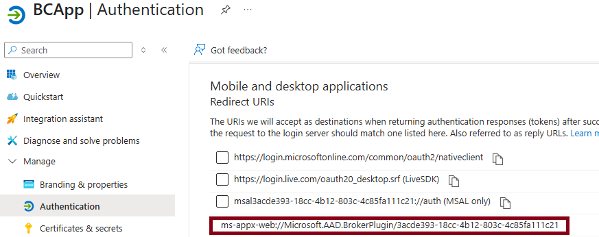
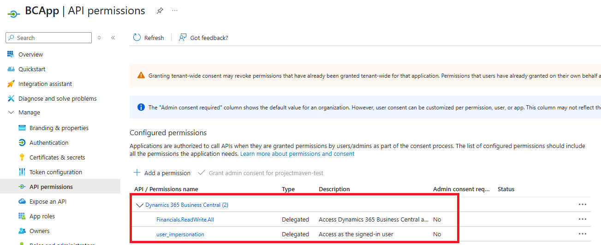
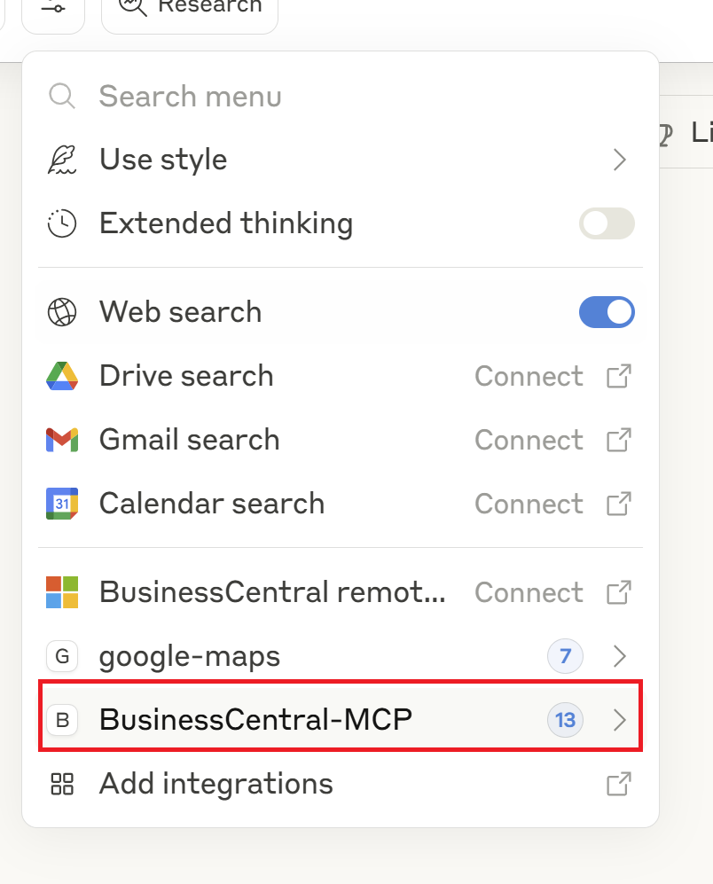

# Business Central MCP Proxy

## ⚠️ Experimental Tool - Not for Production Use

This tool is for **experimentation only** and is **not intended for production use**. It allows you to connect Claude Desktop or VS Code to a Business Central Model Context Protocol (MCP) server.

## Overview

The BC MCP Proxy acts as a bridge between MCP-compatible clients (like Claude Desktop) and Business Central, enabling natural language interactions with your Business Central data and operations.

## Prerequisites

- Microsoft Dynamics 365 Business Central environment
- Azure tenant with appropriate permissions
- Claude Desktop application (for Claude integration)

## Setup Instructions

### 1. Set-up Azure AD App Registration

1. Open [ms.portal.azure.com](https://ms.portal.azure.com)
2. Navigate to **Microsoft Entra ID** and create a new **App Registration**
3. In the **Authentication** section, add the desktop app Redirect URL in the format:
   ```
   ms-appx-web://Microsoft.AAD.BrokerPlugin/<clientID>
   ```
   
   

4. Add the following API permissions:

   

   Required permissions:
   - **Dynamics 365 Business Central (2)**
     - `Financials.ReadWrite.All` (Delegated)
     - `user_impersonation` (Delegated)

### 2. Set-up Business Central Environment

1. Set-Up "Model Context Protocol (MCP) Server Configurations" (Page-Id 8350)

Create a new MCP configuration with the API pages as tools as needed.

2. Enable "Feature: Enable MCP Server access" in Feature Management (Page-Id 2610)

Enable Feature for all users, if not enabled.

### 3.a) Set-up Claude with Business Central MCP Server

1. **Download and Install Claude Desktop**
   - Download Claude for desktop from the official website
   - Install and sign in to your Claude account

2. **Configure Claude Desktop**
   - Open Claude Desktop
   - Navigate to **Settings** → **Developer**
   - Click **"Edit Config"** to create/edit `claude_desktop_config.json`

3. **Edit Configuration File**
   
   Add the BC MCP server configuration to your `claude_desktop_config.json`:

   ```json
   {
     "mcpServers": {
       "BC_MCP": {
         "command": "C:\\Path\\To\\BcMCPProxy.exe",
         "args": [
           "--TenantId",
           "<Your-Tenant-ID>",
           "--ClientId", 
           "<Your-Client-ID>",
           "--Environment",
           "<BC-Environment-Name>",
           "--Company",
           "<Company-Name>",
           "--ConfigurationName",
           "<Configuration-Name>"
         ]
       }
     }
   }
   ```

   **Parameter Details:**
   - `<Your-Tenant-ID>`: Your Azure tenant ID
   - `<Your-Client-ID>`: The Application (client) ID from your Azure app registration
   - `<BC-Environment-Name>`: Name of your Business Central environment
   - `<Company-Name>`: Business Central company name
   - `<Configuration-Name>`: Name of the Business Central "Model Context Protocol (MCP) Server Configurations" configuration as defined in Step 2

4. **Restart Claude Desktop**
   
   After saving the configuration, restart Claude Desktop. You should see the BC MCP tools available:

   

### 3.b) Set-up VS code with Business Central MCP Server

Edit or Create mcp configuration file at "$env:APPDATA\Code\User\mcp.json"
 ```json
"BC_MCP": {
      "type": "stdio",
      "args": [
        "--TenantId",
         "<Your-Tenant-ID>",
        "--ClientId",
         "<Your-Client-ID>",
        "--Environment",
        "<BC-Environment-Name>",
        "--Company",
        "<Company-Name>",
        "--ConfigurationName",
        "<Configuration-Name>"
      ],
      "command": "C:\\Path\\To\\BcMCPProxy.exe",
    }
```

   **Parameter Details:**
   - `<Your-Tenant-ID>`: Your Azure tenant ID
   - `<Your-Client-ID>`: The Application (client) ID from your Azure app registration
   - `<BC-Environment-Name>`: Name of your Business Central environment
   - `<Company-Name>`: Business Central company name
   - `<Configuration-Name>`: Name of the Business Central "Model Context Protocol (MCP) Server Configurations" configuration as defined in Step 2


## Usage

Once configured, you can interact with Business Central through natural language in Claude Desktop. The MCP server will handle authentication and API calls to your Business Central environment.

Example interactions:
- "Show me the latest sales orders"
- "Create a new customer record"
- "What are the current inventory levels?"

## Configuration Parameters

| Parameter | Description | Required |
|-----------|-------------|----------|
| `TenantId` | Azure tenant identifier | Yes |
| `ClientId` | Azure app registration client ID | Yes |
| `Environment` | Business Central environment name | Yes |
| `Company` | Business Central company name | Yes |
| `ConfigurationName` | Name of the Business Central configuration | No |

## Troubleshooting

### Common Issues

1. **Authentication Failures**
   - Verify the redirect URL format in your Azure app registration
   - Ensure all required API permissions are granted
   - Check that admin consent has been provided if required

2. **Connection Issues**
   - Verify the Business Central environment name is correct
   - Ensure the company name matches exactly (case-sensitive)
   - Check network connectivity to Business Central

3. **Claude Desktop Not Detecting MCP Server**
   - Verify the path to `BcMCPProxy.exe` is correct
   - Check that all required parameters are provided
   - Restart Claude Desktop after configuration changes

## Security Considerations

- This tool uses delegated permissions and requires user authentication
- Credentials are handled through Azure's authentication flow
- No passwords or secrets are stored in configuration files
- Always follow your organization's security policies when setting up integrations

## Support

This is an experimental tool provided as-is for development and testing purposes. For Business Central specific issues, consult the official Microsoft Dynamics 365 Business Central documentation.

## License

This project is subject to the Microsoft sample code license terms.
