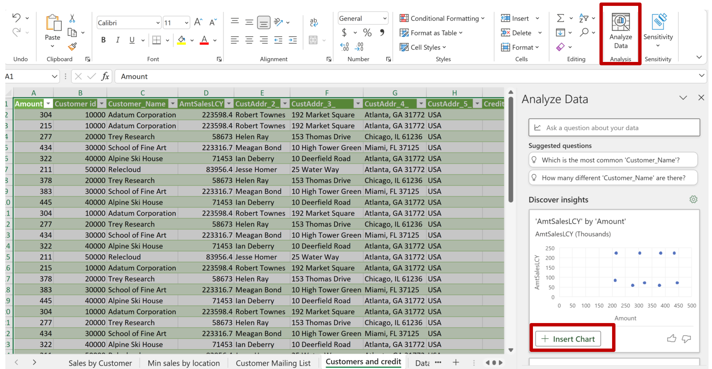

# Business Central Excel Layouts FAQ (Frequently Asked Questions)

## Where can I learn more about Power Query?
If you want to use Power Query in your layouts, please take a look at [Power Query in Excel](https://powerquery.microsoft.com/en-us/excel/)

## Where can I learn more about table formulas in Excel?
If you want to explore the powerful table formulas in Excel, please take a look at this blog post: [Use calculated columns in an Excel table](https://support.microsoft.com/en-us/office/use-calculated-columns-in-an-excel-table-873fbac6-7110-4300-8f6f-aafa2ea11ce8#:~:text=As%20a%20result%2C%20Excel%20built%20the%20formula%3A%20%3DSUM,to%20use%20the%20same%20formula%20for%20each%20row)

## Are there any limitations to what I can do in an Excel layout?
Currently, the following things will not work in an Excel _layout_
* Macros and VBA
* Password protection of worksheets or the workbook
* Document Sensitivity

Note that you can use all of these features on the report once it has been generated. 

## There must be blog posts on this from the community. Where are they?
Sure. Here are some links to get you started:

2023-09-18, _Business Central Excel Layouts_ by Microsoft MVP Josh Anglesea
https://joshanglesea.wordpress.com/2023/09/18/business-central-excel-layouts/

2023-07-28, _BC Excels at Reporting_ by Tonya Bricco-Meske
https://bcdevnotebook.com/2023/07/28/bc-excels-at-reporting/

2022-11-18, _HOW DO I: CREATE AN EXCEL LAYOUT REPORT?_ by Microsoft MVP Steven Renders
https://thinkaboutit.be/2022/11/how-do-i-create-an-excel-layout-report/

2022-08-24, _D365 Business Central : Using Excel Layout for Reporting_ by THATNAVGUY
https://thatnavguy.com/d365-business-central-using-excel-layout-for-reporting/

2022-06-06, _Customizing Report Layouts in Microsoft Dynamics 365 Business Central_ by Microsoft MVP Kristen Hosman
https://www.kristenhosman.com/2022/06/report-layouts-in-microsoft-dynamics.html

2022-05-04, _Excel Reports – something new in reporting space_ by Microsoft MVP Krzysztof Bialowas
https://www.mynavblog.com/2022/05/04/excel-reports-something-new-in-reporting-space/

## I added new fields to the report dataset. Why are they not showing up in my layout file?
Excel layouts support that the layoter can remove columns from the Data table in the Data worksheet. This is why new columns added to the dataset do not appear in the layout automagically. The way to fix this is not to scratch your precious layout file, but simply to edit the header in Data table in the Data worksheet and add the new field metadata here. 

## I just want the report data in Excel. Any tips?
Tip: Just use request page, Schedule, Excel Document (Data only)

Quick tip: do it with an Excel layout if you want to remove columns you don’t need from the Data worksheet (Yes, you can do that)

Advanced tip: Consider doing some data manipulation in Power Query. Just the things you always do
If you use Power Query, Go to Data, Queries & Connections, right click and select Properties (of the Query). Check the box "Refresh data when opening the file". This will reload the data from the Data sheet.

## I want to to create a layout from scratch, but I don’t know what might be useful to show. Any tips?
Try using Analyze Data and just add the insights to the layout.

## I want to manipulate data and show it in a worksheet. Any tips?
Tip: learn about table formulas in Excel

Advanced tip: Do it in Power Query

## I want to use nice headings in the pivot tables
Just rename fields in the Pivot table

Do not rename fields in the Data worksheet (remember the contract)

## I want to use the report as a data source. Any tips?
Every night update an Excel workbook stored in a ‘public’ place (e.g. Onedrive).

Using Power Query, other Excel workbooks (or Power BI) use the report as data source. 

You effectively have your report dataset exposed to Power BI

# Disclaimer
Microsoft Corporation (“Microsoft”) grants you a nonexclusive, perpetual, royalty-free right to use and modify the software code provided by us for the purposes of illustration  ("Sample Code") and to reproduce and distribute the object code form of the Sample Code, provided that you agree: (i) to not use our name, logo, or trademarks to market your software product in which the Sample Code is embedded; (ii) to include a valid copyright notice on your software product in which the Sample Code is embedded; and (iii) to indemnify, hold harmless, and defend us and our suppliers from and against any claims or lawsuits, whether in an action of contract, tort or otherwise, including attorneys’ fees, that arise or result from the use or distribution of the Sample Code or the use or other dealings in the Sample Code. Unless applicable law gives you more rights, Microsoft reserves all other rights not expressly granted herein, whether by implication, estoppel or otherwise. 

THE SAMPLE CODE IS PROVIDED "AS IS", WITHOUT WARRANTY OF ANY KIND, EXPRESS OR IMPLIED, INCLUDING BUT NOT LIMITED TO THE WARRANTIES OF MERCHANTABILITY, FITNESS FOR A PARTICULAR PURPOSE AND NONINFRINGEMENT. IN NO EVENT SHALL MICROSOFT OR ITS LICENSORS BE LIABLE FOR ANY DIRECT, INDIRECT, INCIDENTAL, SPECIAL, EXEMPLARY, OR CONSEQUENTIAL DAMAGES (INCLUDING, BUT NOT LIMITED TO, PROCUREMENT OF SUBSTITUTE GOODS OR SERVICES; LOSS OF USE, DATA, OR PROFITS; OR BUSINESS INTERRUPTION) HOWEVER CAUSED AND ON ANY THEORY OF LIABILITY, WHETHER IN CONTRACT, STRICT LIABILITY, OR TORT (INCLUDING NEGLIGENCE OR OTHERWISE) ARISING IN ANY WAY OUT OF THE USE OF THE SAMPLE CODE, EVEN IF ADVISED OF THE POSSIBILITY OF SUCH DAMAGE.
