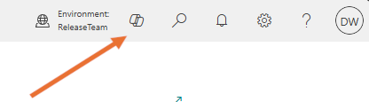
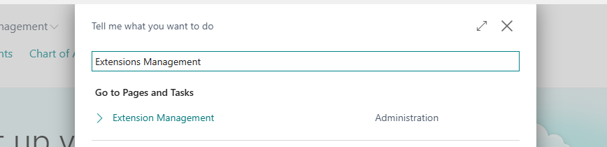
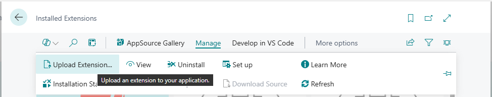
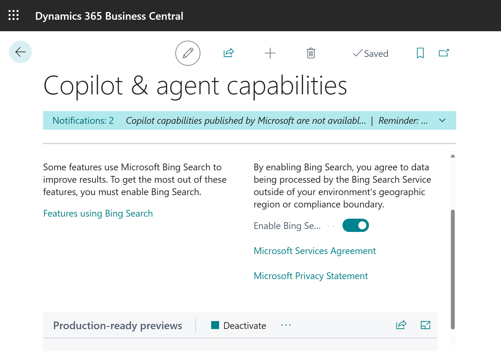

# Microsoft workshop: Extending Chat with your app's documentation
## Introduction
Welcome! 

This document will help you get started with extending Copilot Chat inside Business Central with your app's documentation. By following this guide, you'll experience how seamless it is to plug your documentation into Copilot Chat in Business Central. It might help to reduce support calls, help users onboard faster, and eliminate those repeat questions.

## Prerequisites
1. You need to have access to a Business Central Sandbox environment for developing and testing.
    - You can use any sandbox environment version 27.x inside your tenant,  
    - If you don't have your own tenant, you can get credentials for the test tenant from the host - just reach out and ask.
2. Make sure you have Visual Studio Code installed, or get it at https://aka.ms/vscode.

    Also make sure you have the AL code extension, or install it from https://marketplace.visualstudio.com/items?itemName=ms-dynamics-smb.al.
3. Your AL extension to publish to Sandbox, alternatively you can use an extension provided by us.

## Overview of tasks 
|  | Title | Complexity |
|-------|-----|-----------|
| 1 | Get started  | ⭐  |
| 2 | Setup Copilot Chat for external app content | ⭐ |
| 3 | Connect your extension  to Copilot Chat  | ⭐⭐ |

## Tasks
### Task 1 - Get Started - Complexity: ⭐ 
1. Log into Business Central with your sandbox environment.
2. Open Copilot Chat by clicking the Copilot icon in the top ribbon.  

3. Ask a few questions about extensions to verify whether setup is already in place.

### Task 2 - Setup Copilot Chat for external app content - Complexity: ⭐
1. Search for 'Extensions Management'.  

2. Click Manage and select an option to Upload extension.  

3. Download the extension from [example-app (https://github.com/microsoft/BCTech/tree/master/samples/ISVdocs)](https://github.com/microsoft/BCTech/tree/master/samples/ISVdocs)
4. Open it in the Visual Studio Code. Examine `app.json` file to see URL in the property `help`. This is the documentation it points to.
4. Upload the extension.
5. Go to the 'Copilot & agent capabilities' and make sure Bing Search is **enabled**.  

6. Ask questions based on the documentation, e.g., "how can I create a sales invoice with My Example App?" We encourage you to ask more questions.

### Task 3 - Setup Copilot Chat for external app content - Complexity: ⭐⭐
1. Open your extension code inside Visual Studio Code. Alternatively, create a new extension, follow the [instruction here - https://learn.microsoft.com/en-us/dynamics365/business-central/dev-itpro/developer/devenv-extension-example](https://learn.microsoft.com/en-us/dynamics365/business-central/dev-itpro/developer/devenv-extension-example).
2. Make sure your `app.json` file has a reference to the documentation in the property `help`. It needs to contain a full website address including sub-path if needed, e.g. `"help": "https://your-extension-name.com/docs"`.
3. Ask questions based on the documentation to test the integration.

## Troubleshooting 

See our [troubleshooting instructions](./troubleshooting.md).

We're here to help you! Feel free to ask us about anything!

##### Authors: Ayrton Massey \<aymassey@microsoft.com\>, Matti Nielsen \<mattinielsen@microsoft.com\>, Dawid Wozniak \<dawidwozniak@microsoft.com\>
