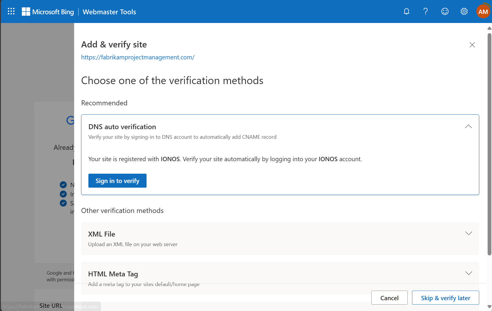
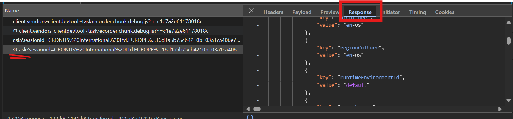

# Troubleshooting _"Copilot Chat with Your Add-on's Documentation"_

| Issue                                 | Troubleshooting Steps                                                                                                                                                                                                                                                                                                                                                                                                                                                                                                                                                                                                                      |
| ------------------------------------- | ------------------------------------------------------------------------------------------------------------------------------------------------------------------------------------------------------------------------------------------------------------------------------------------------------------------------------------------------------------------------------------------------------------------------------------------------------------------------------------------------------------------------------------------------------------------------------------------------------------------------------------------ |
| Copilot doesn't find the page at all. | • [Check that Bing Search is enabled](#check-that-bing-search-is-enabled)<br>• [Ensure the help URL is provided](#ensure-the-help-url-is-provided)<br>• [Check that the page is under the help URL path](#check-that-the-page-is-under-the-help-url-path)<br>• [Verify that Bing returns results for your website](#verify-that-bing-returns-results-for-your-website)<br>• [Verify that the page you expected is in the Bing search results](#verify-that-the-page-you-expected-is-in-the-bing-search-results)<br>• [Use the Bing Webmaster Tools to identify indexing issues](#use-the-bing-webmaster-tools-to-identify-indexing-issues) |
| Copilot answers about the wrong page. | • [Check that the page is under the help URL path](#check-that-the-page-is-under-the-help-url-path)<br>• [Verify that Bing returns results for your website](#verify-that-bing-returns-results-for-your-website)<br>• [Verify that the page you expected is in the Bing search results](#verify-that-the-page-you-expected-is-in-the-bing-search-results)<br>• [Use the Bing Webmaster Tools to identify indexing issues](#use-the-bing-webmaster-tools-to-identify-indexing-issues)                                                                                                                                                       |
| Copilot's answer is incorrect.        | • [Verify that Copilot found the correct page](#verify-that-copilot-found-the-correct-page)<br>• [Verify that the page contains the answer](#verify-that-the-page-contains-the-answer)<br>• [Verify that the snippet contains the answer](#verify-that-the-snippet-contains-the-answer)                                                                                                                                                                                                                                                                                                                                                    |
| Copilot does not show site's icon.    | • [Copilot does not show my site's icon](#copilot-does-not-show-my-sites-icon)                                                                                                                                                                                                                                                                                                                                                                                                                                                                                                                                                             |

## Check that Bing Search is enabled

1. Open the `Copilot & Agent Capabilities` page.

2. The `Enable Bing Search` toggle should be enabled.

   

3. If the `Enable Bing Search` toggle is not enabled:

   1. Enable it,

   2. Close your browser,

   3. Open your browser and log into Business Central again.

4. Open the `Copilot & Agent Capabilities` page.

5. The `Enable Bing Search` toggle should be enabled.

   

## Ensure the `help` URL is provided

1. Open your extension in VSCode.

2. Open `app.json`.

3. Ensure the `help` property is set, for example:

   ```json
   {
       ...
       "help": "https://fabrikamprojectmanagement.com/docs/",
   }
   ```

## Check that the page is under the `help` URL path.

1. Locate the page you expected Copilot to reference, for example:

   `https://fabrikamprojectmanagement.com/docs/guides/create-a-project.html`

2. Find the value of the `help` URL in `app.json`.

3. Verify that the URL of the reference you expected is under the `help` URL path:

   | Discoverable by Copilot | Description             | Reference URL                                                             |
   | ----------------------- | ----------------------- | ------------------------------------------------------------------------- |
   | ✅                      | Same as the `help` path | `https://fabrikamprojectmanagement.com/docs/`                             |
   | ✅                      | Under the `help` path   | `https://fabrikamprojectmanagement.com/docs/guides/create-a-project.html` |
   | ❌                      | Outside the `help` path | `https://fabrikamprojectmanagement.com/about.html`                        |
   | ❌                      | Above the `help` path   | `https://fabrikamprojectmanagement.com/`                                  |
   | ❌                      | On a different site     | `https://contoso.com/blog/creating-a-fabrikam-project.html`               |

## Check that the help path is valid

1. Find the value of the `help` URL in `app.json`.

2. Verify that the `help` URL meets the following criteria:

   | Criteria                               | ✅ Valid                                                | ❌ Not Valid                                                 |
   | -------------------------------------- | ------------------------------------------------------- | ------------------------------------------------------------ |
   | URL is secure (`https`)                | `https://fabrikamprojectmanagement.com`                 | `http://fabrikamprojectmanagement.com`                       |
   | URL is no more than 2 path levels deep | `https://fabrikamprojectmanagement.com/docs/`           | `https://fabrikamprojectmanagement.com/docs/guides/projects` |
   | URL points to a public site            | `https://fabrikamprojectmanagement.com/docs/`           | `https://fabrikamprojectmanagement.com/members/`             |
   | URL points to a webpage or PDF         | `https://fabrikamprojectmanagement.com/docs/manual.pdf` | `https://fabrikamprojectmanagement.com/docs/manual.docx`     |

## Verify that Bing returns results for your website

1. Find the value of the `help` URL in `app.json`, for example:

   `https://fabrikamprojectmanagement.com/help/`

2. Go to [Bing](https://bing.com).

3. Perform a search for the following query:

   ```
   site:<value-of-your-help-url>
   ```

   For example:

   ```
   site:https://fabrikamprojectmanagement.com/docs/
   ```

4. Verify that Bing returns results for your site.

   Example of a site with results:
   

   Example of a site with no results:
   

If Bing returns no results, then either:

- Your site has not been indexed.
  - Follow the steps to index your site.
- Your `help` URL is invalid (e.g. it is more than 2 levels deep).
  - Follow the steps to verify that your `help` URL is valid.

## Verify that the page you expected is in the Bing search results

1. Locate the page you expected Copilot to reference, for example:

   `https://fabrikamprojectmanagement.com/docs/guides/create-a-project.html`

1. Find the value of the `help` URL in `app.json`, for example:

   `https://fabrikamprojectmanagement.com/docs/`

1. Search Bing for the URL:

   

   The page should appear in the results.

1. Search Bing with a relevant query and the `site:` modifier.

   For example, if your question is:

   `"How do I create a project in Fabrikam Project Management?"`

   Try the query:

   `create project site:https://fabrikamprojectmanagement.com/docs/`

   

   The page should appear in the top 3 results.

If the page does not appear in the Bing results:

- Your page is not indexed by Bing, or
  - Verify that your page is indexed by Bing.
- Your page is not under the `help` URL, or
  - Verify that the page is under the `help` URL.
- Your page is not relevant enough to the query
  - Verify that the page is relevant to the query.
  - Apply SEO techniques to the page to improve its ranking.

## Use the Bing Webmaster Tools to identify indexing issues

### Set Up the Bing Webmaster Tools

To follow these steps, you must be the administrator of your website or domain.

1. Go the [Bing Webmaster Tools](https://www.bing.com/webmasters)

2. Enter your site's URL, for example `https://fabrikamprojectmanagement.com`

   

3. Verify that you own the domain by following the steps presented to you.

   

4. Once you've verified your domain, you can access the Bing Webmaster Tools.

   

### Figure out if a page has been indexed

1. Open the [Bing Webmaster Tools](https://www.bing.com/webmasters) for your domain.

2. In the sidebar, click "URL Inspection".

   

3. At the top of the page, enter the full URL of the page you want to inspect and click `Inspect`:

   

4. The page shows the current status of your page, the last time it was crawled by Bing.

   

#### Page successfully indexed

If your page has been successfully indexed, it should show the status above:

- ✅ Indexed successfully
- ✅ No SEO issues found

#### Page cannot be indexed

If your page shows the following:

- ℹ️ **URL cannot be indexed by Bing**

then Bing encountered an issue when crawling the page.

You can:

- Perform a Site Scan to identify issues with your page.
- Follow the [Bing Webmaster Guidelines](https://www.bing.com/webmasters/help/webmaster-guidelines-30fba23a) to ensure your site complies with Bing's best practices, for example:
  - Provide a sitemap and `robots.txt` to instruct search engines on how to crawl your site,
  - Provide `meta` tags to describe your page,
  - Ensure the canonical URL of your page is correct,
  - Provide high quality content that using semantic markup
  - Ensure your site is linked to by other high quality sites,
  - Ensure your page can be found by navigating your site,
  - Fix SEO issues identified by a Bing Site Scan

#### SEO Issues

If your page shows the following:

- ⚠️ **SEO issues detected**

Then your page was crawled, but Bing will not index your site until you fix the SEO issues.

You can:

- Perform a Site Scan to identify issues with your page.

### Identify indexing issues by performing a Site Scan

1. Open the [Bing Webmaster Tools](https://www.bing.com/webmasters).

1. In the sidebar, select `Site Scan`:

   

1. At the top of the page, click `Start new scan`

   

1. Fill out the configuration settings for the scan:

   

1. The scan will take a while depending on capacity and the size of your site. When the scan is done, return to the Webmaster tools and select it from the list:

   

   The scan will list any issues it found with your site, and how many pages each issue affects.

1. Fix the issues Bing detects. To give your site the best chance of being indexed, be sure to address all the issues raised - including Errors, Warnings and Notices.

   

   If you need help fixing an issue, hovering over the issue reveals a link `How to fix?` explaining what the issue is, and how to fix it.

1. When you've fixed all the issues, run a new Site Scan. The scan should complete without any issues:

   

   You should now resubmit your site to be indexed by Bing.

### Submit your site to be indexed by Bing

#### Using IndexNow

The best way to get Bing to continually index your site is to use IndexNow.

1. Open the [Bing Webmaster Tools](https://www.bing.com/webmasters).

2. In the sidebar, select `IndexNow`.

   

3. Follow the instructions to set up `IndexNow`.

#### Using a Sitemap

If you're unable to set up IndexNow, you can manually submit a sitemap to be indexed by Bing.

1. Open the [Bing Webmaster Tools](https://www.bing.com/webmasters).

2. In the sidebar, select `Sitemaps`.

   

3. Click `Submit sitemap` at the top of the page.

   

4. Enter the URL of your sitemap and press `Submit`.

   

   After some time, Bing will crawl the pages listed in your sitemap, assuming that they pass URL inspection.

#### Using Specific URLs

1. Open the [Bing Webmaster Tools](https://www.bing.com/webmasters).

2. In the sidebar, select `Submit URLs`.

3. Enter the URLs, one per line, and press submit.

   

   After some time, Bing will crawl the pages you listed, assuming that they pass URL inspection.

## Verify that the snippet contains the answer

1. Open Business Central with your app installed.

2. Open the browser Developer Tools via `... > More tools > Developer Tools`, or press `F12`.

3. Go to the `Network` tab and ensure that it is recording:

   

   The icon is red if the network trace is being recorded.

4. Open Copilot Chat.

5. Ask a question about your app, for example,

   `How do I create a project?`

6. Wait for Copilot to respond.

   

### Verify that Copilot found the correct page.

1. Inspect Copilot's response. Is the page you expected linked or referenced?

   

   If the page is not linked or referenced, verify that it is indexed by Bing.

### Verify that the page contains the answer

1. Navigate to the page you expected Copilot to find, for example:

   https://fabrikamprojectmanagement.com/docs/guides/create-a-project.html

2. Inspect the page content. Does it contain the answer to your question?

   

   If the page does not contain the answer to your question, modify the content and wait for Bing to re-index the page before trying again.

### Verify that the snippet contains the answer

1. Open the Developer Tools window.

2. Click the filter icon and enter `ask`.

   

3. In the list of network calls, find the latest `ask` call and select it.

   

4. In the panel on the right-hand side, select `Response`:

   

5. Copy everything into a new tab in Visual Studio Code.

6. Search the file for `"value": "Message"`:

   

7. At the same indentation level but further down, find the key `attachments`:

   

8. Copy the value of `attachments` into a new file:

   

9. In the Visual Studio Code Extensions tab, install `JSON Escaper`:

   

10. Open the Command Palette (`Ctrl+Shift+P`) and select `Unescape JSON string`:

    

11. Open the Command Palette and select `Format document`:

    

    - If this doesn't work, make sure the file is in JSON mode by opening the Command Palette and select `Change Language Mode > JSON`:

      

12. Copy the content of the attachment representing the page containing the answer.

    

    Paste it into a new file.

13. Open the Command Palette and select `Unescape JSON string`:

    

    Verify that the snippet of text contains the answer to the question.

If the snippet of text does not contain the answer, the cause may be:

| Potential Cause                                                       | Solution                                                                                                                                                                                                                                                                                                                                                                                                                          |
| --------------------------------------------------------------------- | --------------------------------------------------------------------------------------------------------------------------------------------------------------------------------------------------------------------------------------------------------------------------------------------------------------------------------------------------------------------------------------------------------------------------------- |
| The content of your site has changed since Bing last indexed it.      | Request Bing to re-index your page using one of the submission methods.                                                                                                                                                                                                                                                                                                                                                           |
| Your page is too long for Bing to return all of the relevant content. | Consider breaking your page down into smaller chunks.                                                                                                                                                                                                                                                                                                                                                                             |
| Your page contains content which is not supported by Bing.            | Ensure your content is text-based. Images, videos and other files cannot be indexed by Bing.                                                                                                                                                                                                                                                                                                                                      |
| Bing does not maintain a detailed index of your page.                 | Your page is not relevant enough (does not receive enough traffic, does not have enough inbound links) for Bing to maintain a detailed index of its content.                                                                                                                                                                                                                                                                      |
| Your page is in a language other than English.                        | Offer an English-language version of your page.                                                                                                                                                                                                                                                                                                                                                                                   |
| Your content is a PDF.                                                | Bing has limited support for indexing the content of PDFs. PDFs can be exported by different tools and formatted in different ways, making them difficult to parse and index. In addition, PDF manuals tend to be very long and cover a broad range of topics. To give Copilot the best chance of discovering your content, consider publishing your content as a text-based help site, with many pages covering specific topics. |

## Copilot does not show my site's icon

Copilot will show your site's icon next to links and references if your site has a favicon in the correct location.

Your site's favicon must be stored at the root of your domain in a file named `favicon.ico`.

For example, if my `help` URL is:

`https://fabrikamprojectmanagement.com/docs/`

Then the favicon must be hosted at:

`https://fabrikamprojectmanagement.com/favicon.ico`

It does not matter whether a different favicon is specified in the `<meta>` tags of your page.

Verify that your site's favicon is stored at `<your-help-url-domain>/favicon.ico`.
