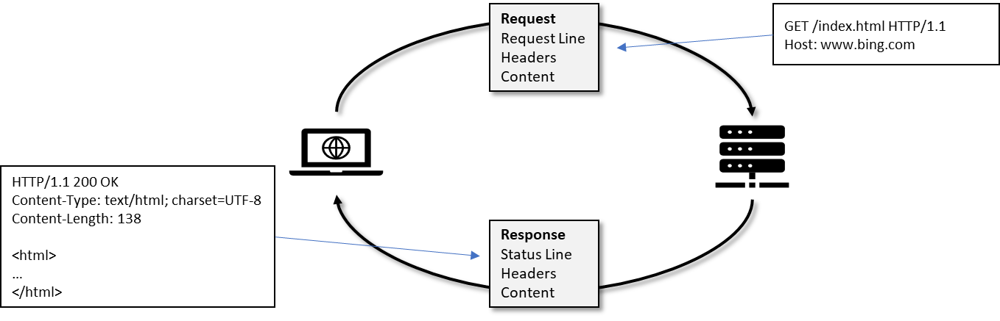

How to make friends in the Cloud?
=================================

It's not a secret that a lot of the work we're doing on Dynamics 365
Business Central is focused on running a secure and reliable service.
Those exact requirements (secure and reliable) are what forced us to
make some hard choices that can make it difficult to move existing
solutions to the cloud without making potentially significant changes.

Extensions
----------

Running a reliable service means that upgrading to new versions of both
the platform and the base-application, but also upgrading extensions,
must be fast and seamless. This is true for upgrading both code and
data.

Separating base application and partner code into separate modules
(extensions) is an import step in that direction.

The challenge of separating your code from the base-application is not a
topic for this blog post. Instead it will focus on the foundation for
solving some of the problems that you may face when moving to the cloud.

Service vs. server
------------------

Some of the challenges that you are facing when moving to the cloud,
occur because we have removed functionality (.NET Interop, Files, ...),
but others are a result of the fact that Business Central online is a
*\*service\** and not a *\*server\**. For example, on a server you have
a file system, where you can store files and retrieve them later, you
don't have that in a service. Of course, the service is running on an
operation system with a hard drive, but you are not guaranteed to ever
run you code on the same machine again. Maybe the machine gets recycled
and replaced with a new fresh machine and your persisted files are gone.

On-premises servers cannot only access local files, but also interact
with local network resources like printers, manufacturing equipment, SQL
servers, devices on the LAN, etc.

Dynamics 365 Business Central online is running in the Azure cloud and
not on your local LAN and therefore you can easily get the feeling that
you are alone and isolated in the cloud, but you are not. There are lots
of new friends to meet in the cloud, you just need to learn some new
communications skills; HTTP and REST.

HTTP - The Hypertext Transfer Protocol
--------------------------------------

When we disallowed .NET functionality from the cloud service, we knew
that we cut one of the primary communication lines to the world outside
Business Central and that we had to address that in AL. The best way to
meet new friends in the cloud is to use HTTP, the main protocol for
communication between systems in the cloud. Straight from Wikipedia "The
Hypertext Transfer Protocol (HTTP) is an application protocol for
distributed, collaborative, hypermedia information systems". As the name
implies it was originally invented for document sharing on the World
Wide Web.

The HTTP protocol consists of a request message sent from the client to
the server and a response message returned from the server to the
client.



### 

The request message contains:

-   Request line with a Method-Type, a resource and protocol version
    (e.g. GET /index.html HTTP/1.1)

-   Request header fields (e.g. Host: www.bing.com)

-   Optional message body

The response message contains:

-   Status line containing status code and reason (e.g. HTTP/1.1 200 OK)

-   Response header fields (e.g. Content-Length: 138)

-   Optional message body

HttpClient datatype
-------------------

Developers have been able to do this with Dynamics NAV for many years
using .NET interop, but that is no longer an option for Dynamics 365
Business Central online. To provide the same functionality in the cloud
we have added the HttpClient and a few supporting datatypes to the AL
language. They can be used to talk to other system using HTTP.

The simplest usage of the HttpClient is just to retrieve the content of
a webpage. The code sample below is retrieving the HTML for the Ready2Go
website.

```
    procedure Ready2Go(var content: Text): Boolean;
    var
        Client: HttpClient;
        Response: HttpResponseMessage;
    begin
        // Get the aka.ms/read2go webpage about the "Ready to Go" program 
        // that contains information about Learning, Coaching, Tools, and
        // Resources for Dynamics 365 Business Central
        Client.Get('https://aka.ms/ready2go', Response);
        
        // Check the HTTP status code for success.
        if not Response.IsSuccessStatusCode() then
            exit(false);

        // Read the response content into the content parameter.
        Response.Content().ReadAs(Content);
        exit(true);
    end;
```

Let's face it, webpages are rather boring friends to have unless you are
a browser. They are mostly for people to look at. Services are looking
for different type of friends -- the friends that talk REST.

REST - Representational State Transfer
--------------------------------------

REST is not a protocol. It's an architectural style for created web
services designed for communication between systems on the Internet.
Although HTTP usage is not a requirement, it is the most common way to
create RESTful services. You can say that, REST takes HTTP to the next
level.

Where classic HTTP mostly regarded web resources as being either
webpages or documents, REST has a more abstract view on what a web
service can be. For example, a Customer in an ERP system or a Message in
a Queue.

The more abstract view combined with a traditional HTTP method types
(GET, PUT, DELETE, ...) are ideal for inter-server communication on the
internet. It forces the developers to create very crisp interfaces that
can be accessed from most languages and runtime environments. Most Azure
services can be configured and used using a REST interface.

It is important to note that REST is an architectural style rather than
a protocol. It is a set of constraints for inter-service communication.
The resources are identified using Uri's, but the representation of the
resources sent to/from the client can be in either XML, JSON, or some
other format.

Back to the beginning
---------------------

Before we dive into using the REST APIs of some advanced Azure services,
let's start by getting our feet wet with something simpler -- Microsoft
Translator Text API
(<https://learn.microsoft.com/en-us/azure/cognitive-services/translator/>
). Microsoft Translator Text API is a cloud-based machine translation
service. It can be accessed through a simple REST API.

The Translator Text API requires a key that is available through the
Azure Portal. Make sure to pick the free tier -- some of the tiers are
quite expensive for a sample program. The key is used to authenticate
your request with the translation service and should be supplied in the
request header.

When we presented AL, the new compiler, and our Visual Studio Code
extension at Directions NA/EMEA in 2016, we showed the traditional
'Hello World' sample adapted to what at that point was called Dynamics
NAV and now is Business Central. The original code can be found here
(<https://github.com/Microsoft/AL/tree/master/samples/HelloWorld> ). A
lot of developers contributed with greetings in their own language. Now,
2 years later, we are ready to go back to the beginning and create an
updated version using the Translator Text API. Not that we didn't value
all your contributions, but in a modern world we should use some of the
new possibilities in the Azure cloud.

We need a method that can translate a Text to another language. We will
call it Translate() and it takes a TargetLanguage parameter and a Text
to translate. It will return the translated text. It uses the
<https://api.cognitive.microsofttranslator.com/translate> resource to do
the translation. The "to" language is specified as a query-parameter,
the SubcriptionKey is in the Request headers and the Text to translate
as JSON is in the body (see documentation
(<https://learn.microsoft.com/en-us/azure/cognitive-services/translator/reference/v3-0-translate>
) for more details).


    // Translate Text to TargetLanguage.
    // API Documentation: 
    // https://learn.microsoft.com/en-us/azure/cognitive-services/translator/reference/v3-0-translate
    procedure Translate(TargetLanguage: Text; Text: Text): Text;
    var
        JArray: JsonArray;
        JObject: JsonObject;
        JToken: JsonToken;
        Client: HttpClient;
        Request: HttpRequestMessage;
        Response: HttpResponseMessage;
        Headers: HttpHeaders;
    begin
        // Set the HTTP method and the resource Uri.
        Request.Method := 'POST';
        Request.SetRequestUri(
            StrSubstNo('https://api.cognitive.microsofttranslator.com/translate?api-version=3.0&to=%1', 
               TargetLanguage));

        // Add the subscription key the Request Headers
        Request.GetHeaders(Headers);
        Headers.Add('Ocp-Apim-Subscription-Key', SubscriptionKeyTxt);

        // Add the text to translate as Json to the content
        JObject.Add('Text', Text);
        JArray.Add(JObject);
        Request.Content().WriteFrom(Format(JArray));

        // Add the Content-Type to the Content headers, but first remove
        // the existing Content-Type.
        Request.Content().GetHeaders(Headers);
        Headers.Remove('Content-Type');
        Headers.Add('Content-Type', 'application/json');

        // Send the request
        Client.Send(Request, Response);

        // Read the response
        Response.Content().ReadAs(Text);
        JArray.ReadFrom(Text);
        JArray.SelectToken(StrSubstNo('$..translations[?(@.to == ''%1'')].text', TargetLanguage), JToken);
        exit(JToken.AsValue().AsText());
    end;


The Translator service will reply with the translated text in a JSON
format like:

```
[
    {
        "detectedLanguage": {
            "language": "en",
            "score": 1
        },
        "translations": [
            {
                "text": "Hej verden!",
                "to": "da"
            }
        ]
    }
]
```

Since we haven't specified the source language, the Translator service
will try to detect it (another feature of the service), and hence the
"detectedLanguage" section in the result. The translated texts are
returned as a JSON array (it is possible to translate to multiple
languages in the same request). The code uses a JSONPath expression to
extract the translated text and return it.

The original code returned the greeting in a random language. To achieve
the same in our updated code, we need a list of languages supported by
the Translator service. The list of supported languages can be retrieved
from
<https://api.cognitive.microsofttranslator.com/languages?api-version=3.0>
. The code to retrieve a random language ID and name looks like this:

```
    local procedure GetRandomLanguage(var LanguageName: Text) LanguageID: Text;
    var
        JObject: JsonObject;
        JToken: JsonToken;
        Client: HttpClient;
        Response: HttpResponseMessage;
        Result: Text;
    begin
        Client.Get('https://api.cognitive.microsofttranslator.com/languages?api-version=3.0&scope=translation', Response);

        Response.Content().ReadAs(Result);
        JObject.ReadFrom(Result);
        JObject.SelectToken('$.translation', JToken);
        JObject := JToken.AsObject();
        JObject.Keys().Get(Random(JObject.Keys().Count()), LanguageID);
        JObject.Get(LanguageID, JToken);
        JObject := JToken.AsObject();
        JObject.Get('name', JToken);
        LanguageName := JToken.AsValue().AsText();
    end;
```

The code is simpler than the translate method because the request
doesn't require anything in the header or in the body.

The final solution uses the random language ID to retrieve a translation
of Hello World to greet customers with.

With the power of Azure, we have updated our first AL Hello World
extension to a more modern version with automated translation.

The complete source for the updated version is available here https://github.com/Microsoft/BCTech/tree/master/samples/HelloWorldV2

Introducing more friends
------------------------

In upcoming blog posts, I will introduce you to some other friends in
the Azure cloud like Service Bus Queue, Service Bus Relay, and Blob
Storage. Watch out.
