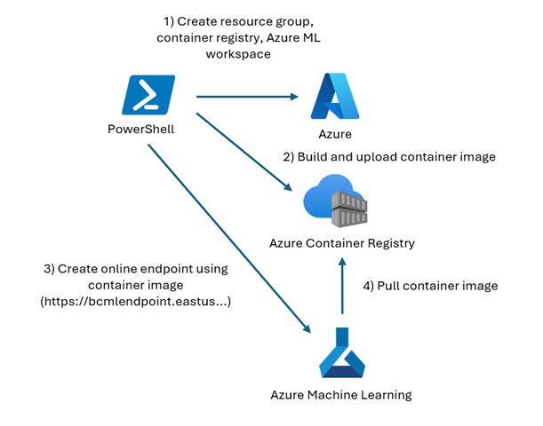
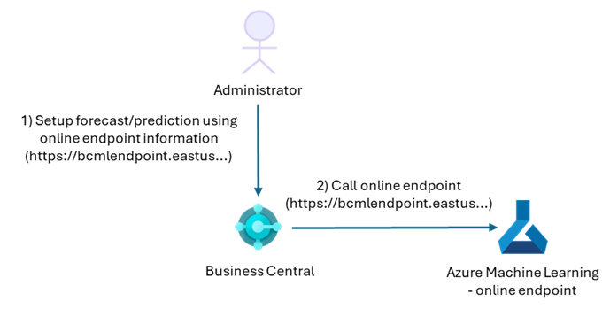
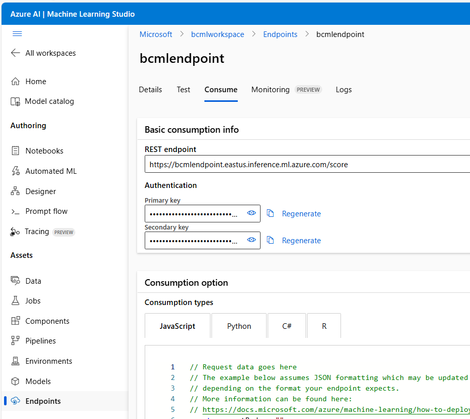

# Create your own machine learning resources for Dynamics 365 Business Central (BC)

The following describes how to deploy your own machine learning resources in Azure for BC to use.

This involves building a container image, uploading the container image to an Azure Container Repository, creating an [Azure Machine Learning online endpoint](https://learn.microsoft.com/en-us/azure/machine-learning/how-to-deploy-online-endpoints?view=azureml-api-2&tabs=cli) using the [custom container image](https://learn.microsoft.com/en-us/azure/machine-learning/how-to-deploy-custom-container?view=azureml-api-2&tabs=cli), and finally pointing your BC instance to the online endpoint.

## Architecture

During deployment (i.e., running the `DeployMachineLearningResources.ps1` script), an [Azure ML managed online endpoint](https://learn.microsoft.com/en-us/azure/machine-learning/concept-endpoints-online?view=azureml-api-2)
will be created. In order to create the online endpoint, a container image with the appropriate R resources (from the `R` folder) needs to be created. This is illustrated below:



After deployment, a Business Central administrator can setup forecast/prediction using the information from the
online endpoint:




## Prerequisites

- An Azure subscription in which Azure Machine Learning resources can be deployed
- [Azure CLI](https://learn.microsoft.com/en-us/cli/azure/install-azure-cli) installed.
- The [Azure ML extension to Azure CLI](https://learn.microsoft.com/en-us/azure/machine-learning/how-to-configure-cli?view=azureml-api-2&tabs=public) installed

These instructions were tested with version Azure CLI version 2.64.0, Azure ML extension version 2.29.0, and run in a PowerShell 7 terminal.

Not all steps can be performed in Azure ML Studio, so the Azure CLI with the ML extension is needed.

If you encounter issues, try the [troubleshooting](#Troubleshooting) tips listed below.

## Steps

Log into the desired Azure subscription in a terminal:

```
az login
```

Deploy machine learning resources using the provided PowerShell script. In the following example, we are using the resource group `bcmlresourcegroup` in the Azure location `West US`. 
An Azure Container Registry named `mybcmlregistry` will be created or used for the Docker images created. 
An Azure Machine Learning endpoint named `mybcmlendpoint` will be created. 
The registry name needs to be globally unique and the endpoint name has to be unique within the region (`West US` in the example below).

The resource group will be created if it does not exist. See the documentation in `DeployMachineLearningResources.ps1` for additional parameters.
```
# Change names of registry and endpoint to be unique
.\DeployMachineLearningResources.ps1 `
    -ResourceGroupName "bcmlresourcegroup" `
    -Location "West US" `
    -RegistryName "bcmlregistry" ` 
    -EndpointName "bcmlendpoint" 
```

This should give an output similar to
```
Logged into subscription 'MySubscription'
Deploying Azure Machine Learning resources in resource group 'bcmlresourcegroup'.
Creating resource group 'bcmlresourcegroup' in location 'West US'.
Creating Azure Machine Learning workspace 'bcmlworkspace' in resource group 'bcmlresourcegroup'.
...
Building container image businesscentralml:latest for Azure Machine Learning model.
...
Creating Azure Machine Learning deployment 'bcmldeployment'.
...
Azure Machine Learning resources deployed successfully.
```

Go to [Azure Machine Learning Studio](https://ml.azure.com/) and locate the created workspace (`bcmlworkspace` if using the standard parameters). Under "Endpoints", go to the "Consume" tab and take a note of the REST endpoint URI and Primary key:



Finally, add the URI and key to appropriate BC configuration, e.g., to the Sales and Inventory forecast and Late Payment Prediction setups.

## Troubleshooting

- If you run into issues installing the Azure ML extension (cf. this [bug](https://github.com/Azure/azure-cli-extensions/issues/7968)), you may need to install the CLI via Python by doing `pip install azure-cli` in a terminal.
- If you see the error `Resource provider [N/A] isn't registered with Subscription [N/A]`, you may need to register the `Microsoft.Cdn` and `Microsoft.PolicyInsights` resource providers for the subscription used, cf. this [accepted support answer](https://learn.microsoft.com/en-us/answers/questions/1983847/error-while-creating-a-managed-online-endpoint-in).
- You need virtual machine quota for the VM used by the online endpoint, so if you see `Not enough quota available for Standard_DS2_v2`, request quota for the desired VM.
- For the `UnicodeDecodeError: 'utf-8' codec can't decode byte 0xff in position 0: invalid start byte` error, please use PowerShell 7 as a terminal.
