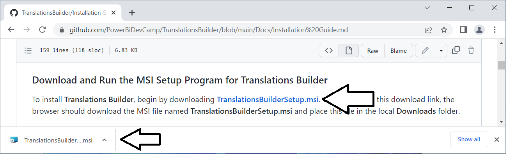
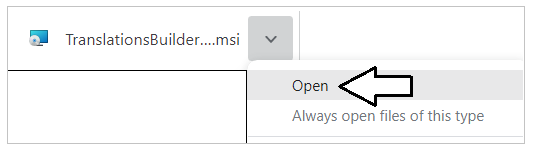

## **Translations Builder Installation Guide**
> This installation guide will walk you through the installation process
to get **Translations Builder** up and running on the same machine where
you work with Power BI Desktop.

Before installing **Translations Builder**, you must ensure your
computer meets the following requirements.

- 64-bit Version of Windows 10 or Windows 11
- 64-bit version of Power BI Desktop (January 2023 or later)

The current version of Translations Builder is **version 2.2**.

### Download and Install the .NET 6 Runtime for Desktop Applications

Before installing Translations Builder, you must first download and
install the **.NET 6 Runtime for Desktop Applications**. You can start
by downloading the installation file from
[**here**](https://dotnet.microsoft.com/en-us/download/dotnet/thank-you/runtime-desktop-6.0.14-windows-x64-installer).
Once the installation file has been downloaded, run the installation
program and accept all default settings to begin the installation
process. Once the installation has completed for the **.NET 6 Runtime
for Desktop Applications**, you can continue to the next step.

### Download and Run the MSI Setup Program for Translations Builder

To install **Translations Builder**, begin by downloading
[**TranslationsBuilderSetup.msi**](https://github.com/PowerBiDevCamp/TranslationsBuilder/raw/main/SetupFiles/TranslationsBuilderSetup.msi).
When you click this download link, the browser should download the MSI
file named **TranslationsBuilderSetup.msi** and place this file in the
local **Downloads** folder. 

The browser should show that **TranslationsBuilderSetup.msi** has been downloaded and provide a
context menu of actions.  The following screenshot shows what this
experience looks like when using Google Chrome. Other browsers will
provide a different experience.

Run the setup program named **TranslationsBuilderSetup.msi**. When you
see the **Welcome** screen of the **Translations Builder Setup Wizard**,
click **Next** to continue,

On the **Select Installation Folder** page, accept the default
**Folder** location value and click **Next**.

> It is recommended that you do not change default **Folder** path value 
of **C:\Program Files\\Translations Builder\\**. The reason you should avoid changing the
**Folder** location is the installation program copies a file named
**translationsbuilder.pbitool.json** into the special folder for Power
BI Desktop external tools and that file has the hardcoded path of the
default **Folder** location. If you change the **Folder** location from
the default value, then you will need to update the file named
**translationsbuilder.pbitool.json** which is explained at the end of
this article in the **Troubleshooting Installation** section.

On the **Confirm Installation** page, click **Next** to continue.

> When you are prompted by the **User Account Control** dialog, you should be able to confirm that **Microsoft Corporation** is listed as the **Verified publisher**. 

Click **Yes** to continue.

Wait until you see the **Installation Complete** dialog and then click
**Close** to complete the installation process.

Now that **Translations Builder** has been installed, you should be able
to launch it from Power BI Desktop as an external tool.

1.  Open Power BI Desktop.
2.  Navigate to the **External Tools** tab.

&nbsp;&nbsp;&nbsp;&nbsp;&nbsp;&nbsp;&nbsp;

3.  Locate and click the **Translations Builder** link on the **External Tools** tab.

&nbsp;&nbsp;&nbsp;&nbsp;&nbsp;&nbsp;&nbsp;

4.  Once you see **Translations Builder** start up without an errors,
    you know it has been installed successfully.

&nbsp;&nbsp;&nbsp;&nbsp;&nbsp;&nbsp;&nbsp;

### Troubleshooting Installation

The following information might be important to you if you need to
troubleshoot your **Translations Builder** installation. The default
**Folder** location for the **Translations Builder** EXE file and other
deployment files uses this path.

> **C:\Program Files\Translations Builder**

Here is what this folder looks like after installation if you examine it
with Windows Explorer.

Another essential part of the installation process for an external tool
is copying a special deployment file with JSON configuration information
into a special folder that is examined by Power BI Desktop as startup.
More specifically, the **Translations Builder** installation program
copies a file named **translationsbuilder.pbitool.json** into the
following folder.

> **C:\Program Files (x86)\Common Files\Microsoft Shared\Power BI Desktop\External Tools**

If you examine this folder, it should contain the file named
**translationsbuilder.pbitool.json** along with a separate files with a
**\*.pbitool.json** extension for any other external tool that you have
installed.

If you open in **translationsbuilder.pbitool.json** in a text editor
such as Notepad, you will see it contains a **path** property with a
configured file path to **TranslationsBuilder.exe**. This is the file
path Power BI Desktop uses to launch **Translations Builder** as an
external tool from the **External Tools** tab.

If you installed **Translations Builder** into a **Folder** location
other than the default value, you will need to modify the **path**
value, save **translationsbuilder.pbitool.json** and restart Power BI
Desktop.

### Upgrading Translations Builder to a New Version
The follow applies to version of Translations Builder 2.1 and later.
When a new version of Translations Builder becomes available, you can
upgrade by simply running the installation program again. Running the
installation program for a new version Translations Builder will
automatically remove the previous version.
