## **Translations Builder Installation Guide**

This installation guide will walk you through the installation process
to get **Translations Builder** up and running on the same machine where you
work with Power BI Desktop. Before installing **Translations
Builder**, you must ensure your computer meets the following
requirements.

- 64-bit Version of Windows 10 or Windows 11
- 64-bit version of Power BI Desktop (November 2022 or later)
- .NET 6 Runtime for Desktop Applications ([download install
  files](https://dotnet.microsoft.com/en-us/download/dotnet/thank-you/runtime-desktop-6.0.8-windows-x64-installer)).

### Download and Run the Installer MSI File

To install **Translations Builder**, begin by downloading
[**TranslationsBuilderInstall.msi**](https://github.com/PowerBiDevCamp/TranslationsBuilder/raw/main/SetupFiles/TranslationsBuilderInstaller.msi).

When you click this download link, the browser should download the MSI
file named **TranslationsBuilderInstall.msi** and place this file in the
local **Downloads** folder. The browser should show that
**TranslationsBuilderInstall.msi** has been downloaded and provide a
context menu of actions. The following screenshot shows what this
experience looks like when using Google Chrome. Other browsers will
provide a different experience.

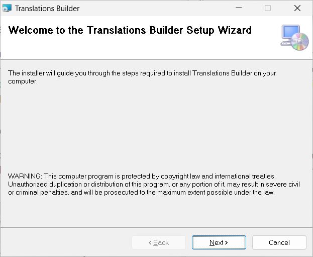

Note that the installation file named **TranslationsBuilderInstall.msi**
has not been signed using Authenticate to verify the authenticity of the
code manufacturer which is **Power BI Dev Camp**. We are currently in
the process of obtaining a code-signing certificate for **Power BI Dev
Camp** which will make the installation process smoother in the future.
But for now, there are some extra steps to go through during
installation because the Window operating system cannot verify who the
publisher is.

Open to context menu for **TranslationsBuilderInstall.msi** and select
**Open** to run the installation program.

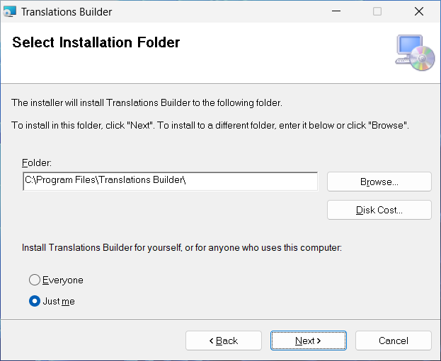

Because **TranslationsBuilderInstall.msi** is not signed with a
code-signing certificate, you will be prompted with the following dialog
with the title **Windows protected your PC dialog**. Click the **More
info** link to continue.

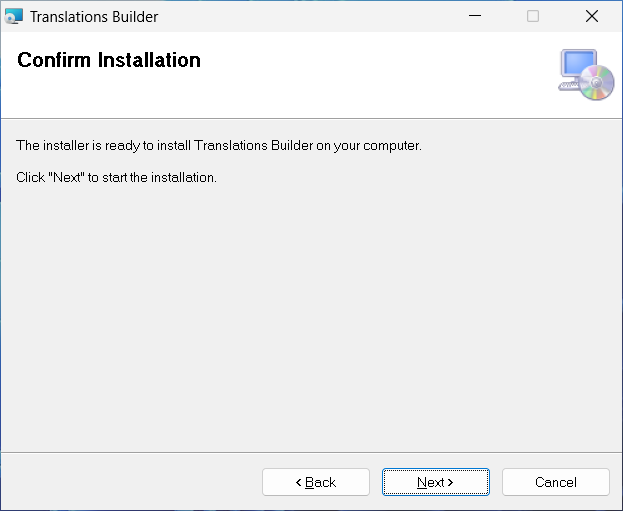

The next screen displays the name of the **App** as
**TranslationsBuilderInstall.msi** and indicates that the publisher is
unknown. Click the **Run anyway** button to begin the installation
process.

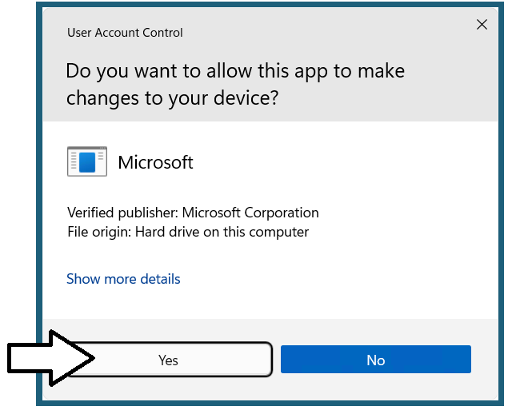

When you see the **Welcome** screen of the **Translations Builder Setup
Wizard**, click **Next** to continue,

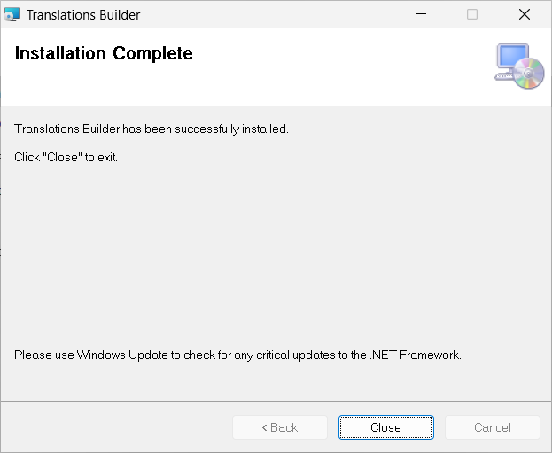 />

On the **Select Installation Folder** page, accept the default
**Folder** location value and click **Next**.

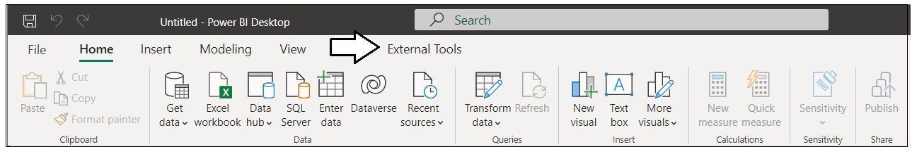

Do not change default **Folder** path value of **C:\Program Files\Power
BI Dev Camp\Translations Builder\\**. The reason you should avoid
changing the **Folder** location is the installation program copies a
file named **translationsbuilder.pbitool.json** into the special folder
for Power BI Desktop external tools and that file has the hardcoded path
of the default **Folder** location. If you change the **Folder**
location from the default value, then you will need to update the file
named **translationsbuilder.pbitool.json** which is explained at the end
of this article in the **Troubleshooting Installation** section.

On the **Confirm Installation** page, click **Next** to continue.

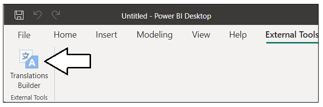

At this point, you should be prompted by the **User Account Control**
dialog. Click **Yes** to continue.


Wait until you see the **Installation Complete** dialog and then click
**Close** to complete the installation process.


> Now that **Translations Builder** has been installed, you should be able to launch it from Power BI Desktop as an external tool.
1.  Open Power BI Desktop and navigate to the **External Tools** tab.
&nbsp;

2.  Locate and click the **Translations Builder** link on the **External Tools** tab. 
&nbsp;

1.  Once you see **Translations Builder** start up without an errors,
    you know it has been installed successfully.
&nbsp;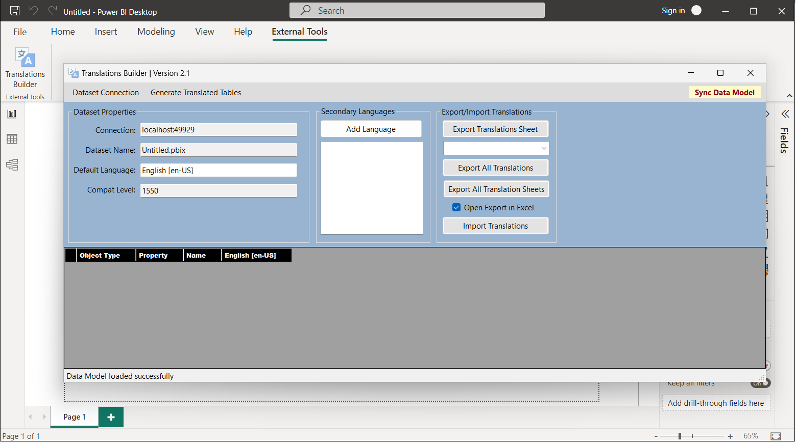

### Troubleshooting Installation
> The following information might be important to you if you need to
troubleshoot your **Translations Builder** installation. 

The default **Folder** location for the installation of the **Translations Builder** EXE file and other
deployment files uses this path.
```
C:\Program Files\Power BI Dev Camp\Translations Builder
```
Here is what this folder looks like after installation if you examine it
with Windows Explorer.

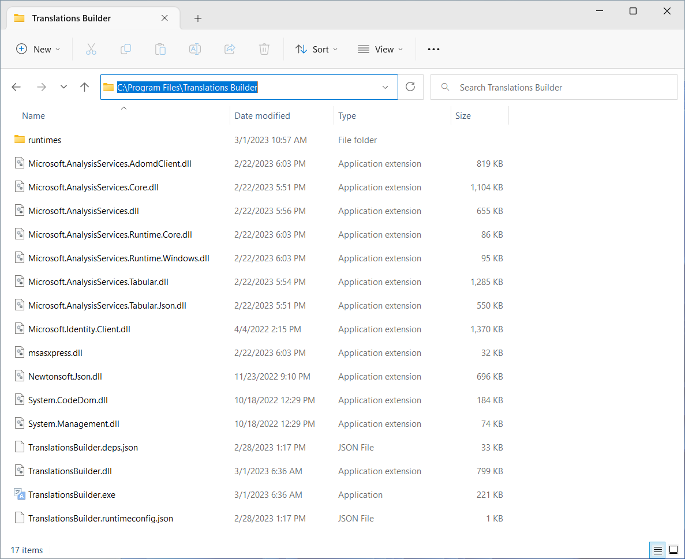

Another essential part of the installation process for an external tool
is copying a special deployment file with JSON configuration information
into a special folder that is examined by Power BI Desktop as startup.
More specifically, the **Translations Builder** installation program
copies a file named **translationsbuilder.pbitool.json** into the
following folder.

```
C:\Program Files (x86)\Common Files\Microsoft Shared\Power BI Desktop\External Tools
```

If you examine this folder, it should contain the file named
**translationsbuilder.pbitool.json** along with a separate files with a
**\*.pbitool.json** extension for any other external tool that you have
installed.

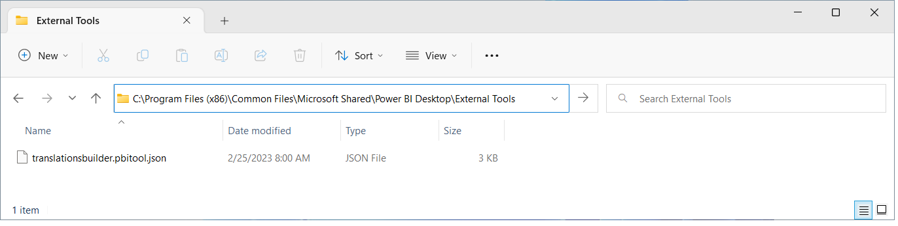

If you open in **translationsbuilder.pbitool.json** in a text editor
such as Notepad, you will see it contains a **path** property with a
configured file path to **TranslationsBuilder.exe**. This is the file
path Power BI Desktop uses to launch **Translations Builder** as an
external tools from the **External Tools** tab.

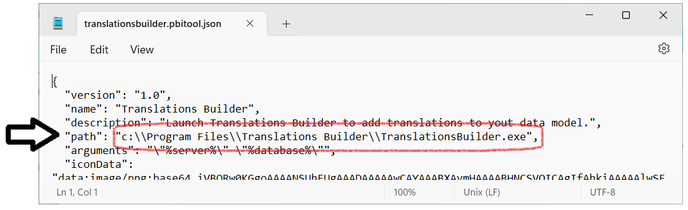

If you installed **Translations Builder** into a **Folder** location
other than the default value, you will need to modify the **path**
value, save **translationsbuilder.pbitool.json** and restart Power BI
Desktop.

### Upgrading Translations Builder to a New Version

When a new version of Translations Builder becomes available, you can
upgrade by simply running the installation program again. Running the
installation program for a new version Translations Builder will
automatically remove the previous version.
