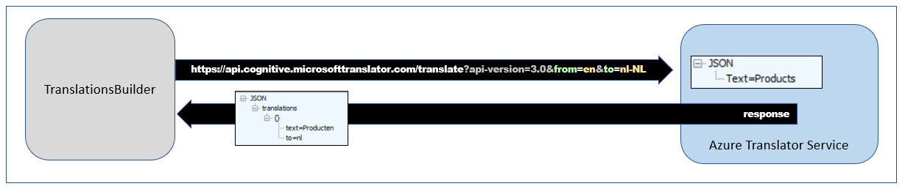
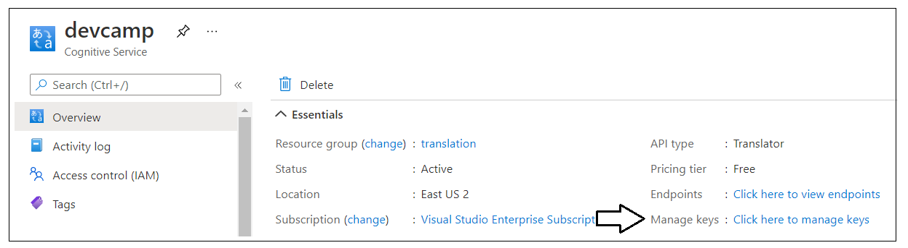
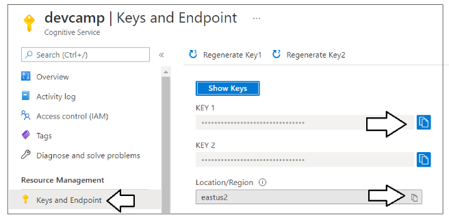
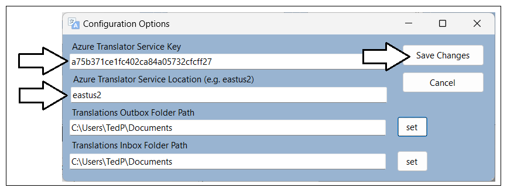
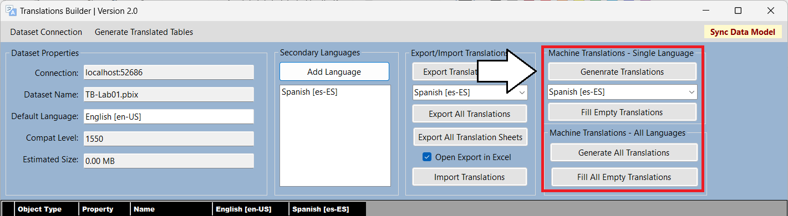

# Obtaining a Key for the Azure Translator Service

The **TranslationsBuilder** application includes support to generate
machine translations with the [Azure Translator
service](https://docs.microsoft.com/en-us/azure/cognitive-services/translator/translator-info-overview)
that is part of Azure Cognitive Services. This Web API makes it possible
to automate enumerating through dataset objects to translate dataset
object names from the default language to secondary languages. The
diagram below shows the details of executing a Translator service API
request to convert a table name from English (en) to Dutch (nl).

If you'd like to test out the support in **TranslationsBuilder** for
generating machine translations, you will require an Azure subscription.
An Azure subscription is required because you must create your own
instance of the Translator service in Microsoft Azure. Once you have
created an instance of the Translator service, you must determine its
location and acquire an application key before you can successfully call
to it from the **TranslationsBuilder** application.

The Azure Translator service does not support anonymous API calls.
Instead, you must acquire an application keys which acts as a security
credential because it allows you to execute secure Web API calls to the
Translator service. When working with an instance of the Translator
service in the Azure portal, you can navigate to the **Keys and
Endpoint** page where you can view and acquire an application key.

On the **Keys and Endpoint** page, you can copy the application key and
then paste it into the **Configuration Options** dialog in
**TranslationsBuilder**. You will also need to copy the service
**Location** and paste that value into the **Configuration Options**
dialog as well.

Once you have copy-and-pasted the application key and the location for
your Translator service instance, you can save your changes in the
**Configuration Options** dialog and begin generating machine
translations.

The **TranslationsBuilder** application contains a **Machine
Translations** section with a **Generate Translations** button. Note
that the **Machine Translations** section will not be visible until you
have added an application key and a location for the Azure Translation
Service in the **Configuration Options** dialog. Once you have
configured **TranslationsBuilder** with an application key and a
location for your Translator service instance, you should be able to
select a target culture with the language you want and click the
**Generate Translations** button to generate machine translation for
that language.

