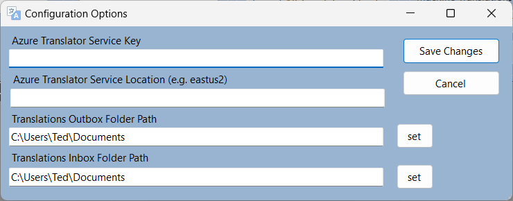
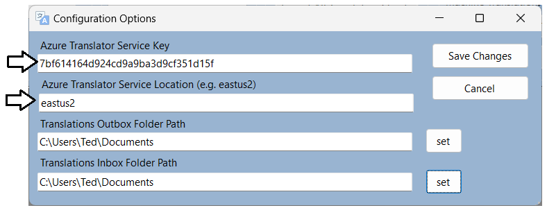
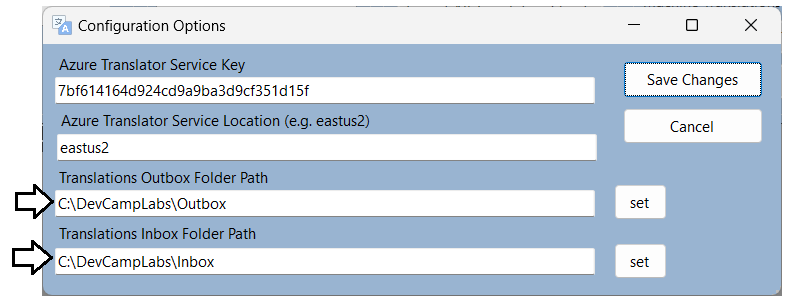
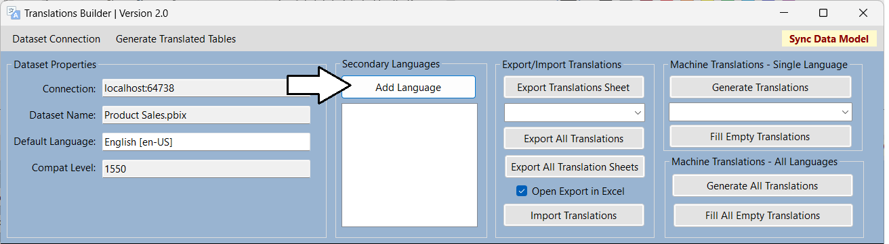
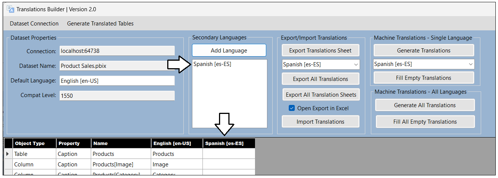
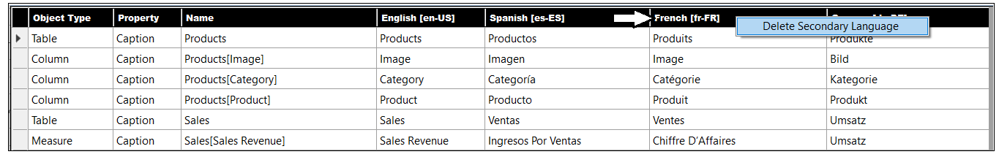
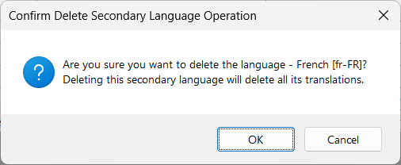

# Translations Builder User Guide

Translations Builder is an external tool created for Power BI Desktop to
assist dataset authors and report authors with tasks associated with
creating translations and building multi-language reports. As a user,
you can install Translations Builder and use it together with Power BI
Desktop to build and test datasets and reports that support multiple
languages.

While this document has been designed to explain the features and
limitations of Translations Builder, it is recommended that you also
read through the [**guidance
document**](https://github.com/PowerBiDevCamp/TranslationsBuilder/blob/main/Docs/Building%20Multi-language%20Reports%20in%20Power%20BI.md)
and that you work through the [**hands-on lab
exercises**](https://github.com/PowerBiDevCamp/TranslationsBuilder/blob/main/Labs/Hands-on%20Lab%20-%20Building%20Multi-language%20Reports%20for%20Power%20BI.md).
These learning resources will complement the contents you’ll find here.

There are three types of translations that come into play when
localizing Power BI datasets and building reports that support multiple
languages. Translations Builder helps to create and manage the first two
types of translations which are **metadata translations** and **report
label translations**. Translations Builder does not provide assistance
with implementing **data translations**. For more conceptual background
on translations used with Power BI, please read [**Understanding the
Three Types of
Translations**](https://github.com/PowerBiDevCamp/TranslationsBuilder/blob/main/Docs/Building%20Multi-language%20Reports%20in%20Power%20BI.md#understanding-the-three-types-of-translations).

### Translations Builder Scope and Limitations

To use Translations Builder effectively, you should be aware of its
scope and a few important limitations discussed here.

#### Supported Dataset Editing Scenarios

Translations Builder has been designed to work with Power BI datasets
running locally in Power BI Desktop. Translations Builder does not
support connecting to Power BI datasets in the Power BI Service or
connecting to older dataset formats used by Analysis Services. It’s
possible to move beyond these limitations by extending Translations
Builder as a developer. See the [**Translations Builders Developer
Guide**](https://github.com/PowerBiDevCamp/TranslationsBuilder/blob/main/Docs/Developer%20Guide.md)
for more information. Translations Builder is similar to Power BI
Desktop in that it can only be installed on the Windows operating
system.

#### Saving Your Changes in Power BI Desktop

While Translations Builder is designed to directly update datasets
loaded into memory by Power BI Desktop, it is not able to persist
changes to a dataset to the underlying PBIX project files on its own.
Therefore, it is important to return to Power BI Desktop and save your
changes after adding and editing translations with Translations Builder.

#### Supported Languages and Locales

When the Power BI Service loads a report, it creates a user context that
includes a **language ID** and a **locale identifier**. The Power BI
Service parses the language ID and the locale identifier together into
string-based value known as the **culture identifier**. For example, a
culture identifier of **en-US** represents a user who speaks English
(**en**) in the United States (**US**). A culture identifier of
**fr-FR** represents a user who speaks French (**fr**) in the France
(**FR**).

Translations Builder supports the following set of languages, each with
a specific culture identifier.

| Afrikaans \[af-ZA\] | Filipino \[fil-PH\]      | Italian \[it-IT\]        | Serbian \[sr-Latn-BA\]   |
|---------------------|--------------------------|--------------------------|--------------------------|
| Arabic \[ar-001\]   | **Finnish \[fi-FI\]**    | **Japanese \[ja-JP\]**   | **Slovak \[sk-SK\]**     |
| Bulgarian \[bg-BG\] | **French \[fr-FR\]**     | **Korean \[ko-KR\]**     | **Slovenian \[sl-SI\]**  |
| Catalan \[ca-ES\]   | **German \[de-DE\]**     | **Latvian \[lv-LV\]**    | **Somalian \[so-SO\]**   |
| Chinese \[zh-CN\]   | **Greek \[el-GR\]**      | **Napali \[ne-NP\]**     | **Spanish \[es-ES\]**    |
| Croatian \[hr-HR\]  | **Hebrew \[he-IL\]**     | **Norwegian \[nb-NO\]**  | **Swedish \[sv-SE\]**    |
| Czech \[cs-CZ\]     | **Hindi \[hi-IN\]**      | **Persian \[fa-IR\]**    | **Thai \[th-TH\]**       |
| Danish \[da-DK\]    | **Hungarian \[hu-HU\]**  | **Polish \[pl-PL\]**     | **Turkish \[tr-TR\]**    |
| Dutch \[nl-NL\]     | **Icelandic \[is-IS\]**  | **Portuguese \[pt-PT\]** | **Ukrainian \[uk-UA\]**  |
| English \[en-US\]   | **Indonesian \[id-ID\]** | **Romanian \[ro-RO\]**   | **Vietnamese \[vi-VN\]** |
| Estonian \[et-EE\]  | **Irish \[ga-IE\]**      | **Russian \[ru-RU\]**    |                          |

While Translations Builder supports all the languages shown above, it is
important to understand that it only supports a single culture
identifier per language. For example, you can add the language **Spanish
\[es-ES\]** to your PBIX project. But you cannot add the language
Spanish with the different culture identifier such as **es-MX** for
Spanish in Mexico.

Even if you intend to build multi-language reports for users who speak
Spanish in Mexico, you are required to add the language as **Spanish
\[es-ES\]**. Keep in mind that the multi-language reports you build can
still load with a cultural identifier of **es-MX**. The DAX code
generated by Translations Builder for implementing report label
translation only uses the first part of the culture identifier so it
would not make a different whether the report is loaded with a culture
identifier of **es-ES** or **es-MX**.

For any project that requires English, you must add the language as
**English \[en-US\]**. For any project that requires French, you must
add the language as **French \[fr-FR\]** and so on. You can inspect list
of languages shown above to see which culture identifier is used for
each of the supported languages.

#### Import and Export using CSV Formatted Files

Translations Builder 2.0 uses the CSV file format to import and export
translations sheets. Due to CSV files using comma separated values,
Translations Builder does not support adding commas (**,**) to
translations as they will cause errors when generating or reading
translations sheets during import and export operations.

In future versions of Translations Builder, we are considering adding
support for other file formats for import/export operations such as the
RESX file format and a JSON-based file format.

### Translations Builder Configuration Options

Before using Translations Builder, it is recommended you configure a few
settings that are tracked on a per user basis. You can start by clicking
the **Configure Settings…** from the **Dataset Connection** menu to
display the **Configuration Options** dialog.

The **Configuration Options** dialog should appear like the one shown in
the following screenshot.

To enable support for generating machine translations with the Azure
Translator Service, you must supply configuration values for the Azure
Translator Service Key and Azure Translator Service Location. If you
have an Azure subscription, you can learn how to obtain this key and its
location by reading [Obtaining a Key for the Azure Translator
Service](https://github.com/PowerBiDevCamp/TranslationsBuilder/blob/main/Docs/Obtaining%20a%20Key%20for%20the%20Azure%20Translator%20Service.md).

The **Configuration Options** dialog also allows you to assign local
folder paths for the **Outbox** and **Inbox**. The **Outbox** folder is
where Translation Builder generates files for export operations. The
**Inbox** folder is where Translations Builder looks for files when you
want to perform an import operation. By default, both the **Outbox** and
**Inbox** are configured to use the Documents folder for the current
user. However,

### Adding Metadata Translations

In general, you start any PBIX project involving translations by adding
one or more secondary languages. Once you have added the languages you
require, then you can begin to add translations.

#### Adding Secondary Languages

You will use the **Add Language** button to add new languages.

Click the **Add Languages** button will open the **Add Language**
dialog. In this dialog you can select a language and then click the
**Add Language** button.

Once the new language has been added, it should be displayed in the list
box just underneath the **Add Languages** button in the **Secondary
Languages** section. The new language should also get its own new column
in the translation grid.

Note the **Add Language** dialog supports multiple selection if you’d
like to add more than one language in one operation.

If you’d like to remove a language from your PBIX project, you can do so
by right-clicking the column header for that language in the translation
grid and clicking the **Delete Secondary Language** menu command.

When deleting a language, you’ll be prompted to confirm the operation as
it deletes all the translations for that language.

#### Creating and Editing Translations by Hand

Remember that calling **SaveChanges** doesn't update the PBIX project
file. After making changes to a dataset using an external tool such as
**TranslationsBuilder**, you still need to return to Power BI Desktop
and save your changes there. OK, now you’ve been told several times to
save your changes in Power BI Desktop. This is your last warning.

#### Testing Metadata Translations in the Power BI Service

#### Creating Machine Translations using the Azure Translation Service

### Adding Report Label Translations

#### Creating the Localized Labels Table

Show command to create table

Create simple label

Show behind the scenes what has been created

Delete all and add multiple labels at once

Import labels from a file

#### Generating the Translated Localized Labels Table

Show command.

Show the two tables behind the scenes.

While the Localized Labels table is hidden from report authors, the
Translated Localized Labels table is not hidden. That is what report
authors use to create translated report labels

#### Surfacing Localized Labels on a Power BI Report

Measure make life easy. Over the last two years, Power BI Desktop has
been extended

- Card visual

- Shape such as a Rectangle

- Button

### Adding Data Translations

When implementing metadata translations and report label translations,
Translations Builder can automate a large percentage of the translations
work that need to be done. Unfortunately, the same is not true for data
translations. Implementing data translations will often require
refactoring the underlying database or datasource to provide extra
columns to provide translations on a row to row basis.

#### Understanding Translations Builder Support for Data Translations
