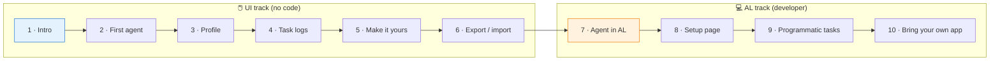

# Building Agents in Business Central

> A hands-on workshop for building AI-powered agents inside Microsoft Dynamics 365 Business Central.

Work through the stages in order — each one builds on the last. **Stages 1-6** are UI-only, no code required. **Stages 7-10** are the AL developer track and assume you're comfortable in VS Code.

---

## 🗺️ Workshop Flow

---

## 📋 Prerequisites

> [!IMPORTANT]
> You'll need your **own** Business Central Sandbox environment with Copilot & AI capabilities enabled. The workshop does not provide one.
>
> - A Business Central Sandbox environment (cloud)
> - A user account with the **SUPER** permission set (or equivalent admin rights)
> - **Copilot & AI capabilities** enabled in the environment
> - For Stages 7+: VS Code with the **AL Language** extension

Don't have a sandbox? Sign up for a free trial at [businesscentral.dynamics.com](https://businesscentral.dynamics.com).

---

## 📚 Stages

| # | Stage | What you'll do |
|---|---|---|
| 1 | 🚀 [Introduction & Setup](./stages/01-introduction.md) | Verify your environment is ready to build. |
| 2 | 🤖 [Your First Agent](./stages/02-first-agent.md) | Create a basic agent from scratch in the UI. |
| 3 | 🎨 [Customizing the Profile](./stages/03-profile-customization.md) | Control what the agent can see and access. |
| 4 | 🔍 [Inspecting Task Logs](./stages/04-testing.md) | See how the agent reasoned through a task. |
| 5 | 🛠️ [Make It Your Own](./stages/05-publishing.md) | Adapt the agent for your own product. |
| 6 | 📤 [Export & Import](./stages/06-export-import.md) | Export the agent as XML, import it back. |
| 7 | 💻 [Agent in AL](./stages/07-al-agent.md) | Convert the agent to a deployable AL extension. |
| 8 | ⚙️ [Customizing the Setup Page](./stages/08-setup-page.md) | Add per-environment config to your AL agent. |
| 9 | ⚡ [Programmatic Tasks](./stages/09-programmatic-tasks.md) | Trigger tasks from page actions and events. |
| 10 | 🔌 [Bring Your Own App](./stages/10-bring-your-own-app.md) | Wire the agent into your own AL extension. |

📖 **[Appendix — Reference Documentation](./appendix.md)** — every Microsoft Learn article referenced across the workshop, grouped by topic.

---

## 🎯 What You'll Learn

By the end you'll have built and deployed an agent that:

- Runs against your own product context, with instructions you wrote yourself
- Is packaged as an AL extension under source control
- Has a configurable setup page for per-environment values
- Can be triggered programmatically from page actions or business events
- Integrates with your existing AL app

---

## 🤝 Contributing

Found a typo or have a suggestion? Open an issue or a PR against this folder in [microsoft/BCTech](https://github.com/microsoft/BCTech).
